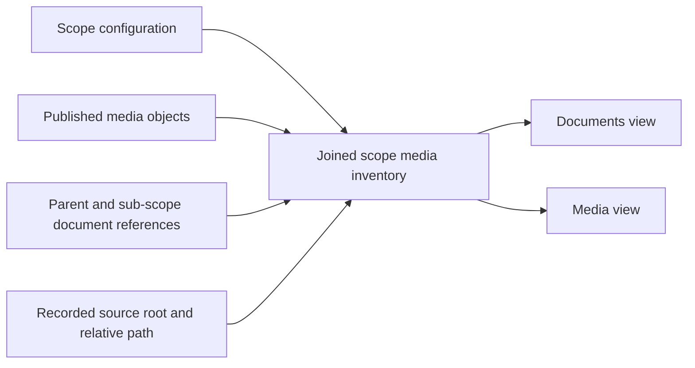

# Scope Media Management Concept

## Problem

Docs Viewer already knows which published media objects a scope owns and which logical media references occur in its parent and sub-scope documents. [Media Sources](/docs/?scope=studio&doc=d-20260812-102047-a3c9e7) adds a small record of the durable source selected by Add image or Add file. Authors need one ordinary place to see how those facts relate.

The report should answer two directions of the same relationship:

- from a document, show every referenced media identity, its size, published state, and source state; and
- from a media identity, show every referencing document together with its published and source evidence.

It should also expose referenced-but-missing, published-but-unreferenced, no-source-recorded, and recorded-source-missing states. None of those states independently authorizes a mutation.

## Joined Read Model



The stable published-media identity remains:

```text
scope + media type + relative identity
```

Provider, filesystem root, R2 prefix, and served URL come from scope configuration. Source evidence is a separate exact association containing a configured source-root identity and root-relative path. The report may check whether that recorded path currently exists, but it does not infer an original from matching names, compare source and published bytes, or monitor the source tree.

## Evidence States

The first report needs a small vocabulary:

| concern | states |
| --- | --- |
| Document reference | referenced by one or more exact parent/sub-scope documents; unreferenced |
| Published object | present with byte size; missing; provider unavailable |
| Durable source | recorded and present; no source recorded; recorded source missing; source root unavailable |
| Build source | registered build source when the current media contract already provides one |

Existing Dotlineform media imported before Media Sources will normally be **no source recorded**. That is useful evidence and must not be hidden by filename inference or a speculative backfill.

## First Useful Surface

The first product is one manage-only **Scope Media** report for one selected configured scope. It offers two views over the same response rather than two independent reporting systems.

```text
┌ Scope Media ────────────────────────────────────────────────────────────┐
│ Scope [Dotlineform ▾]   [Documents] [Media]   [Search…]   [Refresh]   │
│ 249 documents · 344 media · 38.1 MB · 344 without recorded source     │
├────────────────────────────────────────────────────────────────────────┤
│ Documents view                                                        │
│ nerve (abattoir)             3 media     9.6 MB     no source: 3      │
│ living surface versions      4 media     3.6 MB     no source: 4      │
├────────────────────────────────────────────────────────────────────────┤
│ Selected document media                                               │
│ files/…attachment-01.pdf     9.4 MB      published     no source      │
│ img/…image-01.webp           0.1 MB      published     no source      │
└────────────────────────────────────────────────────────────────────────┘
```

The Media view reverses the relationship: one row per logical media identity with type, size, reference count, published state, and source state; selecting it lists exact referencing documents. Whether the UI uses tabs, a segmented control, a primary list plus detail, or another simpler pattern remains a UI trial decision.

The summary is orientation, not a health score. An unreferenced item may be intentional, and no source recorded may accurately describe historical or imported media.

## Report Host Direction

The existing report-backed document remains the provisional first host because it already provides local-only access, scope-prefixed report state, filtering, sorting, shared list/table presentation, and a local service seam. One Studio-owned report can open with `report_scope` set to Dotlineform, Analysis, Processing, or another configured scope.

Before implementation, try representative Dotlineform rows and document/media switching in the current report layout. Accept it if the result is easy to reach, easy to scan, and contained when a provider or source root is unavailable. If it does not fit, stop and revise the surface; do not generalize the report framework or build a dashboard in anticipation of future media actions.

The first surface is read-only apart from refresh, navigation, copying a logical reference, and safe open/download where the existing provider supports it. Replace, delete, relink, source association, and provider movement remain separate later outcomes.

## UI And Delivery Stance

The specification is intentionally provisional. The UI should make the workflow look simple even though the server joins several evidence sources. Prefer fewer controls and progressive detail over exposing the complete model in every row.

The implementation should extend the existing inventory and report seams only as far as the accepted UI needs. It should not add background indexing, caches, a general registry framework, continuous verification, a mutation planner, or rollback/recovery behavior.

Testing should remain lightweight: focused pure/service cases for reference/source joins and missing states, plus the narrowest module or read-endpoint check needed to prove wiring. Visual density, switching feel, modal/list presentation, and ordinary report interactions belong to manual UI review. Do not create or enlarge broad browser smoke files for those details.

## Delivery Order

Implement the first [Media Sources](/docs/?scope=studio&doc=d-20260812-102047-a3c9e7) outcome before this report so new Add image/Add file operations produce real source evidence. After the report has exposed representative counts and sizes, design the small [Media Publication Check](/docs/?scope=studio&doc=d-20260812-114603-9706aa) from that evidence rather than guessing at warning policy in advance.

## Boundaries

- No public inventory surface.
- No arbitrary source-tree scan beyond exact recorded paths and registered build source.
- No inferred source associations or automatic historical backfill.
- No checksum catalogue, content comparison, folder monitoring, thumbnails, OCR, archive expansion, or background indexing.
- No replace, rename, relink, delete, provider move, automatic orphan cleanup, rollback, or recovery workflow.
- No nested published-media identity change; source folders may be nested while published media remains flat within each type.
- No generic report plugin, schema-driven dashboard, or new management route unless the UI fit trial proves the existing report host unusable.

The [feature parent](/docs/?scope=studio&doc=d-20260720-100017-9855dd) owns delivery navigation. [Media And Asset Handling](/docs/?scope=studio&doc=d-20260514-184303-7914e2) remains the current shipped media authority until this feature delivers and closes out.
