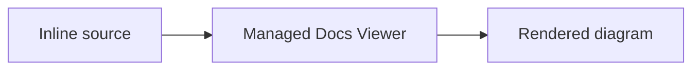
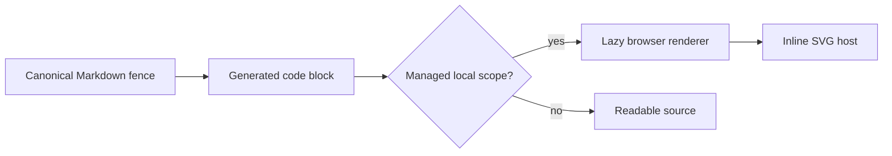

# Inline Mermaid Rendering Concept

## Purpose

Allow either managed local scope type to keep a small diagram directly inside its canonical Markdown and render it in Docs Viewer without creating separate `.mmd` source and SVG media files.

This is an extension of the shipped [Document Diagrams](/docs/?scope=studio&doc=d-20260719-123719-fb7565) workflow, not its replacement. Separate Mermaid source and published SVG remain the portable static-media path.

## Decision

Render fenced Mermaid when the active scope has `scope_type: local` or `scope_type: local_external`:

````text

````

The canonical Markdown fence is the durable authority. The generated document payload retains the ordinary `<pre><code class="language-mermaid">` representation, and the managed reader replaces that element with a rendered diagram after mounting the document.



Inline rendering creates no `.mmd` media item, published SVG, filename, media token, or inventory record.

## Scope Boundary

| scope type | settled inline policy | implementation status | supported diagram form |
| --- | --- | --- | --- |
| `local` | render in the managed reader | shipped | inline fence or Mermaid-to-SVG media |
| `local_external` | render in the managed reader | pending IMD-4 | inline fence or Mermaid-to-SVG media |
| `public` | do not render | shipped | published SVG media only |

External describes where the scope is stored, not a different ownership model, and no separate external-local trust capability is configured. Eligibility therefore follows the managed-local scope capability, not the repository versus external-local provider. The active browser scope configuration supplies the current type; do not infer it from a route name or physical path and do not add a per-scope feature flag.

An inline fence in a public scope remains readable source rather than triggering a browser dependency. Author guidance should direct public scopes to the existing `.mmd` to SVG workflow.

## Reader Contract

- Load the browser renderer only for an eligible managed local scope whose mounted document contains at least one Mermaid fence.
- Pin the browser `mermaid` package directly and exactly beside the existing CLI dependency. A feature-local sync command copies the upstream minified browser distribution and license into one tracked, versioned runtime location; the reader never imports from `node_modules` or a CDN.
- Keep one lazy loader promise and one initialized Mermaid instance per Docs Viewer application session. Every ordinary document mount runs a new targeted render pass over that mount's eligible fences.
- Render several fences sequentially with unique render identities and ignore late results from a superseded document mount.
- Keep initialization, strict security, HTML-label policy, and accessible source requirements aligned with the pinned repository renderer where practical.
- Contain a parse/render failure to the affected fence and leave its source visible with the message **Diagram could not be rendered. Mermaid source is shown below.** Associate the message with the code block and announce it politely without exposing a stack or large parser response in document content.
- Render after every ordinary document mount and avoid reprocessing an already rendered node.
- Do not turn the Markdown source editor into a separate diagram editor. Authors edit the fence directly with the rest of the document.

The shared document controller is the first host. Report details, review surfaces, embedded documents, or other places that mount `content_html` must not gain inline rendering accidentally; each needs explicit scope context before it can opt in.

All configured scopes whose active browser record has `scope_type: local` or `scope_type: local_external` are eligible through that direct rule. Studio owns the first proof document and acceptance review; Notes supplies the external-local parity proof in IMD-4. Do not hard-code either scope id, add a per-scope feature flag, or add proof content to Processing. An eligible scope with no Mermaid fence does not load the browser asset.

A successful render produces an adapter-owned diagram host containing inline SVG. That host may later receive the sibling [Diagram Detail View](/docs/?scope=studio&doc=d-20260720-120201-343f33) control, but inline rendering does not implement the control itself.

## Relationship To SVG Media

Use inline Mermaid when:

- the document is owned by either managed local scope type;
- keeping the diagram beside its explanation is more useful than a separately named asset;
- no static/public consumer currently needs rendered bytes.

Use canonical `.mmd` plus published SVG when:

- the scope is public;
- the diagram is reused, opened separately, or managed as scope media;
- deterministic static bytes are required outside the local viewer;
- publication or export has a proven need for a rendered artifact.

There is no automatic conversion between the two forms.

## Export Decision

Exports keep inline Mermaid inline.

- Source-faithful document packages preserve the exact Markdown fence.
- JSON or JSONL profiles that carry canonical Markdown preserve the same source.
- Static HTML export carries the generated Mermaid code block and does not invoke the CLI, add a browser Mermaid bundle, or manufacture SVG files. The exported page therefore retains readable source unless that export later gains an explicit rendering policy.
- Public publication continues to require SVG media; it does not silently convert managed-local inline diagrams.

Do not add per-export switches yet. A later reader-oriented export may pre-render inline Mermaid to SVG, while a source-oriented export should continue to preserve the fence. That distinction should be introduced only for a concrete consumer that cannot use the inline form.

## Boundaries

- No inline Mermaid runtime on public routes.
- No build-time conversion of inline fences.
- No automatic extraction into `.mmd`, SVG media, or Scope Media inventory.
- No migration of existing SVG-backed diagrams.
- No CDN dependency, arbitrary script execution, or HTML-enabled Mermaid labels.
- No export format matrix before a real consumer needs one.

## Settled Delivery Decisions

- `@mermaid-js/mermaid-cli` and direct browser `mermaid` use the same exact `11.16.0` version under `docs-viewer/build/mermaid/`.
- A checked upstream browser asset is the first implementation. Its current size is acceptable because it loads lazily and once; if measurement disproves that, stop and consider a small Mermaid-only bundle rather than introducing a general frontend bundler.
- Mermaid loads and initializes once per application session. Rendering remains mount-scoped and fence-scoped.
- A failed fence retains readable source plus the concise visible fallback defined above; technical detail belongs in the developer console.
- Every configured `local` or `local_external` scope is eligible; Studio retains the original proof content and Notes supplies the external-local parity proof.

The [delivery](/docs/?scope=studio&doc=d-20260720-102658-7de33d) records the shipped runtime and export boundary plus the pending IMD-4 external-local parity checkpoint. Until IMD-4 ships, the implementation still contains the original exact-`local` guard even though this policy correction is settled.
