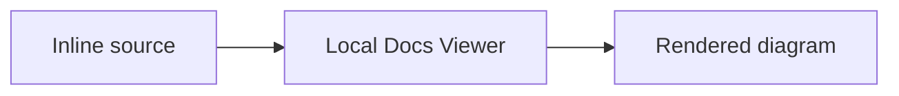

# Inline Mermaid Rendering Concept

## Purpose

Allow a repo-backed local scope to keep a small diagram directly inside its canonical Markdown and render it in Docs Viewer without creating separate `.mmd` source and SVG media files.

This is an extension of the shipped [Document Diagrams](/docs/?scope=studio&doc=d-20260719-123719-fb7565) workflow, not its replacement. Separate Mermaid source and published SVG remain the portable static-media path.

## Decision

Render fenced Mermaid only when the active scope has `scope_type: local`:

````text

````

The canonical Markdown fence is the durable authority. The generated document payload retains the ordinary `<pre><code class="language-mermaid">` representation, and the local reader replaces that element with a rendered diagram after mounting the document.

Inline rendering creates no `.mmd` media item, published SVG, filename, media token, or inventory record.

## Scope Boundary

| scope type | inline Mermaid | supported diagram form |
| --- | --- | --- |
| `local` | rendered in the local viewer | inline fence or existing Mermaid-to-SVG media |
| `local_external` | not rendered | published SVG media only |
| `public` | not rendered | published SVG media only |

Eligibility comes from the current browser scope configuration. Do not infer it from route names, repository paths, management mode, or whether source happens to be writable.

An inline fence in an unsupported scope remains readable source rather than triggering a browser dependency. Author guidance should direct those scopes to the existing `.mmd` to SVG workflow.

## Reader Contract

- Load the browser renderer only for an eligible local scope whose mounted document contains at least one Mermaid fence.
- Use a repository-versioned browser asset; do not load Mermaid from a CDN.
- Keep initialization, strict security, HTML-label policy, and accessible source requirements aligned with the pinned repository renderer where practical.
- Contain a parse/render failure to the affected fence and leave its source visible with a concise error state.
- Render after every ordinary document mount and avoid reprocessing an already rendered node.
- Do not turn the Markdown source editor into a separate diagram editor. Authors edit the fence directly with the rest of the document.

The shared document controller is the first host. Report details, review surfaces, embedded documents, or other places that mount `content_html` must not gain inline rendering accidentally; each needs explicit scope context before it can opt in.

## Relationship To SVG Media

Use inline Mermaid when:

- the document is owned by a repo-backed local scope;
- keeping the diagram beside its explanation is more useful than a separately named asset;
- no static/public consumer currently needs rendered bytes.

Use canonical `.mmd` plus published SVG when:

- the scope is public or external-local;
- the diagram is reused, opened separately, or managed as scope media;
- deterministic static bytes are required outside the local viewer;
- publication or export has a proven need for a rendered artifact.

There is no automatic conversion between the two forms in the first delivery.

## Export Decision

Initially, exports keep inline Mermaid inline.

- Source-faithful document packages preserve the exact Markdown fence.
- JSON or JSONL profiles that carry canonical Markdown preserve the same source.
- Static HTML export carries the generated Mermaid code block and does not invoke the CLI, add a browser Mermaid bundle, or manufacture SVG files. The exported page therefore retains readable source unless that export later gains an explicit rendering policy.
- Public publication continues to require SVG media; it does not silently convert inline local diagrams.

Do not add per-export switches yet. A later reader-oriented export may pre-render inline Mermaid to SVG, while a source-oriented export should continue to preserve the fence. That distinction should be introduced only for a concrete consumer that cannot use the inline form.

## Boundaries

- No inline Mermaid runtime on public or external-local routes.
- No build-time conversion of inline fences in the first delivery.
- No automatic extraction into `.mmd`, SVG media, or Scope Media inventory.
- No migration of existing SVG-backed diagrams.
- No CDN dependency, arbitrary script execution, or HTML-enabled Mermaid labels.
- No export format matrix before a real consumer needs one.

## Questions For Delivery

- Can the browser bundle reuse the currently pinned Mermaid version without coupling runtime loading to the CLI package layout?
- Should a local document with several diagrams load and initialize one shared renderer per document mount or per application session?
- What accessible visible fallback should accompany a contained render error?
- Does the first delivery need inline rendering in Studio only as proof, or every configured `local` scope immediately?

The [delivery](/docs/?scope=studio&doc=d-20260720-102658-7de33d) records the likely runtime, dependency, export-regression, and verification blast radius.
