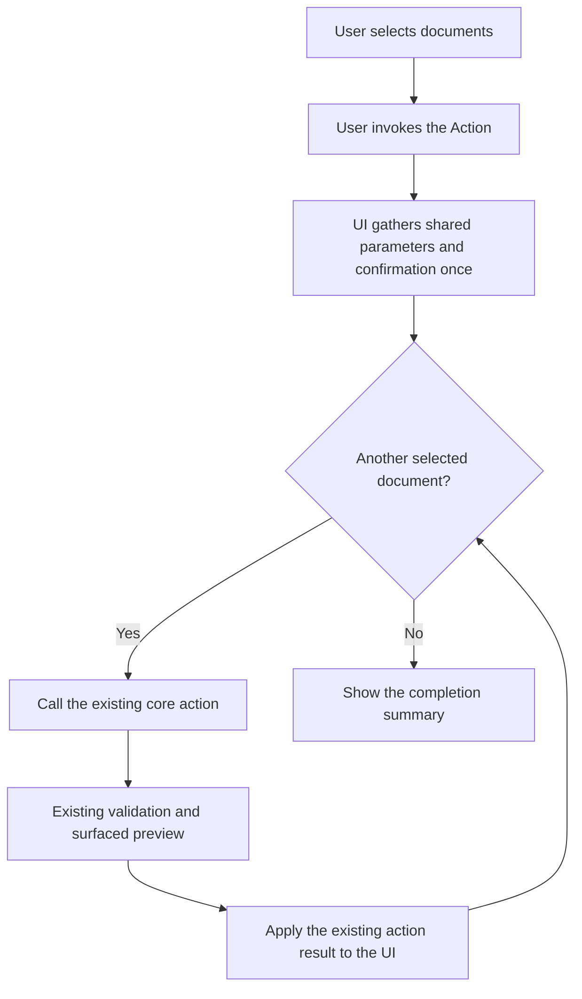

# Index Multiple Selection Consumer Assessment

## Decision Boundary

The checkbox-selection foundation is shipped. **Prepare package** is the first registered selection Action and now resolves checked ids as its only target; its compact workflow and route cutover remain gated in the active delivery.

An Action does not split into a current single-document workflow and a second checkbox-selection workflow. When an applicable existing document Action adopts checkbox selection, that becomes its only document-target model. The Action keeps its current id and label for one or many checked documents. With no eligible checked documents it is disabled; it never falls back to the displayed document or a context-clicked document.

The implementation remains deliberately small. The Action gathers any shared parameters and confirmation once, then loops over the selected document ids and calls the existing core action for each document. If that core action already accepts an explicit list, as package preparation does, the Action passes the checked ids directly instead. Existing validation remains authoritative, as does any preview already surfaced by the UI.

The selection owner supplies the raw checked document ids. Actions that operate on a set require one or more checked documents; Actions that operate on one document require exactly one. A delivery may define the smallest action-specific ordering or filtering needed to call the core action safely, but it must justify that exception with a concrete failure of the direct loop. For example:

- **Prepare package** may offer an include-descendants choice.
- **Move** may reduce checked descendants beneath checked ancestors to effective move roots.
- **Export** must decide exact documents, descendants, media, and output shape.
- **Delete** may need to avoid calling the core action for a descendant already removed with its selected parent.

There is no universal effective selection, new batch service, rollback layer, or general batch-action framework.

## Consumer Assessment

| Candidate | Selection relationship | Usefulness | Blast radius | Current disposition |
| --- | --- | --- | --- | --- |
| **Prepare package** | The checked ids become the existing package input; its compact workflow gathers profile, format, descendant, and confirmation choices once. | High. It removes the duplicate document picker and already uses an explicit selected-documents request shape. | Low to medium. Canonical documents are not mutated, but the browser composition and current route retirement need a complete cutover. | Chosen first. [Prepare Package UI Redesign Delivery](/docs/?scope=studio&doc=d-20260722-133457-e90e21) is in progress; Action registration is complete. |
| **Export** | The existing Action changes from scope targeting to the checked document set. Selecting every document provides the scope-wide case without retaining a second workflow. | Medium to high. Read-only output is a natural use of an assembled set. | Medium. Descendant, media, format, filename, and one-versus-many artifact semantics are not yet defined. | Early candidate after its product semantics are settled. |
| **Move** | The existing Action gathers the destination once, then repeats the existing move operation for the checked set. A one-document move uses the same selection workflow. | High. It removes repeated reparenting and gives one visible targeting model. | Medium to high. The direct loop must preserve existing destination validation and avoid flattening a selected parent/descendant pair. | High-value candidate once its single workflow is documented. |
| **Delete** | The existing Action confirms the checked set, retains any existing surfaced preview, then repeats the existing delete operation. A one-document deletion uses the same selection workflow. | Medium. Useful for deliberate cleanup, but less frequent than preparation, export, or movement. | High. The loop must make completed, failed, and unattempted documents clear and avoid a redundant child call after deleting a selected parent. | Defer until a safer Action has proved the selection-only pattern. |
| **Import** | Ordinary Import creates documents in the active scope; checked existing documents are not plural input. | Low as a selection consumer because the meaning is unclear. | High if overloaded to replace or mutate selected documents, and incompatible with the ordinary create-only import contract. | Ruled out. A future **Import under selected parent…** would be a distinct exactly-one action with its own need and delivery. |
| **Returned packages** | None. It opens a scope-owned inbox and operates on one complete prepared package. | Useful as a scope workflow, not as a selection consumer. | Selection would violate the whole-package validation and apply contract. | Excluded. Returned rows remain read-only evidence and never participate in index selection or partial apply. |

## One Target Model Per Action

- A document Action targets only the checkbox selection. It declares either one-or-more or exactly-one cardinality, and the same rule applies wherever the Action is placed.
- The displayed document, highlighted index row, focused row, and context-menu row never become fallback Action targets. Opening a context menu on an unchecked row does not silently retarget an Action.
- Scope Actions remain scope Actions: **Import**, **Publish**, **Rebuild**, **Settings**, **New**, show-non-viewable, and scope or sub-scope lifecycle Actions. **Returned packages** remains scope navigation into the whole-package inbox.
- A control intrinsically tied to the rendered document may remain a rendered-view or navigation control rather than a checkbox Action. Its user-facing document must name that target explicitly; it must not alternate between rendered-document and checkbox targeting.

Actions such as **Copy subtree**, **Edit metadata**, **Show**, **New child**, and **New sibling** require exactly one checked document if they remain document Actions. Set Actions such as **Prepare package**, **Export**, **Move**, and **Delete** require one or more. No `-selected` action ids, plural labels, compatibility aliases, or parallel workflows are introduced.

## Provisional Order

Prepare package is the chosen first delivery. The remaining entries retain their provisional value-to-risk order:

1. **Prepare package** — strongest reuse of an existing explicit-id workflow with no canonical document mutation.
2. **Export** — read-only, once its document/media/output semantics are explicit.
3. **Move** — high daily value, using one destination and repeated calls to the existing move operation.
4. **Delete** — last because repeated destructive calls need especially clear confirmation and result reporting.

Move may be chosen ahead of Export if its practical value justifies accepting the larger first delivery. Import and Returned packages do not enter this ordering.

## Delivery Gate For Any Approved Consumer

Keep the delivery proportional to a thin selection caller. Before implementation, it must identify:

- the existing Action id and label being retained;
- whether it requires one-or-more or exactly-one checked documents, with its disabled reason;
- removal of displayed-document and invocation-document fallback everywhere the Action is placed;
- the existing core action being reused;
- any parameters gathered once at the beginning;
- the direct iteration order and only the minimum filtering needed for correctness;
- where existing validation and any existing surfaced preview occur;
- the simple stop, continue, and result-reporting behavior when an individual call fails;
- the resulting selection state after completion or failure;
- focused evidence that one checked document and several checked documents use the same target and workflow, and that the repeated core calls work.

Do not add a parallel action id or workflow. Do not add a new batch service, batch validation model, atomic transaction, rollback system, generalized normalization, or cache/recovery framework unless a concrete requirement proves that the existing action loop cannot be correct without it. A sequential Action may partially complete; the UI must report completed, failed, and unattempted documents plainly rather than imply atomicity.

### Required Action Workflow Document

A confirmed delivery must link to a specific user-facing document for the action. Reuse an existing action document when it already explains the complete workflow; otherwise create one. The delivery cannot close until that document includes a clear Mermaid workflow diagram showing both the UI steps and the underlying action calls.

The following is the default shape. The confirmed action document replaces the generic labels with the real controls, parameters, preview, core action, failure behavior, and completion state:

This is also a documentation check: every delivered Action must have one identifiable user-facing document that explains what the user does and what the product does in response.

## Next Decision

Continue only through explicit checkpoints in the [Prepare Package UI Redesign Delivery](/docs/?scope=studio&doc=d-20260722-133457-e90e21). DSU-P2 compact-workflow composition is next; no other selection Action is approved.
