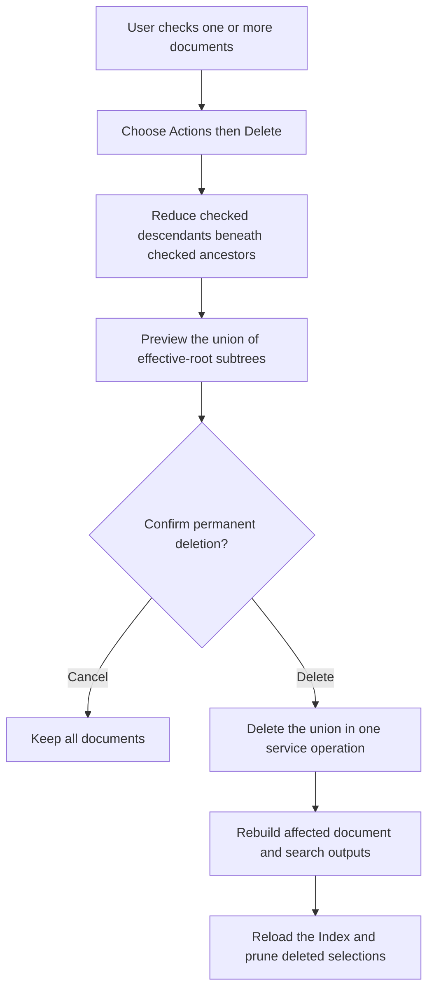
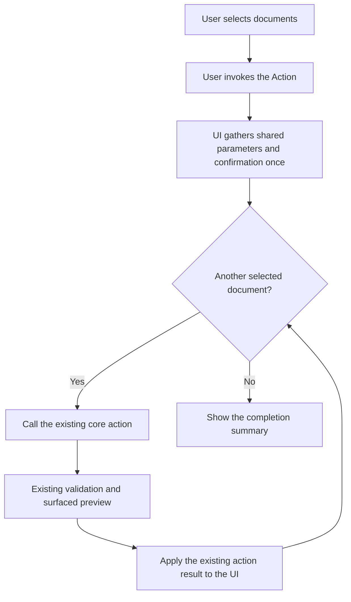

# Index Multiple Selection Consumer Assessment

## Decision Boundary

The checkbox-selection foundation is shipped. **Prepare package** and **Delete** now resolve checked ids as their only document targets. [Copy And Move Documents Between Scopes Delivery](/docs/?scope=studio&doc=d-20260723-223400-c7a1e4) approves the next checkbox cutover without starting its implementation. None of these Actions falls back to the displayed or context-clicked document.

An Action does not split into a current single-document workflow and a second checkbox-selection workflow. When an applicable existing document Action adopts checkbox selection, that becomes its only document-target model. The Action keeps its current id and label for one or many checked documents. With no eligible checked documents it is disabled; it never falls back to the displayed document or a context-clicked document.

The implementation remains deliberately small. An Action gathers shared parameters and confirmation once, then either loops over the checked ids or passes the explicit list to an existing set-aware operation. Existing validation remains authoritative, as does any preview already surfaced by the UI.

The selection owner supplies the raw checked document ids. Actions that operate on a set require one or more checked documents; Actions that operate on one document require exactly one. A delivery may define the smallest action-specific ordering or filtering needed to call the core action safely, but it must justify that exception with a concrete failure of the direct loop. For example:

- **Prepare package** may offer an include-descendants choice.
- **Move** may reduce checked descendants beneath checked ancestors to effective move roots.
- **Export** must decide exact documents, descendants, media, and output shape.
- **Delete** reduces checked descendants beneath checked ancestors, then previews and deletes the union of the effective-root subtrees once.

There is no universal effective selection, new batch service, rollback layer, or general batch-action framework.

## Consumer Assessment

| Candidate | Selection relationship | Usefulness | Blast radius | Current disposition |
| --- | --- | --- | --- | --- |
| **Prepare package** | The checked ids become the existing package input; its compact workflow gathers profile, format, descendant, and confirmation choices once. | High. It removes the duplicate document picker and already uses an explicit selected-documents request shape. | Low to medium. Canonical documents are not mutated, but the browser composition and current route retirement need a complete cutover. | Shipped first. [Prepare Package UI Redesign Delivery](/docs/?scope=studio&doc=d-20260722-133457-e90e21) is complete, with [Prepare Package](/docs/?scope=studio&doc=d-20260722-151224-7b61c4) as its user workflow. |
| **Copy / Move to scope** | Both Actions use checked ids. Copy optionally expands descendants and creates new identities; Move forces complete selected-parent subtrees and preserves identities before removing sources. | High. It directly supports transferring several unrelated documents without creating a temporary parent merely to satisfy subtree-only Copy. | Medium to high. Copy must generalise hierarchy projection; Move adds collision, inbound-link, target-first apply, source cleanup, and explicit incomplete-follow-through contracts. | Approved for a subsequent session. [Copy And Move Documents Between Scopes Delivery](/docs/?scope=studio&doc=d-20260723-223400-c7a1e4) is documentation-only at CMV-0. |
| **Export** | The existing Action changes from scope targeting to the checked document set. Selecting every document provides the scope-wide case without retaining a second workflow. | Medium to high. Read-only output is a natural use of an assembled set. | Medium. Descendant, media, format, filename, and one-versus-many artifact semantics are not yet defined. | Early candidate after its product semantics are settled. |
| **Same-scope group Move** | The existing hierarchy Action gathers one parent destination and applies it to checked effective roots. | Medium after cross-scope transfer. It would remove repeated same-scope reparenting. | Medium to high. It must preserve destination validation and avoid flattening checked parent/descendant pairs. | Still unapproved and separate from the planned cross-scope **Move to scope…** Action. |
| **Delete** | The existing Action sends the checked ids to one preview and one confirmed apply. Checked descendants beneath checked ancestors are not separate roots; the service deletes the union of effective-root subtrees once. | Medium. Useful for deliberate cleanup, including small groups of related research notes. | High but bounded. The modal reports the complete delete count and calls out additional unselected descendants without listing a partial sample. | Shipped as the second checkbox consumer. One checked document and many use the same Action and service contract. |
| **Import** | Ordinary Import creates documents in the active scope; checked existing documents are not plural input. | Low as a selection consumer because the meaning is unclear. | High if overloaded to replace or mutate selected documents, and incompatible with the ordinary create-only import contract. | Ruled out. A future **Import under selected parent…** would be a distinct exactly-one action with its own need and delivery. |
| **Returned packages** | None. It opens a scope-owned inbox and operates on one complete prepared package. | Useful as a scope workflow, not as a selection consumer. | Selection would violate the whole-package validation and apply contract. | Excluded. Returned rows remain read-only evidence and never participate in index selection or partial apply. |

## One Target Model Per Action

- A document Action targets only the checkbox selection. It declares either one-or-more or exactly-one cardinality, and the same rule applies wherever the Action is placed.
- The displayed document, highlighted index row, focused row, and context-menu row never become fallback Action targets. Opening a context menu on an unchecked row does not silently retarget an Action.
- Scope Actions remain scope Actions: **Import**, **Publish**, **Rebuild**, **Settings**, **New**, and scope or sub-scope lifecycle Actions. **Returned packages** remains scope navigation into the whole-package inbox.
- A control intrinsically tied to the rendered document may remain a rendered-view or navigation control rather than a checkbox Action. Its user-facing document must name that target explicitly; it must not alternate between rendered-document and checkbox targeting.

Actions such as **Edit metadata**, **New child**, and **New sibling** require exactly one checked document if they become checkbox Actions. Set Actions such as **Prepare package**, **Copy to scope**, **Move to scope**, **Export**, same-scope group **Move**, and **Delete** require one or more. No `-selected` action ids, compatibility aliases, or parallel single/multi-document workflows are introduced.

## Remaining Provisional Order

Prepare package and Delete are shipped. The remaining candidates retain their provisional value-to-risk order:

1. **Export** — read-only, once its document/media/output semantics are explicit.
2. **Same-scope group Move** — useful after the separate cross-scope Copy/Move delivery, using one parent destination and the existing hierarchy operation.

Same-scope group Move may be chosen ahead of Export if its practical value justifies the hierarchy-mutation scope. Import and Returned packages do not enter this ordering.

## Delete Documents Workflow

1. Enter selection mode in the Index and check one or more documents.
2. Choose **Actions → Delete**. The Action is disabled when nothing is checked and ignores the displayed or context-clicked document.
3. Review the total number of documents. Unchecked descendants are included and called out as additional descendants.
4. **Cancel** is initially focused. Confirming deletes the union once, rebuilds affected outputs, and reloads the Index so deleted ids are pruned from selection.

## Delivery Gate For Any Approved Consumer

Keep the delivery proportional to a thin selection caller. Before implementation, it must identify:

- the existing Action id and label being retained;
- whether it requires one-or-more or exactly-one checked documents, with its disabled reason;
- removal of displayed-document and invocation-document fallback everywhere the Action is placed;
- the existing core action being reused;
- any parameters gathered once at the beginning;
- the direct iteration order and only the minimum filtering needed for correctness;
- where existing validation and any existing surfaced preview occur;
- the simple stop, continue, and result-reporting behavior when an individual call fails;
- the resulting selection state after completion or failure;
- focused evidence that one checked document and several checked documents use the same target and workflow, and that the repeated core calls work.

Do not add a parallel action id or workflow. Do not add a new batch service, batch validation model, atomic transaction, rollback system, generalized normalization, or cache/recovery framework unless a concrete requirement proves that the existing action loop cannot be correct without it. A sequential Action may partially complete; the UI must report completed, failed, and unattempted documents plainly rather than imply atomicity.

### Required Action Workflow Document

A confirmed delivery must link to a specific user-facing document for the action. Reuse an existing action document when it already explains the complete workflow; otherwise create one. The delivery cannot close until that document includes a clear Mermaid workflow diagram showing both the UI steps and the underlying action calls.

The following is the default shape. The confirmed action document replaces the generic labels with the real controls, parameters, preview, core action, failure behavior, and completion state:

This is also a documentation check: every delivered Action must have one identifiable user-facing document that explains what the user does and what the product does in response.

## Next Decision

Prepare package and Delete are complete. Cross-scope Copy/Move is approved through CMV-0 but implementation is reserved for a subsequent session. Export and same-scope group Move remain unapproved.
