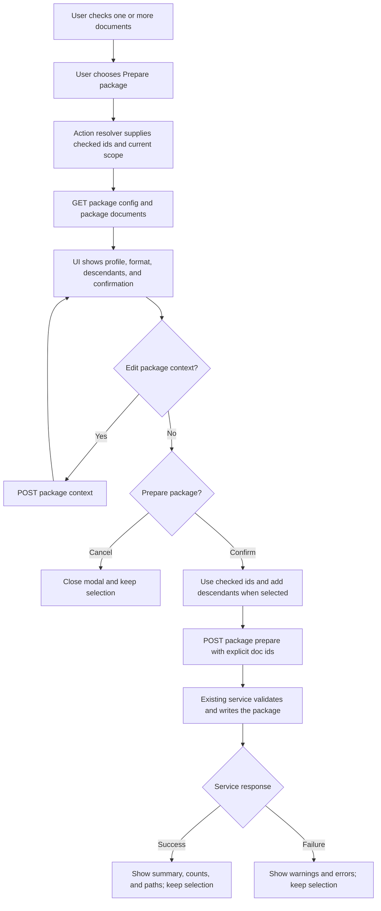

# Prepare Package UI Redesign Delivery

## Status And Outcome

**Complete. DSU-P0 through DSU-P4 are shipped and verified.** This is the first chosen delivery from the [Index Multiple Selection Consumer Assessment](/docs/?scope=studio&doc=d-20260722-000158-9c0f3e).

The existing **Prepare package** operation becomes one manage-only Action whose sole document target is the checkbox selection. It keeps one label and one workflow for one or many checked documents. The Action opens a compact options and confirmation modal in Docs Viewer, calls the existing package preparation service with explicit document ids, shows the existing result information, and leaves the checked selection intact.

The completed cutover removes the dedicated Prepare route and its duplicate document picker without a redirect, alias, or second workflow. Returned Packages remains on its current scope-owned route and is outside this delivery apart from removing any navigation link to the retired Prepare page.

## Accepted Product Contract

- **Prepare package** is enabled only in manage mode when one or more eligible documents are checked and the integrated package capability and workspace are available.
- The checked ids are the only document target. The displayed document, highlighted row, focused row, and context-menu row never act as fallbacks.
- The active Docs Viewer scope is the package scope. The workflow has no scope picker.
- The modal gathers profile, package format, content format when supported, include-descendants behavior, and confirmation once.
- The current package-document feed may be reused for eligibility and descendant expansion, but no second tree, filter, select-all control, or private selected-documents state is rendered.
- If descendants are included, the workflow expands the checked ids using the existing source-document hierarchy before sending the request. Profiles that require descendants keep that option fixed on.
- The existing `POST /docs/packages/prepare` request remains authoritative. It receives the current scope, profile and format choices, explicit `doc_ids`, and `select_all: false`; existing profile, source, selection, limit, path, metadata, and write validation remains unchanged.
- The optional package-context editor remains available from the compact workflow and continues to use `POST /docs/packages/context`.
- No new write-free preview is invented. Confirmation occurs in the options modal, and the existing result summary, counts, paths, warnings, and errors remain visible after the request.
- Cancel, success, and failure all preserve checkbox selection and selection mode. The user chooses **Clear** or **Done** explicitly.

## User And Action-Call Workflow

`GET package config`, `GET package documents`, `POST package context`, and `POST package prepare` above refer to the existing `/docs/packages/*` endpoints. The confirmed implementation keeps those endpoint and service contracts rather than creating a batch or modal-specific API.

## Ownership After Cutover

| Responsibility | Owner |
| --- | --- |
| checked ids and selection lifecycle | existing index-selection owner |
| Action identity, selection cardinality, and disabled reason | existing action-definition and resolver owner |
| Actions-menu placement and manage-route busy/result integration | existing management composition |
| profile options, descendant expansion, context editing, request composition, and result shaping | one focused document-package Prepare workflow |
| transport | existing document-package client |
| profile, source, selection, path, metadata, and write validation | existing document-package service |

The focused workflow may reuse current package helpers, but the main Docs Viewer must not mount the old route application or import its full route stylesheet. Delete route-only state, list rendering, shell markup, and helpers once the Action owns the complete workflow.

## Delivery Checkpoints

### DSU-P0 — Confirm The Boundary

- [x] Choose **Prepare package** as the first checkbox-selection consumer.
- [x] Keep one existing Action identity and one selection-only target model.
- [x] Record the complete UI and underlying request workflow.
- [x] Preserve existing package profiles, service validation, writes, metadata, workspace paths, and result behavior.
- [x] Exclude the Returned Packages inbox redesign and every other document Action.

### DSU-P1 — Register The Selection Action

- [x] Register **Prepare package** as a selection Action requiring one or more checked documents; do not add a `prepare-selected` id or label.
- [x] Replace the Actions-menu route link with the Action control and project clear disabled reasons for empty selection, unavailable capability, busy management state, or unavailable package workspace.
- [x] Resolve the checked ids through the selection owner with no active-document or context-row fallback.
- [x] Keep the current Returned Packages Action link and scope propagation unchanged.

Focused browser-module evidence proves empty, one-document, and multi-document resolution; active-document and context-row isolation; capability, workspace, and busy disabled reasons; the rendered Prepare Action button; and the unchanged Returned Packages link. DSU-P2 supplied the Action's compact workflow, and DSU-P3 then retired the old route.

### DSU-P2 — Compose The Compact Workflow

- [x] Extract the reusable profile, format, descendant, context, request, and result behavior from the dedicated Prepare route into one focused workflow.
- [x] Use the current scope and checked ids as explicit inputs; do not render a document list or construct a second selection store.
- [x] Reuse package config and document reads for supported options, eligibility, and descendant expansion.
- [x] Present profile, package format, supported content format, descendant behavior, optional context editing, and the final confirmation through the established management modal composition.
- [x] Submit the existing prepare payload and retain the existing result detail without adding a preview, batch service, or new server contract.
- [x] Keep selection unchanged after cancel, success, and failure.

The manage Action now loads one focused Prepare workflow. It receives a snapshot of the current checked ids and active scope, verifies them against the existing config and document feeds, expands selectable descendants when requested, and sends the unchanged explicit-id package payload. Its compact management modal contains only package options, optional context editing, confirmation, and result detail. Focused browser evidence covers request composition, fixed tree descendants, context save, success and failure detail, ready/busy state, cancellation, and unchanged selection.

### DSU-P3 — Cut Over And Retire The Route

- [x] Prove the Action owns the complete Prepare workflow before removing the old entrypoint.
- [x] Remove the dedicated Prepare shell, route boot mapping, route entry module, duplicate document picker, and dead route-only presentation code.
- [x] Remove or replace links to `/docs/packages/prepare/`, including the current Returned Packages route navigation, without adding a redirect or compatibility alias.
- [x] Move the existing `prepare-document-package` activity attribution from the retired route control to the manage Action without adding a second action id or duplicate registry entry.
- [x] Retain all `/docs/packages/*` JSON endpoints needed by the Action and Returned Packages.
- [x] Do not redesign the Returned Packages route or consolidate the wider package stylesheet in this slice.

The dedicated shell and route entry are deleted, the local service no longer serves their GET route, and the Returned page links only to itself and Docs Viewer. The shared package client and every JSON endpoint remain; only Prepare-specific selection rendering helpers and selectors were removed from the Returned-owned shared files. The single `prepare-document-package` activity entry now identifies the manage Action. Focused service evidence proves the retired browser URL returns 404 while the Prepare API and Returned page still respond successfully.

### DSU-P4 — Verify And Document

- [x] Prove Action targeting and disabled reasons as pure state, including one checked document, several checked documents, and no checked documents.
- [x] Prove option-to-request composition, descendant expansion, context save, selection preservation, and success/error result shaping in focused module tests.
- [x] Retain focused service/API evidence for profile validation, explicit `doc_ids`, JSON/JSONL output, metadata, workspace containment, and failures.
- [x] Use one focused manage-route browser smoke for Action registration, module wiring, modal-to-endpoint agreement, and ready/busy state; leave visual and tactile modal review to the user.
- [x] Create or promote one durable, action-specific **Prepare package** user document before closeout. It must explain the shipped workflow and include the final UI/action-call diagram; the broad Share Document Packages page and maintainer-facing profile page are not substitutes.
- [x] Update the feature parent and current package/endpoint owners, run `git diff --check`, and close only when the old Prepare route is absent and the Action works end to end.

Focused pure and browser-module checks cover empty, one-document, and multi-document targets; disabled reasons; option and explicit-id request composition; descendant expansion; context save; cancellation; unchanged selection; and success/error result shaping. The real manage-route smoke loads package config and documents from the service, opens the lazily wired compact modal, observes ready/busy transitions, and verifies its `POST /docs/packages/prepare` payload without writing package artifacts. Thirty-five focused service tests retain JSON/JSONL, profile, metadata, source-context, explicit-selection, workspace-containment, and failure evidence. [Prepare Package](/docs/?scope=studio&doc=d-20260722-151224-7b61c4) is the durable user workflow and final UI/action-call diagram.

## Explicitly Outside This Delivery

- Returned Packages inbox composition, returned-row behavior, review, publication, or apply changes.
- Export, Move, Delete, Copy subtree, metadata, creation, or other Action retargeting.
- New package profiles, formats, schemas, return contracts, workspaces, or service endpoints.
- A generic batch-action framework, action plugin system, package UI framework, or rollback layer.
- Public Docs Viewer, Docs Review route UI, portable core, Standalone Docs Viewer, and broad styling consolidation.

## Completion Gates

- one **Prepare package** Action consumes only checked document ids in the current scope;
- one-document and multi-document preparation use the same workflow;
- existing package validation, output, metadata, activity, and result contracts remain authoritative;
- the old Prepare route, duplicate picker, and every link to it are removed without aliases;
- Returned Packages remains operational and whole-package owned;
- the final action-specific user document and focused evidence are complete.

## Next Checkpoint

This delivery is complete. Do not begin the Returned Packages redesign or another selection consumer without its own explicit approval and bounded delivery contract.
