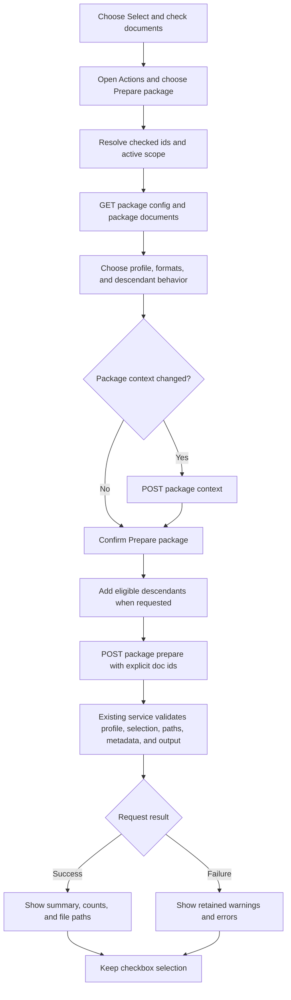

# Package Prepare

## Purpose

Use **Prepare package** to create one JSON or JSONL working package from documents checked in the manage index. Preparation reads the current Docs Viewer source and writes package artifacts; it does not change document source, metadata, or publication state.

## Prepare A Package

1. Open Docs Viewer in manage mode for the scope you want to package.
2. Choose **Select** in the index and check one or more documents.
3. Open **Actions**, then choose **Prepare package**.
4. Choose the profile, package format, and content format when the profile supports a choice.
5. Choose whether to include descendants. A tree profile keeps descendants on because it requires a complete subtree.
6. Optionally open **Edit package context** and update the task, response guidance, or field descriptions.
7. Choose **Prepare package** to confirm once.
8. Review the result summary, counts, file paths, warnings, or errors.

The checked documents remain selected after cancel, success, or failure. Choose **Clear** or **Done** when you want to change or leave selection mode.

## Selection Rules

- Checked document ids are the only package target.
- The displayed document, highlighted row, focused row, and context-menu row do not become implicit targets.
- One checked document and several checked documents use the same Action and modal.
- The active Docs Viewer scope is always the package scope; there is no second scope picker.
- **Include descendants** adds eligible descendants from the current source hierarchy before the request is sent.

## UI And Action Calls

The calls above use the existing `/docs/packages/*` endpoints. There is no batch-specific service, preview request, duplicate document picker, or separate Prepare browser page.

## Modal confirmation

When the action is completed, results are displayed in a modal.

`selected = exported + failed`

`truncated` is a subset of `exported`, while `skipped` is excluded before export.

| Field | Meaning |
| --- | --- |
| **selected** | Eligible documents accepted for processing, including requested descendants. This can exceed the number originally checked. |
| **exported** | Selected documents whose package records were built successfully. |
| **failed** | Selected documents whose records could not be built. Any failures prevent the package being written. |
| **skipped** | Requested documents excluded before record building—for example, not found, filtered as non-viewable, already having a summary under a relevant filter, or exceeding a configured document limit. Normal current UI use should usually show `0`. |
| **truncated** | Exported documents whose content was shortened by the profile limit. It counts documents, not characters. The current content profile limits content to 50,000 characters and adds `[truncated]` at a paragraph boundary. |

## When The Action Is Unavailable

**Prepare package** is disabled when no eligible documents are checked, document packages are unavailable, the package workspace is unavailable, or Docs Viewer management is busy. The Actions menu reports the current reason. Resolve that condition and use the same Action again.

## Package Output

A successful request reports the generated package, metadata, and context paths. The selected profile determines JSON or JSONL shape, included fields, supported format choices, and descendant requirements. [Documents Prepare Profiles](/docs/?scope=studio&doc=d-20260503-141500-98fa03) records those profile contracts.

For engine commands, output fields, validation details, and workspace requirements, use [Documents Package Preparation Script](/docs/?scope=studio&doc=d-20260503-150500-b0f1df). Returned packages remain a separate whole-package workflow documented by [Share Document Packages](/docs/?scope=studio&doc=d-20260718-155350-c84e62).
