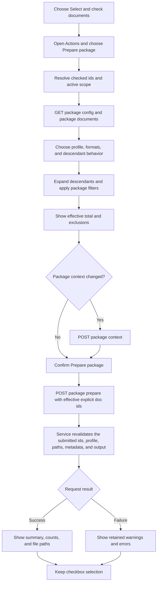

# Package Prepare

## Purpose

Use **Prepare package** to create one JSON or JSONL working package from documents checked in the manage index. Preparation reads the current Docs Viewer source and writes package artifacts; it does not change document source, metadata, or publication state.

## Prepare A Package

1. Open Docs Viewer in manage mode for the scope you want to package.
2. Choose **Select** in the index and check documents. Choose **Select all** to use the complete manage index, including collapsed and non-viewable documents.
3. Open **Actions**, then choose **Prepare package**.
4. Choose the profile, package format, and content format when the profile supports a choice.
5. Choose whether to include descendants. A tree profile keeps descendants on because it requires a complete subtree.
6. For **Document content**, optionally select **Only documents missing summaries** or clear **Include non-viewable documents**.
7. Review **Total documents to be prepared** and any included or excluded counts.
8. Optionally open **Edit package context** and update the task, response guidance, or field descriptions.
9. Choose **Prepare package** to confirm once.
10. Review the result summary, counts, file paths, warnings, or errors.

The checked documents remain selected after cancel, success, or failure. Choose **Clear** or **Done** when you want to change or leave selection mode.

## Selection Rules

- Checked document ids are the only package target.
- The displayed document, highlighted row, focused row, and context-menu row do not become implicit targets.
- One checked document and several checked documents use the same Action and modal.
- The active Docs Viewer scope is always the package scope; there is no second scope picker.
- **Select all** updates the checkbox-selection owner; it does not use the package service's `select_all` request mode.
- **Include descendants** adds eligible descendants from the current source hierarchy.
- The modal calculates one effective target in this order: checked-id eligibility, descendant expansion, non-viewable filtering, missing-summary filtering, then any configured maximum document count.
- Only that final effective id set is sent. The service revalidates it but never adds a document the modal excluded.

## Modal Filters And Total

**Document content** offers two package-composition choices:

- **Only documents missing summaries** is off by default. A missing summary is empty or whitespace-only source `summary` metadata.
- **Include non-viewable documents** is on by default. `viewable` controls public discovery; it does not prohibit package inclusion.

**Document tree** keeps descendants and non-viewable documents included and does not offer either filter.

The displayed total is the final effective target for the loaded source snapshot. The modal reports documents deliberately excluded by the filters and discloses included non-viewable documents. Those pre-submit exclusions are not result `skipped` documents. When no document remains, the modal reports why and disables **Prepare package**.

## When The Action Is Unavailable

**Prepare package** is disabled when no eligible documents are checked, document packages are unavailable, the package workspace is unavailable, or Docs Viewer management is busy. The Actions menu reports the current reason. Resolve that condition and use the same Action again.

## Package Output

A successful request reports the generated package, metadata, and context paths. The selected profile determines JSON or JSONL shape, included fields, supported format choices, and descendant requirements. [Documents Prepare Profiles](/docs/?scope=studio&doc=d-20260503-141500-98fa03) records those profile contracts.

For engine commands, output fields, validation details, and workspace requirements, use [Documents Package Preparation Script](/docs/?scope=studio&doc=d-20260503-150500-b0f1df). Returned packages remain a separate whole-package workflow documented by [Share Document Packages](/docs/?scope=studio&doc=d-20260718-155350-c84e62).

## UI And Action Calls

The calls above use the existing `/docs/packages/*` endpoints. There is no batch-specific service, preview request, duplicate document picker, or separate Prepare browser page.

## Result Counts

The result modal always orders document counts as:

1. `selected`
2. `exported`
3. `failed`
4. `skipped`
5. `truncated`

The invariants are:

`selected = exported + failed + skipped`

`truncated <= exported`

| Field | Meaning |
| --- | --- |
| **selected** | The effective ids submitted from the modal. For unchanged source state, this equals **Total documents to be prepared**. |
| **exported** | Selected documents whose package records were built successfully. |
| **failed** | Selected documents whose records could not be built. Any failures prevent the package being written. |
| **skipped** | Submitted documents which no longer exist or no longer satisfy an active filter when the service revalidates current source. |
| **truncated** | Exported documents whose content was shortened by the profile limit. It counts documents, not characters. The current content profile limits content to 50,000 characters and adds `[truncated]` at a paragraph boundary. |

### Failed

For the **failed** count, the most likely per-document causes are:

- A required field is empty—currently `doc_id`, `title`, and rendered `content` are required.
- The source document cannot be rendered into HTML.
- Rendered HTML cannot be converted into the requested Markdown or plain-text content.
- The source record and source document have drifted apart, so the selected document can no longer be resolved.
- Less commonly, a package-profile defect: unsupported field source or transform, invalid field mapping, or blank output path. These should normally be caught by profile validation first.

Each selected document either produces a record or increments `failed`; any record-building error prevents the package from being written. The error details should identify the document and cause. See [export_transforms.py](/Users/dlf/Developer/dotlineform/dotlineform-site/docs-viewer/services/docs_document_packages/export_transforms.py:344).

Some operation-level problems do **not** increment `failed`, because processing never reaches individual documents—for example:

- Package workspace missing or unwritable.
- Invalid profile or format.
- Unsafe output path.
- Metadata/output filename collision.
- Missing scope source root.
- Service or request failure.

Those appear as an overall preparation error, generally with zero document counts.

### Skipped

Modal exclusions occur before submission and are explained beside the total. They do not inflate `selected` or `skipped`.

After submission, the service applies the same active summary and viewability choices to current source. A document changed or removed after the modal snapshot remains part of `selected` but can become `skipped`; the service does not replace it or broaden the request.

Both current profiles set `max_documents` and `max_total_chars` to `null`, so there is no package-wide document or character limit. The active 50,000-character content limit per **Document content** record produces `truncated`, not `skipped`.
