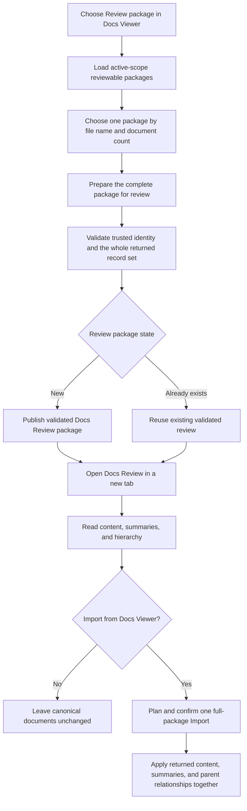

# Review Package UI Redesign Delivery

## Status And Outcome

**Planned. RPU-P0 is accepted; RPU-P1 is the next checkpoint.**

Replace the dedicated **Returned packages** route with one manage-only **Review package** Action and modal in Docs Viewer. The modal lists reviewable packages for the active scope, prepares one complete document-content package for Docs Review, and opens the resulting read-only review in a new tab.

The cutover retires package inspection, standalone summary and hierarchy reports, summary-only apply, hierarchy-only apply, and the Docs Review Import handoff. Full Docs Viewer Import becomes the single canonical apply path: returned content, summaries, and parent relationships travel and apply together as one whole package.

## Accepted Product Contract

- **Review package** is a manage-only Docs Viewer Action. The active Docs Viewer scope is its scope; there is no scope picker.
- The modal contains one table with **File name** and **Documents** columns. A table row selects one package, not documents inside it.
- Only trusted, active-scope packages whose profile supports return import appear. Unassigned files and export-only tree packages are not normal review choices.
- **Documents** is the number of records actually present in the staged package. Trusted preparation metadata remains part of whole-package validation but is not substituted for the returned record count.
- The modal has no package inspector, reconstructed document tree, profile/export detail panel, blocked export-only list, or document-row selection.
- The primary operation prepares the complete selected package for Docs Review. The service revalidates trusted scope, profile, export identity, prepared document membership, returned records, content, and hierarchy before publication.
- A newly prepared package produces an **Open in Docs Review** link to `/docs-review/?package=<package-id>` with a new-tab browser boundary.
- When the matching validated Docs Review package already exists, the operation succeeds as **Open existing review**. It does not overwrite, merge, rebuild, or version the existing package. An identity mismatch remains an error.
- Docs Review remains read-only. Returned summaries appear through document metadata and returned hierarchy through the review index tree.
- The visible Prepare profile label is **Document tree (export only)** when `supports_return_import` is false. The canonical profile id and name remain unchanged.
- Returned packages remain whole-package owned. No review or import flow accepts document-row selection, filtering, partial apply, or `record_indices`.

## Review And Import Workflow

Docs Review never starts Import. The user returns to Docs Viewer and opens its normal **Import** Action. Ordinary file and collection imports retain their current contracts; the reviewed returned-package path must preserve whole-package validation and confirmation rather than exposing per-document decisions.

## Ownership After Cutover

| Responsibility | Owner |
| --- | --- |
| Action placement, active scope, modal lifecycle, and busy/result state | Docs Viewer management composition |
| reviewable package list, actual document count, and selected package state | focused Review package workflow plus document-package service |
| trusted metadata and whole-package validation | existing returned-package service owners |
| validated review materialization and existing-package identity | existing Docs Review materialization owner |
| read-only content, summary metadata, and hierarchy display | Docs Review provider and shared reader |
| canonical content, summary, and parent writes | Docs Viewer Import planning and apply owners |

The modal may reuse package clients and modal primitives, but it must not mount the retired route application or retain a second route-shaped state owner.

## Delivery Checkpoints

### RPU-P0 — Confirm The Boundary

- [x] Rename the user operation from **Returned packages** to **Review package**.
- [x] Keep one package as the atomic target and remove document-row inspection and selection from the intended UI.
- [x] Make full document-content review the only review-materialization path.
- [x] Retire summary-only and hierarchy-only review and apply behavior.
- [x] Keep canonical mutation in Docs Viewer Import and Docs Review read-only.
- [x] Use **Open existing review** instead of an overwrite workflow.

Stop before RPU-P1 until implementation is explicitly approved.

### RPU-P1 — Project The Reviewable Package List

- [ ] Register **Review package** as a scope-owned manage Action and replace the route link with a modal workflow.
- [ ] Extend the returned-package listing contract with the actual validated record count needed by the table.
- [ ] Render only **File name** and **Documents**, with one selected package and no nested document projection.
- [ ] Exclude export-only tree packages from the review list and append **(export only)** to their profile label in Prepare.
- [ ] Preserve trusted active-scope partitioning, workspace availability, and fail-closed behavior.

### RPU-P2 — Prepare Or Open The Review

- [ ] Make full document-content review the only projected review action and remove the redundant review-action discriminator if it has no remaining consumer.
- [ ] Validate the complete selected package before materialization; the list count is not write authority.
- [ ] Publish a new validated Docs Review package through the existing materialization owner.
- [ ] Recognise a matching existing validated package as a successful idempotent result and return its safe package identity.
- [ ] Show **Open in Docs Review** or **Open existing review** as a new-tab link without exposing workspace paths.
- [ ] Keep mismatched, malformed, or incomplete packages as errors; do not add overwrite, merge, revision, or rollback machinery.

### RPU-P3 — Consolidate Review And Import Ownership

- [ ] Remove **Review summaries** and **Review hierarchy** plus their shared standalone Markdown report path when no consumer remains.
- [ ] Remove **Update summaries** and **Apply hierarchy** plus their endpoints, clients, confirmations, activity entries, and tests when no consumer remains.
- [ ] Remove the Docs Review **Import** button and its query-string handoff.
- [ ] Confirm the Docs Viewer Import plan carries returned content, summary, and `parent_id` changes together and preserves omitted fields according to the existing normalized import contract.
- [ ] Keep reviewed returned-package import whole-package owned; do not inherit ordinary per-record selection, skip, or partial-apply behavior.
- [ ] Keep Docs Review summary metadata, hierarchy rendering, canonical links, assets, and generated-output repair working.

### RPU-P4 — Retire The Returned Packages Route

- [ ] Prove the Action owns the complete review workflow before removing the old entrypoint.
- [ ] Remove the dedicated Returned Packages shell, route boot mapping, route entry module, inspector state, reconstructed-tree presentation, and dead route-only styling.
- [ ] Remove links and activity attribution that still name `/docs/packages/returned/` as a browser page.
- [ ] Remove the inspect endpoint and any review/apply endpoint surface made unreachable by RPU-P2 and RPU-P3.
- [ ] Retain only the package JSON services and validation/materialization owners used by Review package and Import.
- [ ] Return 404 for the retired browser route without a redirect or compatibility alias.

### RPU-P5 — Verify And Document

- [ ] Prove list partitioning, actual record counts, export-only exclusion, complete-set validation, and existing-review identity with focused service tests.
- [ ] Prove modal request/result shaping and the full-package Import boundary with focused pure or browser-module tests.
- [ ] Use one focused manage-route smoke for Action registration, lazy modal wiring, endpoint agreement, new-tab review URL, and ready/busy state.
- [ ] Retain focused Docs Review evidence for read-only controls, summary metadata, hierarchy projection, canonical links, and package reads.
- [ ] Update [Share Document Packages](/docs/?scope=studio&doc=d-20260718-155350-c84e62), Docs Review, Docs Import, endpoint, and development-checklist owners with shipped behavior only.
- [ ] Run `git diff --check` and close only when the modal and full Import work end to end and the old route/actions are absent.

UI copy, spacing, and tactile refinements may follow implementation findings inside these checkpoints, but they do not change the accepted ownership or whole-package contract.

## Explicitly Outside This Delivery

- New package profiles, returned-package schemas, external provider contracts, or workspace layouts.
- Partial package review or import, document-row selection, and summary-only or hierarchy-only modes.
- Docs Review editing, import, promotion, or general management authority.
- Overwrite, merge, version history, rollback, or deletion UI for persistent review packages.
- Changes to ordinary Word, HTML, Markdown, text, collection, media, or interactive-asset import behavior.
- Index-selection consumers, Export, Move, Delete, Copy subtree, or broad Docs Viewer styling consolidation.

## Completion Gates

- one **Review package** Action lists only reviewable packages for the active scope in a two-column modal;
- one selected package is validated and materialized as a complete Docs Review package;
- a matching existing package opens successfully without overwrite or duplicate output;
- Docs Review exposes content, summaries, and hierarchy but no Import action or canonical write authority;
- one full Docs Viewer Import owns returned content, summary, and hierarchy changes together;
- standalone summary/hierarchy review and apply paths are removed without aliases;
- the old Returned Packages route and inspector UI are absent while required package services remain;
- focused evidence and durable documentation describe the shipped workflow.

## Next Checkpoint

RPU-P1 is ready but not started. Begin only after explicit implementation approval.
