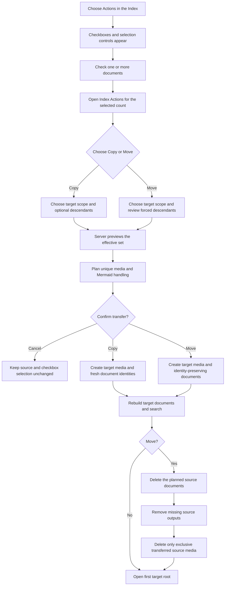

# Copy And Move Documents Between Scopes Delivery

## Outcome

The Index owns one checkbox **Actions** mode and menu. This button is only enabled when the checkboxes are enabled; after one or more documents are checked, the Actions menu offers the current document-selection consumers:

- **Prepare package…** prepares the checked set using its existing choices.
- **Copy to scope…** creates independent documents in another writable non-public scope and leaves every source unchanged.
- **Move to scope…** relocates canonical documents to another writable non-public scope and removes the sources only after the target write succeeds.
- **Delete…** previews and deletes the checked set using its existing forced-descendant contract.

Copy and Move include the unique source-scope media referenced by the effective document set. They rewrite those references to target-owned media, preserve registered media-build source such as Mermaid `.mmd`, and never leave a successfully transferred document dependent on media owned only by its former scope.

Future document-set Actions such as **Export…** belong in the same menu once their product contracts are approved. The app-level **Actions** menu beside the scope selector remains the home of scope-level operations rather than checkbox consumers.

All document-selection Actions use checked document ids as their only source target. None falls back to the displayed, active, highlighted, or context-clicked document or introduces a parallel singular workflow.

Rendered-document controls remain in the document toolbar.

## Settled Product Contract

### Shared Selection And Placement

- The existing Index **Select** entry and direct **Copy subtree to scope…** control are replaced by one Index-owned **Actions** entry point. Direct **Copy** and **Move** buttons are not added.
- When selection mode is inactive, **Actions** is disabled. It does not first open a menu in which every selection Action is disabled.
- When selection mode is active, **Actions** is enabled, but its menu items remain disabled until at least one document has been checked.
- **Done** exits selection mode and clears the checked set under the existing selection lifecycle, and disables the Actions button.
- Both Actions require one or more checked documents and use the same target-scope eligibility rules.
- Checked ids are the raw requested set. Parent/child overlaps are deduplicated before preview and apply.
- Each effective root is placed at the target scope root. A copied or moved document retains its direct parent only when that parent is also in the effective set; the delivery does not add a target-parent picker.
- Cancel and every pre-apply failure retain the checked set. Success opens the first resulting effective root in the target scope; the existing scope-change lifecycle then clears source-scope selection.

### Associated Media

- The transfer planner derives one unique media set from configured media references in the effective documents. It includes every source-scope-owned published `img`, `svg`, `files`, or `html` identity those documents reference, plus any registered canonical build source required to reproduce a referenced output.
- A referenced SVG produced from a configured Mermaid source transfers its same-basename `.mmd` source and is rendered through the target scope's registered Mermaid-to-SVG producer. It is not flattened to copied output bytes when editable canonical Mermaid source exists.
- The plan fails before confirmation when a referenced source artifact is missing or unreadable, when the target does not configure the required published media role or build relationship, or when required provider access is unavailable. Repository, external-local, and R2 source locations use the existing artifact-location boundary.
- A transferred media identity keeps its confined filename and relative identity while changing to the target scope's logical reference prefix. One identity referenced by several effective documents is transferred once and every in-set reference is rewritten to the same target identity.
- An absent target identity is created and byte-verified. An existing target identity may be reused only when its bytes, and any registered build source, exactly match; differing bytes are a blocking collision. Copy and Move never overwrite target media.
- External URLs and media owned by a different scope are not source-owned transfer inputs. They remain unchanged and are reported in preview as retained external dependencies rather than counted as transferred media. Unreferenced source media is not inferred or transferred.
- Copy leaves every source artifact unchanged. Move deletes a transferred source media identity only after target media, target documents, and both rebuilds succeed, and only when no source document outside the effective set still references it. Shared source media is copied to the target and retained for the documents left behind.

### Inline Mermaid At The Scope Boundary

- An inline Mermaid fence remains inline when the target has exact `scope_type: local`; the target's shipped lazy runtime can render the unchanged canonical source.
- When the target has `scope_type: local_external`, each valid inline Mermaid fence is materialized as target-owned canonical `.mmd` plus a produced and sanitized SVG. The target document replaces the fence with the SVG media token. Identities use the target document id and fence order, such as `<target-doc-id>-diagram-01.mmd` and `.svg`, so Copy's fresh document identities also give its converted diagrams fresh media identities.
- External-local conversion requires the target's registered Mermaid-to-SVG relationship and must render successfully during target preflight/apply. A missing relationship, filename collision, parse failure, inaccessible producer, or failed byte verification blocks the transfer without changing the source.
- Copy performs this conversion only in the target; the source document keeps its inline fence. Move removes the source only after the converted target media and document are durable.
- This delivery does not broaden inline runtime eligibility to `local_external`. There is no fundamental filesystem barrier—the manage composition already owns the checked browser runtime—but doing so would change the shipped external-scope reader and export boundary for all external documents while leaving the diagram non-portable outside that reader. Persistent Mermaid source plus SVG is the bounded, inventory-visible transfer contract.

### App level Actions

- The app-level **Actions** menu beside the scope selector contains scope/application operations such as **New**, **Import**, **Review package**, **Publish**, **Settings**, **Rebuild**, and scope lifecycle.

### Copy

- Copy uses the exact checked set by default.
- When at least one checked document has descendants, the modal offers **Include descendants of checked documents**. It is off by default.
- Enabling the option expands the effective set to the union of every checked document and its descendants. Overlapping checked subtrees are included once.
- Copy remains a create operation: every target document receives a fresh immutable id and filename, copy-time timestamps, and target-default viewability.
- Parent ids and Docs Viewer links are remapped only where both ends are in the effective set. Documents whose direct parent is not copied become target roots.
- Repeating Copy remains additive and never overwrites an existing target.

### Move

- Move always expands every checked document to its complete descendant subtree. Descendants are forced rather than optional so removing a selected parent cannot orphan children in the source scope.
- Checked descendants beneath another checked document are not separate move roots and are moved only once.
- Move is relocation rather than creation: it preserves each document's immutable id, matching filename, `added_date`, `last_updated`, and ordinary canonical metadata. Effective roots receive blank target `parent_id`; descendant relationships remain intact.
- A target document or differing media identity collision blocks preview. Move does not silently allocate a replacement identity, overwrite, merge, or become Copy.
- Docs Viewer links inside the moved set are rewritten to the target scope while retaining document ids. Known inbound Docs Viewer links from outside the moved set block the first delivery; automatic mutation of unselected documents is out of scope.
- Apply revalidates the complete source and media sets, target availability, collisions, and inbound-link gate before the first write. Target media, canonical files, and generated documents/search must succeed before source deletion begins.
- The cross-scope filesystem operation does not claim transactional rollback. If follow-through fails after target creation, the response must report the exact target and source state and retain a recoverable canonical copy; it must not claim a completed move.

## Delivery Boundary

In scope:

- one write-free server preview for explicit checked ids, transfer mode, target scope, and Copy's descendant choice;
- deterministic effective-set expansion, overlap removal, hierarchy projection, document/media counts, and confirmation;
- provider-neutral discovery and transfer of source-scope media referenced by the effective documents, including registered build-source dependencies, missing-artifact checks, exact-byte reuse, and blocking collisions;
- target-scope rewriting of transferred media and interactive-asset references;
- target-owned `.mmd` plus produced SVG conversion for inline Mermaid when the target is external-local;
- reuse of current Copy transformation, media inventory/storage and Mermaid producer boundaries, stale-plan receipt, target collision, coordinated rebuild, and activity-reporting owners where their contracts still apply;
- a new identity-preserving Move transformation and source-removal phase;
- one target-scope picker and one confirmation per Action invocation;
- one Index-owned checkbox Actions mode/menu, including migration of the shipped Prepare package and Delete consumers into that surface;
- a clean placement boundary between Index selection Actions, app-level scope Actions, and rendered-document controls;
- exact disabled reasons, busy state, cancel/failure selection retention, success navigation, and focused durable documentation;
- current public-source Copy service coverage plus local and external-local source coverage; all targets remain writable non-public scopes, and Move sources must also be writable and non-public.

Out of scope:

- same-scope reparenting, group drag/drop, sibling ordering, or replacement of the current `/docs/move` hierarchy mutation;
- a target-parent picker;
- public-scope targets;
- unreferenced media, arbitrary attachment inference, or automatic orphan cleanup outside the exact Move transfer set;
- fetching, vendoring, or rewriting external URLs or media owned by a third scope;
- target-media overwrite, a collision rename picker, general media migration, or provider selection in the modal;
- enabling runtime inline Mermaid for external-local or public scopes;
- overwrite, merge, synchronization, return, undo, rollback, versioning, or a generic batch-action framework;
- rewriting links or semantic references in documents outside the effective set;
- a broader visual redesign of the Index, toolbars, or existing modals;
- compatibility aliases or retained singular **Copy subtree** UI.

## Current Authority To Reuse

- `docs_subtree_copy.py` and `docs_subtree_copy_apply.py` own the shipped fresh-identity Copy planning, transformation, stale receipt, target-only apply, and rebuild boundary.
- `docs_media_inventory.py`, `docs_media_storage.py`, and the artifact-location adapters own scope-confined media reference discovery, provider-neutral reads/writes, byte verification, and location capabilities.
- `docs_mermaid_media.py` owns canonical `.mmd` to SVG production; the inline Mermaid adapter remains a local-reader concern and is not a persistent media source.
- `docs-viewer-action-definitions.js` owns document-selection eligibility, labels, and disabled reasons; the Index selection owner supplies checked ids without active/context fallback.
- `docs-viewer-copy-subtree-workflow.js` owns the current target choice and confirmation flow to be replaced, not duplicated.
- [Button Placement](/docs/?scope=studio&doc=d-20260716-204013-3be4e1) owns the current placement vocabulary and must record the final Index/app/document split at closeout.
- [Document Identity](/docs/?scope=studio&doc=d-20260715-094411-2b6e65) distinguishes Copy creation from identity-preserving Move.
- [Create And Import Endpoints](/docs/?scope=studio&doc=d-20260607-222033-78a47c) remains the durable endpoint owner.

These are responsibility seams to inspect at implementation time. The code and focused tests remain authoritative for exact module boundaries.

## Delivery Tracker

**Current state:** CMV-0 is complete. The product and safety contract is documented; no runtime or service implementation has started.

**Next checkpoint:** CMV-1, in a subsequent session and only after explicit approval to begin implementation.

### [x] CMV-0 — Define The Cutover Contract

- [x] Confirm one Index-owned action mode/menu containing separate Copy and Move commands with one checkbox target model.
- [x] Separate Index document-selection Actions from app-level scope Actions and rendered-document controls.
- [x] Define optional descendants for Copy and forced descendant closure for Move.
- [x] Keep Copy as fresh-identity creation and define Move as identity-preserving relocation.
- [x] Bring referenced scope-owned media, registered build sources, and external-local inline Mermaid conversion into the same transfer plan.
- [x] Define target-root placement, parent/child overlap, document/media collision, inbound-link, shared-media retention, failure, selection, and no-alias boundaries.

**Checkpoint evidence:** this delivery records the approved behavior beneath the existing feature parent while leaving implementation unstarted.

### [ ] CMV-1 — Generalize Write-Free Transfer Planning

- [ ] Accept one or more explicit checked ids, transfer mode, target scope, and Copy's `include_descendants` choice.
- [ ] Derive one deterministic effective set: exact checked ids or optional subtree union for Copy, forced subtree union for Move.
- [ ] Preserve direct included-parent relationships, project effective roots to target root, and remove parent/child overlap without duplicate records.
- [ ] Inventory and deduplicate every effective document's source-scope-owned media references, attach registered build-source dependencies, and classify retained external dependencies.
- [ ] Plan target prefixes, inline-Mermaid conversions, exact-byte reuse, missing artifacts, unsupported target roles/builds, and differing-byte collisions without writing or rendering into persistent locations.
- [ ] Return requested, effective-root, descendant, document, unique-media, converted-diagram, and retained-external counts plus a bounded stale-safe apply receipt; write nothing.
- [ ] For Move, preserve identities and timestamps, reject document/media collisions, identify source media shared with documents outside the effective set, require writable source and target roots, and block known inbound Docs Viewer links from outside the effective set.

**Checkpoint evidence:** leaf, disjoint multi-root, checked parent/child overlap, Copy descendant-off/on, forced Move descendants, shared media, missing media, build-backed SVG, inline conversion, provider, and collision cases produce complete repeatable plans without source or target writes.

### [ ] CMV-2 — Apply Selection-Aware Copy

- [ ] Generalize the existing Copy transformation from one complete subtree to the planned effective set without changing its fresh-identity contract.
- [ ] Remap included parents and copied-set viewer links, make parent-gap documents target roots, and rewrite only planned media references to target-owned identities.
- [ ] Transfer and byte-verify unique referenced media before writing documents; preserve registered Mermaid sources, produce their target SVGs, and convert inline fences only for external-local targets.
- [ ] Revalidate the receipt, create only absent target media and sources, reuse only exact matching media, refuse every overwrite, and rebuild the target once.
- [ ] Return created ids, effective-root mappings, target URLs, document/media/converted-diagram counts, viewer/media link-rewrite counts, retained external dependencies, and exact partial-target evidence after a write failure.

**Checkpoint evidence:** one or many checked documents copy with and without descendants, shared media transfers once, repeated Copy is additive without media overwrite, source bytes are unchanged, external-local inline diagrams become persistent media, and every target hierarchy and transferred artifact is loadable.

### [ ] CMV-3 — Apply Identity-Preserving Move

- [ ] Transform the planned forced-subtree union without allocating identities or replacing creation timestamps.
- [ ] Rewrite only moved-set viewer links and planned media references to the target scope and preserve every other canonical field not owned by target-root placement or external-local inline conversion.
- [ ] Revalidate the complete document/media plan and write, byte-verify, and rebuild the target before deleting any source document or media.
- [ ] Delete the exact effective document set, rebuild source generated documents/search with missing-id removal, then delete only transferred media no longer referenced by any remaining source document.
- [ ] Retain shared source media, report it separately from removable media, and record one bounded Move activity event only after required media cleanup completes.
- [ ] Report target-created/source-removed state precisely when later follow-through fails; add no hidden rollback, retry, or success claim.

**Checkpoint evidence:** successful Move leaves one canonical document identity and its exclusive media in the target; forced descendants prevent orphans; shared source media remains available to unselected documents; target failure leaves the complete source unchanged; later failure produces explicit recoverable evidence.

### [ ] CMV-4 — Build The Index Action Mode And Menu

- [ ] Retire the current Index **Select** entry and direct **Copy subtree to scope…** control without aliases or parallel paths; add one Index **Actions** entry point.
- [ ] Make its initial activation enter selection mode and immediately reveal checkboxes, selected count, **Select all**, **Clear**, and **Done** rather than opening an all-disabled menu.
- [ ] With one or more checked documents, project **Actions (N)** as the menu trigger for **Prepare package…**, **Copy to scope…**, **Move to scope…**, and **Delete…**; keep future **Export…** out until its product contract is approved.
- [ ] Resolve each menu item's cardinality, eligibility, and exact disabled reason from the shared Action definitions without active/context fallback.
- [ ] Keep app-level **Actions** beside the scope selector for scope/application operations only; keep rendered-document controls in the document toolbar.
- [ ] Use one compact modal per Action. Copy conditionally shows the descendant checkbox; Move shows forced descendant inclusion as read-only impact.
- [ ] Preview before confirmation, display the effective document and unique-media totals plus material conversions, retained external dependencies, blockers, and warnings; prevent duplicate submission and keep Cancel initially focused.
- [ ] Retain selection after cancel/failure and open the first target effective root after success.

**Checkpoint evidence:** zero-selection entry visibly teaches checkbox targeting; leaf and multi-selection invocations use the same menu and request shapes; the shipped Prepare package and Delete consumers still work; active/context documents never retarget an Action; and the old direct Copy path is absent.

### [ ] CMV-5 — Verify, Document, And Close

- [ ] Cover planner, transformation, apply, route, request, modal, action-definition, lifecycle, and real manage-route behavior at the lowest stable layers.
- [ ] Prove Copy identity replacement and Move identity preservation, hierarchy projection, overlap removal, document/media link behavior, build-backed and inline Mermaid handling, exact-byte reuse, shared-media retention, collisions, stale receipts, target failure, source-removal failure reporting, and target/source rebuild ids.
- [ ] Update this feature parent, endpoint documentation, Button Placement, Index Multiple Selection consumer status, and roadmap state to shipped.
- [ ] Run focused Python tests, browser module and route smokes, the complete Docs Viewer smoke profile, generated JSON/link checks, and `git diff --check`.

**Checkpoint evidence:** code and durable documents describe one current workflow, all focused and full-profile checks pass, and no singular Copy Subtree control, compatibility route, or stale targeting description remains.

## Workflow

## Done When

- One Index **Actions** control enters checkbox mode and, after selection, opens the selection-consumer menu; there are no direct Copy/Move buttons, active-document fallback, or retained singular Copy workflow.
- The Index menu owns checked-document consumers, app-level **Actions** owns scope/application operations, and rendered-document controls remain in the document toolbar.
- Copy defaults to exact checked documents and includes descendants only when requested.
- Move always includes all descendants of every checked parent and never orphans a source child.
- Copy creates fresh identities; Move preserves identities and blocks target collisions.
- Parent/child overlap is applied once, included hierarchy remains valid, and effective roots appear at target root.
- Every readable source-scope media artifact referenced by the effective documents is transferred once, byte-verified, and rewritten to a target-owned reference; missing, incompatible, or differing target media blocks before apply.
- Registered Mermaid source remains editable. Inline fences remain inline for local targets and become target-owned `.mmd` plus SVG media for external-local targets.
- Copy leaves all source media unchanged. Move removes only exclusive transferred source media and retains media still used by documents left behind.
- Preview is write-free and confirmation reports the effective document/media totals and material conversion or dependency impact.
- Move never removes a source document or media artifact before successful target creation/rebuild and never conceals an incomplete follow-through.
- Cancel/failure keeps selection; success opens the target and follows the existing scope-change selection lifecycle.
- Focused and complete Docs Viewer validation passes, and durable docs describe only the shipped final surface.
