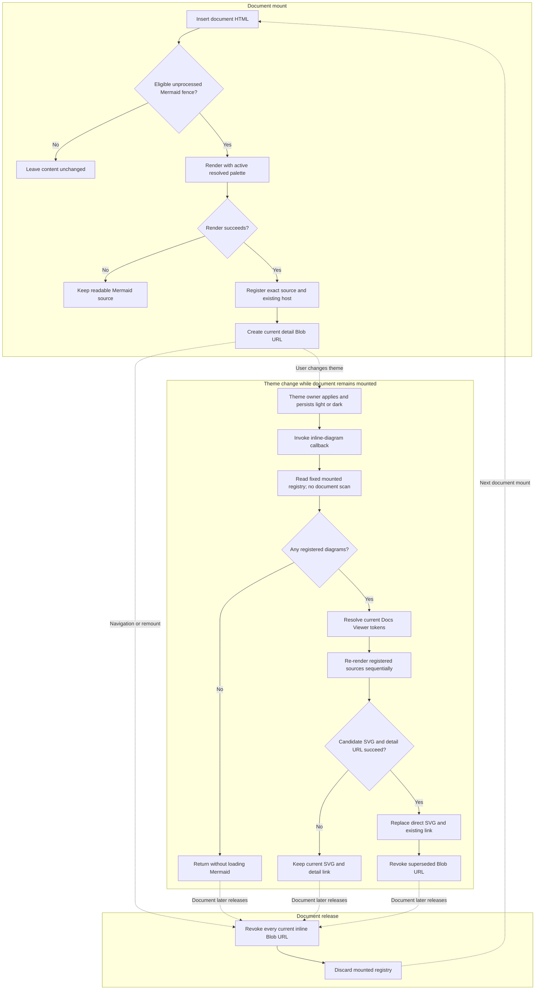

# Inline Mermaid Theme Synchronisation Delivery

## Status And Outcome

**In progress. IMT-P0 and IMT-P1 are implemented; IMT-P1 is at its review gate and IMT-P2 has not started.**

Managed-local inline Mermaid diagrams use the active Docs Viewer light or dark palette when first rendered and re-render in place when the user changes theme. Each successful re-render also replaces the diagram's temporary standalone detail resource, so **Open diagram in new tab** matches the displayed theme.

This is a bounded follow-up to [Docs Viewer Manage Theme Restoration](/docs/?scope=studio&doc=d-20260723-101224-e62173). It extends that feature's shared theme contract to one deliberately neutral surface without reopening the completed route, modal, or palette restoration.

[Mermaid Authoring And Publication](/docs/?scope=studio&doc=d-20260724-190603-860f64) owns the broader forward feature and treats this delivery as the managed-reader prerequisite for later public projection.

## Baseline Before Delivery

- `docs-viewer-theme.js` owns `html[data-theme]`, the existing `theme` storage value, and toggle projection.
- `docs-viewer-inline-mermaid.js` lazily loads the pinned Mermaid browser asset, initializes it once with `theme: "neutral"`, renders fences sequentially, and replaces successful fences with in-memory SVG hosts.
- `.docsViewer__diagram` has a hard-coded white background.
- The inline adapter does not retain the Mermaid source after replacing a fence.
- `docs-viewer-diagram-detail.js` serializes a successful inline SVG into one temporary `image/svg+xml` Blob URL when it registers the diagram and releases tracked resources with the mounted document.
- Persistent `.mmd` to sanitized SVG media remains a separate fixed-output workflow.

## Accepted Contract

### Lifecycle At A Glance

### Theme Ownership And Trigger

- `html[data-theme="light"|"dark"]` and the existing storage key remain the only user theme authority.
- The theme owner applies and persists the selected theme, updates its controls, and then invokes one composition-supplied inline-diagram theme callback.
- The theme module does not import Mermaid, inspect diagram markup, or acquire document lifecycle ownership.
- The callback receives the selected theme. The inline adapter reads the now-current computed Docs Viewer tokens from the viewer root and resolves them to concrete color values before calling Mermaid.
- Initial document rendering uses the active theme through the same palette resolver.
- A theme change with no registered inline diagrams is a no-op. It does not load Mermaid or create detail resources.

### Theme Variable Mapping

Use Mermaid's `base` theme with a small semantic seed rather than maintaining diagram-type CSS or overriding Mermaid's complete variable catalogue.

| Docs Viewer role | Mermaid seed |
| --- | --- |
| panel surface | `background` and the SVG canvas background |
| subtle panel surface | `primaryColor`, `mainBkg`, and ordinary node background |
| primary text | `primaryTextColor`, `textColor`, `nodeTextColor`, and `titleColor` |
| strong border | `primaryBorderColor`, `nodeBorder`, and ordinary actor or note borders |
| muted text | `lineColor`, `arrowheadColor`, and ordinary connector color |
| selection surface | `secondaryColor`, `activationBkgColor`, and note background |
| selection text | `secondaryTextColor` and note text |
| canvas surface | `tertiaryColor` and cluster background |
| viewer sans-serif stack | `fontFamily` |
| active light or dark mode | `darkMode` |

- Resolve token values after the theme attribute changes. Do not pass unresolved `var(...)` expressions into Mermaid's color calculations.
- Let Mermaid derive its diagram-specific flowchart, sequence, state, Gantt, pie, and related variables from this seed.
- Use the existing Docs Viewer semantic vocabulary first. Add a dedicated diagram token only when representative contrast evidence proves that the existing roles cannot express a required state.
- Source-authored Mermaid `style` and `classDef` declarations remain explicit author overrides.
- Replace the hard-coded white diagram surface with the same theme-aware background supplied to Mermaid.
- Ensure the resolved canvas color is carried by the inline SVG itself so its serialized standalone detail view does not depend on inherited Docs Viewer CSS.

### Registered Diagram Lifecycle

- On a successful initial render, the inline adapter retains one record containing the host and exact Mermaid source for the lifetime of the mounted document.
- Normal document mount and release maintain that registry. Theme switching does not rescan fences, reconcile document state, remount content, or rediscover diagrams from DOM selectors.
- During a theme change, document content and the registered diagram set are treated as fixed.
- Re-render registered diagrams through the existing sequential Mermaid queue in registration order.
- Initialize the Mermaid render configuration with the selected resolved palette immediately before each queued render.
- On success, replace only the direct SVG child of the existing inline host and reapply Mermaid bindings. Preserve the frame, viewport, detail control, reading order, and scroll ownership.
- On failure, retain the previously displayed SVG and detail target and report technical detail through the existing console-warning boundary.
- Do not add document-generation checks, connected-host checks, mutation observation, stale-result handling, debounce, or theme-request coalescing to this path.

### Detail Resource Refresh

- The detail adapter owns one current temporary Blob resource per registered inline host rather than an append-only set of theme variants.
- After a themed SVG succeeds, serialize that new direct SVG child, create its replacement Blob URL, update the existing detail link, and revoke the superseded URL.
- If replacement resource creation fails, retain the existing working detail link and displayed diagram.
- Ordinary document release still revokes every current inline resource.
- Persistent SVG detail links continue to open their stable served URLs and do not participate in theme refresh.

## Delivery Checkpoints

### IMT-P0 — Establish Theme Inputs And Composition

- [x] Add the smallest composition callback from the existing theme owner to the manage-owned inline Mermaid adapter without introducing a Mermaid dependency into the theme module.
- [x] Resolve the accepted semantic token seed from the active viewer root as concrete colors.
- [x] Change Mermaid initialization from a once-per-session neutral configuration to a once-per-queued-render configuration using the resolved `base` theme variables.
- [x] Preserve strict security, disabled HTML labels, lazy asset loading, sequential rendering, accessibility metadata, and readable-source failure behavior.
- [x] Make initial inline rendering use the active light or dark palette.
- [x] Stop for review after theme ownership, the exact variable seed, and light/dark initial rendering are proven.

**Review evidence:** the theme module callback, inline Mermaid module, and real manage-route smokes pass. A live remount of this document rendered without failure in both modes and produced distinct light and dark SVG palettes. The route smoke now uses this active delivery rather than the archived Inline Mermaid Rendering documents.

### IMT-P1 — Re-render Registered Diagrams And Refresh Detail URLs

- [x] Retain the exact source and host for each successfully mounted inline diagram.
- [x] Re-render only those registered diagrams when the theme callback runs; do not scan or reconcile the document.
- [x] Replace the SVG inside the existing host without rebuilding its frame, viewport, or control.
- [x] Make the diagram and serialized SVG canvas use the resolved theme background.
- [x] Give the detail adapter one refresh operation that atomically replaces the current inline Blob target and revokes the superseded target.
- [x] Retain the previous displayed SVG and detail URL when either re-rendering or replacement-resource creation fails.
- [x] Keep persistent SVG, public reader, review/detail surfaces, source mode, and exports unchanged.

**Review evidence:** the inline Mermaid and Diagram Detail View module smokes prove fixed-registry source reuse, sequential theme rendering, stable frame/viewport/control identity, one current URL per host, superseded URL revocation, ordinary release cleanup, no fence rescan, and rollback for render or detail-resource failure. The real manage route proves that changing theme replaces the displayed SVG and detail target while retaining accessible content and carrying the resolved canvas background into the standalone SVG. The isolated external-local route remains green.

### IMT-P2 — Verify And Close

- [ ] Extend the theme-module DOM harness to prove the optional callback receives normalized initial and changed themes without changing storage or toggle behavior.
- [ ] Extend the inline Mermaid DOM harness to prove concrete light/dark configuration, retained-source sequential re-rendering, in-place SVG replacement, no-diagram no-op behavior, and failure retention.
- [ ] Extend the detail-adapter harness to prove one current URL per inline host, successful replacement ordering, superseded URL revocation, replacement failure retention, and ordinary document cleanup.
- [ ] Inspect representative inline flowchart, sequence, and state diagrams in both themes, including explicit source styles and narrow horizontal overflow.
- [ ] Confirm **Open diagram in new tab** matches each displayed theme and retains title, description, responsive `viewBox`, and browser zoom.
- [ ] Confirm the public route still does not load the manage-owned Mermaid adapter or vendor asset and persistent diagram behavior is unchanged.
- [ ] Run the smallest affected module, route, browser, and repository-whitespace checks.
- [ ] Update the Theme Restoration parent and Mermaid Authoring And Publication owner with shipped evidence, then close this delivery.

## Verification Boundary

Permanent checks should protect theme callback wiring, semantic configuration, sequential source reuse, SVG replacement, Blob resource ownership, and public/manage composition. They should not assert exact palette values, complete generated SVG markup, incidental Mermaid selectors, or screenshots.

Browser review owns visual contrast across representative diagram types, the transition between themes, narrow overflow, explicit source styles, and standalone SVG presentation.

## Explicitly Outside This Delivery

- Changes to canonical Markdown, generated document payloads, source mode, or export formats.
- Theme-sensitive persistent SVG media, dual static outputs, or public Mermaid runtime delivery.
- A third, automatic, or system-following theme.
- A general event bus, mutation observer, document reconciliation layer, or diagram registry outside the inline adapter.
- A comprehensive Mermaid variable mirror or large CSS override sheet.
- Reworking Diagram Detail View placement, visibility, zoom, or interaction.
- Restyling unrelated Docs Viewer controls, modals, reports, or document content.

## Completion Gates

- newly mounted inline diagrams use the active Docs Viewer palette;
- changing light or dark mode re-renders only registered inline diagrams from retained source;
- the existing diagram host, frame, viewport, and control remain stable;
- each successful themed SVG has one matching current standalone detail URL and superseded URLs are revoked;
- no-diagram theme changes remain lazy and perform no Mermaid work;
- failures retain the last usable diagram and detail link;
- persistent SVG, public, source, review, and export boundaries remain unchanged;
- focused automated evidence and manual light/dark review pass.
