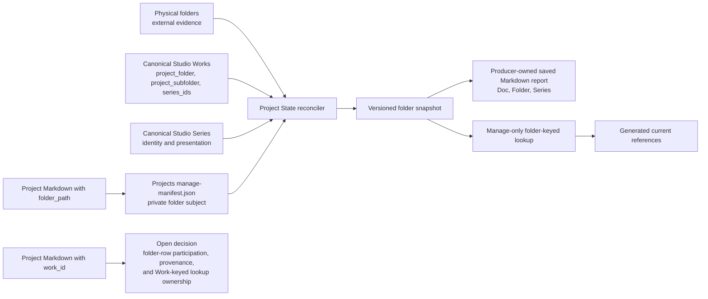

# Project State Concept And Architecture

## Purpose

Project State is a generated relationship artefact with downstream consumers. This document owns its meaning, row model, report projection, resolver lookup, refresh behavior, and failure boundary. Delivery details belong to [SSP-2](/docs/?scope=studio&doc=d-20260801-133318-15e8fa).

This is a retained component draft. Its settled model is the folder-centred report and folder-keyed lookup described below. How a Project document declaring `work_id` participates in folder rows, derivation evidence, or a Work-keyed lookup remains an explicit open decision shared with [Sub-Scope Publishing Concept And Architecture](/docs/?scope=studio&doc=d-20260802-194358-7717ee); this document does not select that behavior.

## Problem

Three independent inputs describe overlapping but non-identical parts of a project:

| input | meaning |
| --- | --- |
| current folders | physical evidence found in configured discovery roots or by exact declared contained-path checks |
| Project documents | user-maintained notes with optional `folder_path` or proposed `work_id`; folder-subject behavior is specified here while Work-subject behavior remains open |
| canonical Works and Series | historical source-path and Series-membership evidence owned by Studio |

Project State reconciles those inputs without synchronizing them. A folder remains the useful row key for the first management report. The separate Work-subject decision may later add typed derivation evidence or a focused Work-keyed product without requiring Work rows in that report.

## Planning Evidence Snapshot

On 2026-08-02, the planning snapshot contained 1,940 Works, all with at least one `series_id`. Their normalized folder evidence produced 145 folder rows: 143 related to one Series and two related to two Series. The Projects Manage manifest contained 241 documents, of which 229 declared `folder_path`; 16 folder paths were shared by multiple documents and the largest group contained 14 documents.

These values justify arrays on both sides of a folder row. They are current evidence, not schema limits or permanent invariants.

## Relationship Model

The settled folder-centred relationship is:



One normalized row represents one exact base-relative folder path. Its Project-document and Series sides are arrays. Works are traversed only while producing the row: every Work whose normalized source folder matches the row contributes all of its `series_ids`; the producer deduplicates those IDs and sorts them by canonical Series ID.

The current catalogue happens to contain no Work without a Series, but the producer must retain missing, malformed, or unknown Series membership as exceptional evidence rather than silently dropping it.

The Project State snapshot is not the existing Projects Manage manifest. It consumes that manifest and publishes its own versioned generated model. An illustrative row is:

```json
{
  "folder_path": "projects/nerve",
  "folder_state": "present",
  "documents": [
    {
      "scope": "dotlineform",
      "sub_scope": "projects",
      "doc_id": "d-example",
      "title": "Nerve"
    }
  ],
  "series": [
    {
      "family": "catalogue",
      "target_type": "series",
      "target_id": "026"
    },
    {
      "family": "catalogue",
      "target_type": "series",
      "target_id": "105"
    }
  ]
}
```

The exact field names and state vocabulary are bounded SSP-2.1 implementation decisions reviewed at that step's checkpoint. The structural commitments are the normalized folder key, `documents[]`, `series[]`, explicit folder state, generation metadata, and separate exceptional records for evidence that cannot form a valid folder row.

## Open Work-Subject Decision

The architecture intentionally leaves three related questions unanswered until the product choice is made:

- whether a Project document declaring `work_id` appears in the folder row derived from that Work;
- whether Project State retains the direct or indirect association path as explicit provenance; and
- whether Project State produces a Work-keyed focused lookup or another bounded producer owns it.

SSP-1 may project the normalized Work subject and generate the subject-to-documents association without answering these Project State questions. SSP-2 and SSP-3 must not infer an answer from field names, the visible folder report, or convenient existing data flow.

## Row Coverage And Ordering

The row set is the union of:

- normalized folders found in configured Project discovery roots;
- exact valid `folder_path` values declared by Project documents, including contained prospective or missing targets; and
- normalized Work source folders, including catalogue evidence whose current folder is missing.

Rows sort by normalized folder path. Documents sort by normalized title then `doc_id`. Series sort by canonical Series ID. A Project document without `folder_path` appears in an unlinked-document exception set and in the report with empty Folder and Series cells. Malformed paths and incomplete catalogue evidence remain explicit exceptions.

## Saved Docs Viewer Report

Project State is a persistent generated Markdown document with one stable `doc_id` in scope `dotlineform`. It is not a dynamic report module and does not run merely because the document opens. Opening shows the last successfully saved snapshot immediately.

Running or explicitly refreshing Project State computes one complete generation, validates its outputs, updates the saved Markdown source, publishes the matching relationship snapshot and resolver lookup, and rebuilds the exact report document. The durable Markdown is a producer-owned generated artefact rather than human-authored canonical truth, so a successful generation replaces its body. SSP-2.2 implements the smallest clear ownership marker and management presentation and reviews them at that step's checkpoint.

The primary report is a three-column table with one row per folder:

| Doc | Folder | Series |
| --- | --- | --- |
| one or more exact Project-document links | one validated local-folder link | one or more Series links |

Multiple links remain inside their cell. Existing folders use the `dlf-local:` activation contract; missing or invalid folders render as non-activating evidence. Project-document links use exact `{scope, sub_scope, doc_id}` targets. Series cells use current catalogue Series labels and routes when the report is generated.

Empty cells show concise states such as no document, missing folder, or no Series. Generation time, freshness, counts, and exceptional evidence may appear above or below the table without adding more relationship columns. The saved Markdown remains readable in Source, ordinary editors, exports, bookmarks, and Docs Viewer search.

## Resolver Lookup

The settled Manage-only Project lookup is generated from the same normalized folder rows. Its accepted subject is an exact folder key, and its declared result groups are:

```text
folder -> Series[] + Project documents[]
```

It does not publish catalogue URLs or Series titles as parallel canonical truth. Each Series item carries the semantic identity `(catalogue, series, canonical id)`. SSP-3 passes that identity through the existing Semantic Tokens target lookup and link projector, producing one resolver-derived semantic usage row for every rendered Series link.

Project-document result items retain exact Docs Viewer target identity and folder results retain the validated local-link contract. Resolver expansion reads one keyed row and never scans folders, manifests, Works, Series, tags, or another relationship registry. Work-subject lookup behavior remains governed by the open decision above.

## Full Refresh

A full run reads all three inputs and replaces the complete generation. It is required when the snapshot is missing, corrupt, version-incompatible, explicitly refreshed, or cannot be updated from trusted before/after evidence. Direct Finder changes become visible on the next run; no filesystem watcher is introduced.

Opening the saved report is not a refresh trigger. This distinction is deliberate: persistence gives immediate access to the last result and keeps a failed or unavailable scan from replacing useful prior evidence.

## Targeted Follow-Through

Known successful mutations may update affected folder rows and then regenerate the compact saved report from the updated snapshot:

| mutation evidence | Project State effect |
| --- | --- |
| Work create/delete | recompute affected folder-to-Series membership |
| Work `project_folder` or `project_subfolder` | recompute old and new folder rows |
| Work `series_ids` | recompute the affected folder's `series[]` union |
| Work `title`, `project_filename`, status, dates, or unrelated metadata | no relationship change |
| Project document create/delete or `folder_path` change | recompute old and new folder rows plus unlinked exceptions |

The Studio integration remains a read-only post-commit observer. It consumes exact committed before/after records and writes only derived Docs Viewer state. Follow-through failure never rolls back or repeats the canonical mutation.

Series title or route presentation remains owned by the catalogue and Semantic Tokens target projection. A Series title change does not change the Project lookup relationship; the saved report receives the current label on its next full run unless a later delivery explicitly adds a narrow presentation-only refresh hook.

## Generation And Failure

Report source, relationship snapshot, and resolver lookup carry one generation identity. SSP-2.1 and SSP-2.2 implement staging, validation, commit order, and exact-build failure behavior within their current owners; their step reviews must prove that consumers never treat a mixed generation as complete.

If production or follow-through fails, the last complete generation remains readable and is marked stale with the failure reason. Source mutations remain committed. Project State never performs repair, retries the originating mutation, or silently falls back to a live scan during Resolver Token expansion.

## Downstream Contract

SSP-3 consumes only the versioned focused lookup and Semantic Tokens projection. It does not depend on the saved report's Markdown layout. SSP-7 Project Media Audit may reuse the generated-document lifecycle, but it does not enter the Project State snapshot or lookup.

## Not In Scope

- Work-level rows in the first visible report;
- Work-subject Project State and Resolver behavior until the open decision above is resolved;
- image discovery, missing-image analysis, or primary-image auditing;
- automatic repair, folder synchronization, continuous watching, or recursive resolution;
- public Project State data or local-folder activation; or
- retirement of the current Studio image-audit route and Markdown output, which belongs to SSP-7.
