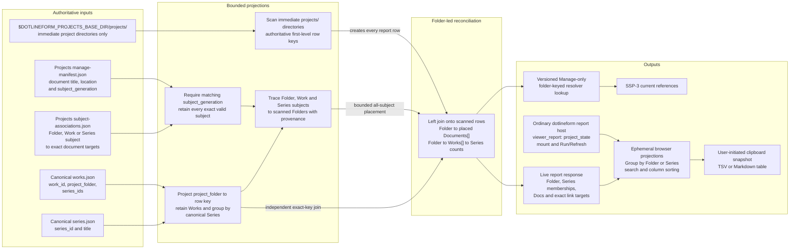

# Project State Concept And Architecture

## Purpose

Project State is a local Docs Viewer report over a server-produced relationship result, with a separate generated lookup for downstream consumers. This document owns its meaning, row model, report projection, resolver lookup, refresh behavior, and failure boundary. Delivery details belong to [SSP-2](/docs/?scope=studio&doc=d-20260801-133318-15e8fa).

All private working documents may remain together in the external-local `dotlineform/projects` sub-scope. A document may declare `folder_path`, `work_id`, `series_id`, or no subject under the shared authoring convention. Project State retains every valid exact subject, then places the document into scanned real-folder rows through the declared Folder, the canonical Work's first-level `project_folder`, or the first-level Folders containing current member Works of the declared Series. The Project State Work projection remains limited to `work_id`, `project_folder`, and `series_ids`; Studio catalogue/media retains `project_subfolder`, `project_filename`, and exact media resolution.

## Problem

Four independent inputs describe overlapping but non-identical parts of a project:

| input | meaning |
| --- | --- |
| current folders | physical evidence found by scanning `$DOTLINEFORM_PROJECTS_BASE_DIR/projects/` only |
| Project documents | private user-maintained notes whose exact Folder, Work, or Series subject can be traced to zero or more scanned real Folders through current canonical relationships |
| canonical Works | exact `work_id`, first-level `project_folder`, and current `series_ids` |
| canonical Series | grouping and presentation context for the matched Works |

Project State reconciles those inputs without synchronizing them. The scanned real-folder inventory is authoritative for the primary row set. Canonical Works join those rows by exact normalized `project_folder`; documents then reach only established rows through exact Folder, Work, or Series relationships. Documents never establish Folder or Work identity, and their projected placement never rewrites their declared subject. Physical file enumeration and draft/published distinctions do not enter the Work count.

## Planning Evidence Snapshot

On 2026-08-02, the planning inventory contained 206 immediate project directories. Canonical Works matched 144 of them: 142 related to one Series and two related to two Series. The Projects Manage manifest contained 241 documents, of which 229 declared `folder_path`; 16 folder paths were shared by multiple documents and the largest group contained 14 documents.

These values justify arrays on every relationship side of a folder row. The two observed multi-Series folders also provide live acceptance examples for the alternate Series-first browser projection; their exact paths belong in delivery evidence rather than this durable contract. The values are current evidence, not schema limits or permanent invariants.

## Relationship Model

The settled folder-centred relationship is:



One normalized row originates from one immediate project directory established by the current scan. Nested directories remain internal project contents. The producer first joins zero or more canonical Works using the exact projection `projects/<normalized project_folder>`, then derives current Work-to-Folder and Series-to-distinct-Folders indexes. A Folder-subject document reaches its exact key, a Work-subject document reaches its Work's Folder, and a Series-subject document reaches every scanned Folder containing a current member Work. Several member Works may establish the same Series placement, but one document appears only once per Folder. Project State reads only `work_id`, `project_folder`, and `series_ids` from each Work; Studio catalogue/media retains every nested media-location field. A Work belonging to more than one Series contributes once to each applicable membership count, so Series counts do not imply a unique sum. The browser projects exact Series links without presenting those counts.

The current catalogue happens to contain no Work without a Series, but the producer must retain missing, malformed, or unknown Series membership as exceptional evidence rather than silently dropping it.

The live Project State response is not the existing Projects Manage manifest. It consumes that manifest and returns its own normalized report rows. The same successful reconciliation publishes the focused lookup required by SSP-3. An illustrative row is:

```json
{
  "folder_path": "projects/nerve",
  "folder_state": "present",
  "documents": [
    {
      "scope": "dotlineform",
      "sub_scope": "projects",
      "doc_id": "d-example",
      "title": "Nerve",
      "declared_subject": {"kind": "series", "key": "026"},
      "applicable_series_ids": ["026"]
    }
  ],
  "works": [
    {
      "family": "catalogue",
      "target_type": "work",
      "target_id": "00123",
      "series_ids": ["026"]
    },
    {
      "family": "catalogue",
      "target_type": "work",
      "target_id": "00124",
      "series_ids": ["105"]
    }
  ],
  "series": [
    {
      "family": "catalogue",
      "target_type": "series",
      "target_id": "026",
      "work_count": 1
    },
    {
      "family": "catalogue",
      "target_type": "series",
      "target_id": "105",
      "work_count": 1
    }
  ]
}
```

The historical SSP-2.1 producer returned `docs_project_state_report_v1` and `docs_project_state_folder_lookup_v1`; their `documents[]` contained only exact Folder-subject matches. SSP-2.5 introduces `docs_project_state_report_v2` and `docs_project_state_folder_lookup_v2` rather than changing that meaning in place. The current ordered row retains the scanned `folder`, placed `documents[]` with exact declared-subject and applicable-Series provenance, semantic `works[]` with current `series_ids`, canonical `series[]` with exact `work_ids` and `work_count`, `series_issues[]`, distinct matched-Work count, distinct placed-document count, total document-placement count, and explicit reconciliation/document/Series states under one generation identity.

The server returns one complete versioned Project State JSON response for each mount or Run/Refresh. Its envelope contains the generation identity, run time or generated time, bounded diagnostics, and the complete ordered row array. `matched_document_count` counts distinct documents reaching at least one scanned Folder; a separate placement count records total Folder-row appearances when a Series spans Folders. Each row carries the typed values needed to render the three columns, activate exact links, select provenance-correct documents for Folder/Series projection, derive one distinct matched-Work count, and perform deterministic browser sorting. The browser never joins the Projects manifest, associations, Works, Series, or filesystem itself.

This response is a live presentation product rather than a persisted JSON file. It may include current document and Series labels and exact link targets because those values belong to the report projection. The separately persisted resolver lookup at `var/docs/project-state/folder-lookup.json` retains semantic identities and exact memberships under a current/stale status while catalogue and document presentation keep their existing owners.

## Collection Boundary

Project State consumes valid Folder-, Work-, and Series-subject documents from `dotlineform/projects`. Folder placement requires an exact scanned `projects/<project-directory>` key. Work placement requires the exact canonical Work and its first-level `project_folder`. Series placement requires at least one current canonical member Work in a scanned Folder. A valid assignment elsewhere under `$DOTLINEFORM_PROJECTS_BASE_DIR/`, no-subject document, unknown catalogue identity, Series with no placeable Work, malformed declaration, or conflicting declaration creates no row and receives no guessed placement.

Work/Series front matter remains optional exact document-level authoring metadata. Project State uses current catalogue relationships only to place the document in existing real-folder rows; it does not turn a Work document into a Series document, a Series document into member-Work documents, or any related link into public `doc_url[]` reverse association evidence.

## Row Coverage And Ordering

The primary row set contains only immediate project directories established by scanning `$DOTLINEFORM_PROJECTS_BASE_DIR/projects/`. Nested directories remain contents of their immediate project, while the base root and sibling trees retain their existing owners. A Project-document declaration, canonical Work path, or physical folder outside that immediate-child inventory cannot establish a Project State row.

For each scanned row, the producer joins Work row keys derived only from canonical `project_folder`, then places exact valid document subjects through the resulting Folder/Work/Series relationships. A Work recorded at `project_folder: wa` and `project_subfolder: ink` therefore joins `projects/wa`; Project State ignores `project_subfolder`, then its `series_ids` contribute to that row's Series counts and document placement provenance. This yields the fully reconciled state plus the three useful gaps: documents without Works, Works without documents, and real folders with neither. Recorded document or Work keys that do not reach a scanned real Folder belong to bounded unmatched diagnostics or a separate reverse-reconciliation report rather than Project State rows.

Rows sort by normalized real-folder path. Documents sort by normalized title then `doc_id`; Works and Series sort by canonical ID. One document is deduplicated by exact target once per Folder even when several Series member Works establish that placement. None, malformed, conflicting, unknown, and currently unplaceable subjects remain SSP-1 or bounded relationship evidence and do not become Project State rows.

## Embedded Docs Viewer Report

Project State uses the existing Docs Viewer report-host mechanism rather than introducing generated Markdown or another reporting system. One ordinary human-authored document in scope `dotlineform` declares `viewer_report: project_state` and `viewer_report_access: local`. Its stable `doc_id`, title, explanatory Markdown, index placement, bookmark behavior, and Source view remain ordinary document concerns; the report module mounts beneath that content.

The shipped report is registered only in the Manage report registry. The Docs management service owns `POST /docs/project-state`, delegates reconciliation and lookup publication to the Project State producer, and returns the matching live report and lookup products. The focused browser module owns automatic mount, explicit Run/Refresh, the two bounded Folder/Series projections, visible-text search, deterministic column sorting, exact link activation, pure TSV/Markdown serialization, clipboard initiation, and current-run busy, empty, and error presentation.

Mounting the report automatically runs one fresh server-side reconciliation. The module shows a running state, renders the returned Folder/Series/Docs evidence, and offers Run/Refresh to repeat the same operation. The browser never scans the filesystem. Closing the document discards the rendered rows; reopening runs the report again. A failed run displays a contained error rather than an older report result.

The primary report is a three-column table with one row per scanned real folder:

| Folder | Series | Docs |
| --- | --- | --- |
| one validated local-folder link | zero or more exact linked Series names | zero or more exact Project-document links |

Folder links use the `dlf-local:` activation contract. Project-document links use exact `{scope, sub_scope, doc_id}` targets. Series labels use current catalogue titles and routes when the report is generated, and the browser resolves those routes against the configured site-preview base. Project State does not enumerate files in the folder or expose draft/published distinctions.

Every scanned row has a normalized key beginning `projects/` with one project-directory segment. The Folder cell omits that guaranteed prefix, so `projects/curve poems (2025)` appears as `curve poems (2025)`. The stored key, lookup identity, producer reconciliation state, and `dlf-local:` activation target remain unchanged.

For example:

| Folder | Series | Docs |
| --- | --- | --- |
| `curve poems (2025)` opens in Finder | [`curve poems`](/series/?series=036) | one or more exact Project-document links |
| `example/document-only` opens in Finder |  | one or more exact Project-document links |
| `example/works-only` opens in Finder | [`series 1`](/series/?series=001) |  |
| `example/folder-only` opens in Finder |  |  |

When a folder contributes Works to two Series, the Series cell contains one exact linked name per Series. Work counts and Series-issue evidence remain in the accepted response but do not become browser labels or diagnostics.

Missing Series and Docs values render as blank cells, and every Folder cell contains only the exact first-level name. The producer retains its reconciliation states, but the browser does not translate them into secondary labels or diagnostics. Run time, counts, and scan diagnostics may appear above or below the table without adding more relationship columns. Report rows are runtime inspection data and do not enter document Source, automatic exports, bookmarks, or Docs Viewer search; only an explicit clipboard action creates a portable snapshot.

## Browser Grouping, Search, Sorting, And Clipboard

The mounted module treats the single live JSON response as one ephemeral source for two bounded browser projections. One icon pill toggles to the other projection and names that destination in its tooltip and accessible label: Folder view shows the established list icon with **Group by Series**, while Series view shows a folder icon with **Group by Folder**. This is not arbitrary column rearrangement or another server report:

| option | visible column order | browser row grain |
| --- | --- | --- |
| Folder | Folder, Series, Docs | one row per scanned real Folder; each placed document appears once and multiple Series remain ordered within the Series cell |
| Series | Series, Folder, Docs | one row per exact Series-folder relationship with only provenance-applicable documents, plus a blank-Series row when documents in that Folder have no current Series route |

Folder is the initial projection because the physical scan establishes the authoritative inventory. The Series projection is derived locally from each Folder row's exact `series[]` memberships and document placement provenance. A Series-subject document appears only in the matching Series row. A Work-subject document appears in each row matching that Work's current `series_ids` within the Folder. A Folder-subject document is Folder-wide context and appears with each current Series row; if the Folder has no Series it appears in the blank-Series row. Any placed document with no current Series route also receives one blank-Series row rather than disappearing. The browser does not infer beyond the provenance supplied by the producer.

Dynamic search filters the current projection locally after every input change, using a case-insensitive substring match over the composed visible text of Folder, Series, and Docs. It does not search arbitrary raw JSON or hidden identities. Typing, clearing the search, switching grouping, changing sort order, and copying the current projection perform no server request.

Every visible column heading supports ascending and descending sorting over its current browser rows. Folder uses natural normalized display-path order. Docs uses the first ordered normalized document title, then exact `doc_id`. Series uses normalized Series title then canonical Series ID. Blank Series values fall through to the normalized folder key, which remains the deterministic final tie-break for every comparator. Each projection initially sorts by its leading column ascending. Switching grouping preserves the search text and selects the new projection's leading sort; a successful Run/Refresh preserves the selected projection and reapplies its active search and sort.

Two user-initiated clipboard actions transform the currently filtered rows in their current sort order:

- The established Copy Table icon pill, labelled **Copy table**, emits semantic TSV with the three visible headings, tabs between cells, line feeds between rows, visible link text, normalized internal whitespace, and preserved blank Series or Docs values. It is the spreadsheet-oriented format and pastes directly into Excel.
- The **MD** pill, labelled **Copy Markdown**, emits `Project State - YYYY-MM-DD HH:MM` using the live response's report generation time converted to GMT, one blank line, and then a Markdown table with the same three headings and rows, retaining exact Folder, Project-document, and Series links and escaping Markdown table syntax.

Both transforms preserve the current projection's visible column order and row grain. Folder view keeps one physical Folder per exported row and separates multiple Series or documents within their cells using `; `. Series view emits one row per Series-folder relationship plus any required blank-Series row, and its Docs cell contains only documents applicable to that visible projection row. With no active search, the actions copy the complete sorted projection. Copy table remains pure TSV with its visible headings first; the Markdown preamble makes a manual paste into a new Docs Viewer document self-identifying without creating or retaining an archive. Both actions read only the in-memory report projection, do not mutate or save report JSON, source Markdown, canonical inputs, or the resolver lookup, and follow the existing clipboard convention of showing no success message.

## Resolver Lookup

The Manage-only `docs_project_state_folder_lookup_v2` is generated from the same scanned real-folder rows and carries the same placement meaning as the v2 report. Its accepted subject is an exact Folder key, and its available groups are:

```text
folder -> Work[] + Series[] + placed Project documents[]
```

It does not publish catalogue URLs or Work/Series titles as parallel canonical truth. Each catalogue item carries the semantic identity `(catalogue, work|series, canonical id)` and the lookup retains exact Series membership without Work publication status. SSP-3 passes those identities through the existing Semantic Tokens target lookup and link projector, producing one resolver-derived semantic usage row for every rendered catalogue link.

Project-document items retain exact Docs Viewer target identity plus declared-subject/placement provenance. SSP-3 currently consumes only Folder/Work/Series relationship evidence, not Project-document links. Resolver expansion reads one keyed row and never scans folders, manifests, Works, Series, or another relationship registry.

## Live Run And Refresh

Every report mount and explicit Run/Refresh performs the complete operation: scan the real-folder inventory first, join both recorded-system routes, validate the result, return the live rows, and atomically replace the focused lookup. Direct Finder changes therefore become visible when the report next opens or refreshes; no filesystem watcher is introduced.

The report does not persist presentation state or fall back to a previous run. SSP-2.0 times the real operation and confirms automatic run-on-mount remains suitable; if that bounded scan is materially slow, the checkpoint must revisit mount behavior rather than invent a cache or parallel report mechanism.

## Resolver Lookup Freshness

SSP-2 adds no Studio or Docs post-commit synchronization hook. The mounted report remains independently useful and every mount or explicit Run/Refresh performs one complete producer run that atomically replaces the focused lookup. Canonical Work, Series, Project-document, and filesystem mutations retain their existing owners and never depend on Project State success.

After SSP-2.5 recloses the product, SSP-3 owns lookup freshness at the point of consumption. A selected Manage or publication build whose Resolver Tokens require Folder relationships refreshes Project State once per build operation, after current normalized subject products are available and before relationship preparation. The build then resolves every selected token against that exact generation. Token expansion itself performs one lookup-row read and never scans relationship owners or initiates another refresh.

Build planning must avoid Project State work when selected tokens need no Folder relationship and must not refresh once per document or token. A publication build may consume the private relationship row, but public payloads/runtime receive no Folder identity, local link, lookup data, or refresh capability. A refresh failure produces an explicit stale or unavailable resolver outcome and never silently presents the previous lookup as current. Targeted-build preservation, ordering between subject projection and resolver rendering, and generation agreement are SSP-3 contracts.

Series title and route presentation remains owned by the catalogue and Semantic Tokens target projection. A Series title change does not change the Project lookup relationship; a later report run or relevant SSP-3 build prerequisite receives the current label and semantic identity. Work titles do not appear in the Project State report.

## Generation And Failure

Each successful full run returns one validated live v2 result and atomically publishes the matching v2 resolver lookup under one generation identity. The same Project State producer serves the report and the later SSP-3 build prerequisite. SSP-2.1 retains the accepted input-validation, atomic-publication, and stale-retention foundation; SSP-2.5 owns the versioned all-subject placement products and provenance-aware browser projection. SSP-2.2 retains management-service composition and browser delivery ownership.

If a live run fails, the report shows that failure and renders no older rows. The previous complete lookup remains available to SSP-3 and is marked stale with the failure reason. Source mutations remain committed. Project State never performs repair, retries the originating mutation, or makes Resolver Token expansion perform a live scan.

## Downstream Contract

SSP-3 implementation waits for SSP-2.5 to reclose the versioned lookup. It then schedules one Project State producer run before a selected build whose Resolver Tokens need Folder relationships and consumes only the resulting focused relationship data plus Semantic Tokens projection. It does not depend on the live report response or browser layout. SSP-6 Project Media Audit may use the same existing local report-host mechanism, but it does not enter the Project State lookup.

## Not In Scope

- Work-level rows or a Work-keyed Project State report;
- catalogue document-coverage presentation, Manage index subject cues, editorial copy, or public catalogue document metadata; Project State's bounded use of exact Work/Series subjects for Folder placement remains in scope;
- image discovery, folder file counts, missing-image analysis, or primary-image auditing;
- a detail-level report whose rows or grouping follow `project_subfolder`, which would be a separate future report and delivery;
- generated report Markdown, a persisted report-result snapshot, or a new reporting mechanism;
- downloaded CSV/TSV files, saved export history, or automatic clipboard persistence;
- arbitrary column layouts, user-authored grouping definitions, or a second Series-keyed server response;
- scanning `$DOTLINEFORM_PROJECTS_BASE_DIR/` itself or reporting physical folders and recorded paths outside its `projects/` subtree;
- reverse reconciliation of document or Work paths that do not match a scanned real folder, which belongs to a separate report;
- automatic repair, folder synchronization, continuous watching, or recursive resolution;
- Studio or Docs post-commit Project State synchronization hooks;
- public Project State data or public local-folder activation; or
- retirement of the current Studio image-audit route and Markdown output, which belongs to SSP-6.
