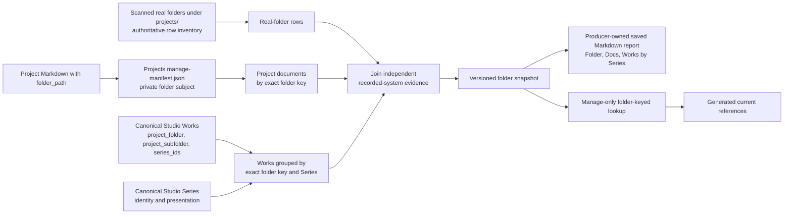

# Project State Concept And Architecture

## Purpose

Project State is a generated relationship artefact with downstream consumers. This document owns its meaning, row model, report projection, resolver lookup, refresh behavior, and failure boundary. Delivery details belong to [SSP-2](/docs/?scope=studio&doc=d-20260801-133318-15e8fa).

All private working documents may remain together in the external-local `dotlineform/projects` sub-scope. A document may declare `folder_path`, `work_id`, `series_id`, or no subject under the shared authoring convention, but Project State consumes only an unambiguous valid `folder_path`. Canonical Works remain an essential Project State input because their recorded source folders show which Work records have been imported from each folder and how those Works are currently grouped into Series.

## Problem

Four independent inputs describe overlapping but non-identical parts of a project:

| input | meaning |
| --- | --- |
| current folders | physical evidence found by scanning `$DOTLINEFORM_PROJECTS_BASE_DIR/projects/` only |
| folder-subject Project documents | private user-maintained notes whose valid `folder_path` describes the condition or intended use of physical folder contents; other documents in the same sub-scope are outside Project State |
| canonical Works | historical source-path, exact Work identity, and Series-membership evidence owned by Studio |
| canonical Series | grouping and presentation context for the matched Works |

Project State reconciles those inputs without synchronizing them. The scanned real-folder inventory is authoritative for the primary row set. Project documents and canonical Works are two independent recorded-system routes joined to those rows by exact normalized folder identity; documents never mediate or imply the Work relationship. Physical file enumeration and draft/published distinctions do not enter the Work count.

## Planning Evidence Snapshot

On 2026-08-02, the planning inventory contained 206 scanned real folders. Canonical Works matched 144 of them: 142 related to one Series and two related to two Series. The Projects Manage manifest contained 241 documents, of which 229 declared `folder_path`; 16 folder paths were shared by multiple documents and the largest group contained 14 documents.

These values justify arrays on every relationship side of a folder row. They are current evidence, not schema limits or permanent invariants.

## Relationship Model

The settled folder-centred relationship is:



One normalized row originates from one real folder established by the current scan. The producer independently joins zero or more Project documents and zero or more canonical Works whose normalized recorded folder matches that row. It groups the matched Work identities by current Series ID and derives the count presented beside each Series. A Work belonging to more than one Series contributes once to each applicable membership count, so Series counts do not imply a unique sum.

The current catalogue happens to contain no Work without a Series, but the producer must retain missing, malformed, or unknown Series membership as exceptional evidence rather than silently dropping it.

The Project State snapshot is not the existing Projects Manage manifest. It consumes that manifest and publishes its own versioned generated model. An illustrative row is:

```json
{
  "folder_path": "projects/nerve",
  "folder_state": "present",
  "documents": [
    {
      "scope": "dotlineform",
      "sub_scope": "projects",
      "doc_id": "d-example",
      "title": "Nerve"
    }
  ],
  "works": [
    {
      "family": "catalogue",
      "target_type": "work",
      "target_id": "00123",
      "series_ids": ["026"]
    },
    {
      "family": "catalogue",
      "target_type": "work",
      "target_id": "00124",
      "series_ids": ["105"]
    }
  ],
  "series": [
    {
      "family": "catalogue",
      "target_type": "series",
      "target_id": "026",
      "work_count": 1
    },
    {
      "family": "catalogue",
      "target_type": "series",
      "target_id": "105",
      "work_count": 1
    }
  ]
}
```

The exact field names and state vocabulary are bounded SSP-2.1 implementation decisions reviewed at that step's checkpoint. The structural commitments are the scanned normalized folder key, `documents[]`, `works[]`, `series[]`, explicit present-folder evidence, and generation metadata.

## Collection Boundary

Project State consumes only valid folder-subject documents from `dotlineform/projects` whose normalized key begins `projects/` and exactly matches a scanned row. A valid assignment elsewhere under `$DOTLINEFORM_PROJECTS_BASE_DIR/`, a no-subject document, or a Work-subject or Series-subject document may coexist in that same working collection without participating. Project State does not consume `work_id` or `series_id` associations, infer a folder from a catalogue subject, or use editorial publication as folder evidence.

Work/Series front matter remains optional document-level authoring metadata used by current references and the public reverse lookup. Those products share canonical catalogue identity with Project State but neither becomes an input to the folder report.

## Row Coverage And Ordering

The primary row set contains only real folders established by scanning `$DOTLINEFORM_PROJECTS_BASE_DIR/projects/`. Project State does not scan the base root or any sibling tree. A Project-document declaration, canonical Work path, or physical folder outside `projects/` never creates a Project State row.

For each scanned row, the producer independently joins exact valid Project-document `folder_path` assignments and exact normalized Work source folders. This yields the fully reconciled state plus the three useful gaps: documents without Works, Works without documents, and real folders with neither. Recorded document or Work paths that do not match a scanned real folder belong to a separate reverse-reconciliation report rather than Project State.

Rows sort by normalized real-folder path. Documents sort by normalized title then `doc_id`; Works and Series sort by canonical ID. Documents without `folder_path` do not participate. Malformed or conflicting folder declarations remain SSP-1 authoring evidence and do not become Project State rows.

## Saved Docs Viewer Report

Project State is a persistent generated Markdown document with one stable `doc_id` in scope `dotlineform`. It is not a dynamic report module and does not run merely because the document opens. Opening shows the last successfully saved snapshot immediately.

Running or explicitly refreshing Project State computes one complete generation, validates its outputs, updates the saved Markdown source, publishes the matching relationship snapshot and resolver lookup, and rebuilds the exact report document. The durable Markdown is a producer-owned generated artefact rather than human-authored canonical truth, so a successful generation replaces its body. SSP-2.2 implements the smallest clear ownership marker and management presentation and reviews them at that step's checkpoint.

The primary report is a three-column table with one row per scanned real folder:

| Folder | Docs | Works by Series |
| --- | --- | --- |
| one validated local-folder link | zero or more exact Project-document links | zero or more linked Series labels with their matching canonical Work counts |

Folder links use the `dlf-local:` activation contract. Project-document links use exact `{scope, sub_scope, doc_id}` targets. Series labels use current catalogue titles and routes when the report is generated. Project State does not enumerate files in the folder or expose draft/published distinctions.

Every scanned row has a normalized key beginning `projects/`. The Folder cell omits that guaranteed prefix and gains a leading slash, so `projects/curve/poems (2025)` appears as `/curve/poems (2025)`. The stored key, lookup identity, and `dlf-local:` activation target remain unchanged.

For example:

| Folder | Docs | Works by Series |
| --- | --- | --- |
| `/curve/poems (2025)` opens in Finder | one or more exact Project-document links | [`curve poems`](/series/?series=036) — 87 works |
| `/example/document-only` opens in Finder | one or more exact Project-document links | no canonical Works |
| `/example/works-only` opens in Finder | no document | [`series 1`](/series/?series=001) — 12 works |
| `/example/folder-only` opens in Finder | no document | no canonical Works |

When a folder contributes Works to two Series, the final cell contains one linked line per Series, such as `series 1 — 87 works` and `series 2 — 1 work`.

The Docs and Works-by-Series cells show concise states such as no document or no canonical Work. Together with the fully reconciled row, the table therefore exposes document-only, Works-only, and folder-only states without changing its row owner. Generation time, freshness, counts, and scan diagnostics may appear above or below the table without adding more relationship columns. The saved Markdown remains readable in Source, ordinary editors, exports, bookmarks, and Docs Viewer search.

## Resolver Lookup

The settled Manage-only Project lookup is generated from the same scanned real-folder rows. Its accepted subject is an exact folder key, and its declared result groups are:

```text
folder -> Work[] + Series[] + Project documents[]
```

It does not publish catalogue URLs or Work/Series titles as parallel canonical truth. Each catalogue item carries the semantic identity `(catalogue, work|series, canonical id)` and the lookup retains exact Series membership without Work publication status. SSP-3 passes those identities through the existing Semantic Tokens target lookup and link projector, producing one resolver-derived semantic usage row for every rendered catalogue link.

Project-document result items retain exact Docs Viewer target identity and folder results retain the validated local-link contract. Resolver expansion reads one keyed row and never scans folders, manifests, Works, Series, or another relationship registry.

## Full Refresh

A full run scans the real-folder inventory first, joins both recorded-system routes, and replaces the complete generation. It is required when the snapshot is missing, corrupt, version-incompatible, explicitly refreshed, or cannot be updated from trusted before/after evidence. Direct Finder changes become visible on the next run; no filesystem watcher is introduced.

Opening the saved report is not a refresh trigger. This distinction is deliberate: persistence gives immediate access to the last result and keeps a failed or unavailable scan from replacing useful prior evidence.

## Targeted Follow-Through

Known successful mutations may update affected folder rows and then regenerate the compact saved report from the updated snapshot:

| mutation evidence | Project State effect |
| --- | --- |
| Work create/delete | recompute an affected row only when its exact folder key is present in the scanned inventory |
| Work `project_folder` or `project_subfolder` | recompute any old or new key present in the scanned inventory |
| Work `series_ids` | recompute the matching scanned row's Series memberships and counts |
| Work `status`, `published_date`, or `title` | no Project State effect |
| Work `project_filename` or unrelated metadata | no Project State effect |
| Project document create/delete or `folder_path` change | recompute any old or new key present in the scanned inventory |
| Project document `work_id`, `series_id`, or no-subject change | no Project State effect |

The Studio integration remains a read-only post-commit observer. It consumes exact committed before/after records and writes only derived Docs Viewer state. Follow-through failure never rolls back or repeats the canonical mutation.

Series title and route presentation remains owned by the catalogue and Semantic Tokens target projection. A Series title change does not change the Project lookup relationship; the saved report receives the current label on its next full run unless SSP-2 implements a narrow presentation-only refresh hook. Work titles do not appear in the report.

## Generation And Failure

Report source, relationship snapshot, and resolver lookup carry one generation identity. SSP-2.1 and SSP-2.2 implement staging, validation, commit order, and exact-build failure behavior within their current owners; their step reviews must prove that consumers never treat a mixed generation as complete.

If production or follow-through fails, the last complete generation remains readable and is marked stale with the failure reason. Source mutations remain committed. Project State never performs repair, retries the originating mutation, or silently falls back to a live scan during Resolver Token expansion.

## Downstream Contract

SSP-3 consumes only the versioned focused lookup and Semantic Tokens projection. It does not depend on the saved report's Markdown layout. SSP-6 Project Media Audit may reuse the generated-document lifecycle, but it does not enter the Project State snapshot or lookup.

## Not In Scope

- Work-level rows or a Work-keyed Project State report;
- `work_id`/`series_id` reverse associations, Manage index subject cues, editorial copy, or public catalogue document metadata;
- image discovery, folder file counts, missing-image analysis, or primary-image auditing;
- scanning `$DOTLINEFORM_PROJECTS_BASE_DIR/` itself or reporting physical folders and recorded paths outside its `projects/` subtree;
- reverse reconciliation of document or Work paths that do not match a scanned real folder, which belongs to a separate report;
- automatic repair, folder synchronization, continuous watching, or recursive resolution;
- public Project State data or public local-folder activation; or
- retirement of the current Studio image-audit route and Markdown output, which belongs to SSP-6.
