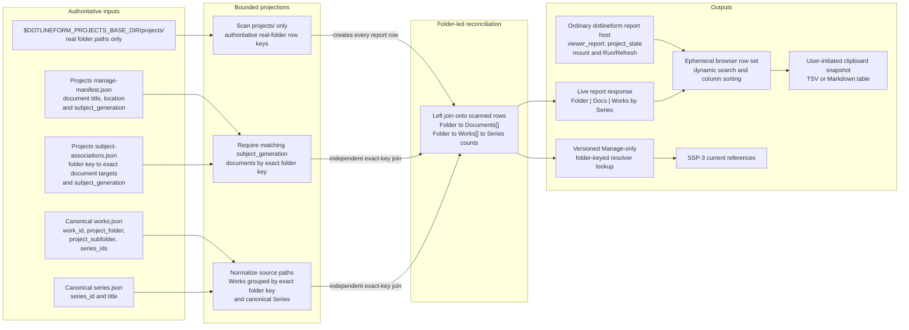

# Project State Concept And Architecture

## Purpose

Project State is a local Docs Viewer report over a server-produced relationship result, with a separate generated lookup for downstream consumers. This document owns its meaning, row model, report projection, resolver lookup, refresh behavior, and failure boundary. Delivery details belong to [SSP-2](/docs/?scope=studio&doc=d-20260801-133318-15e8fa).

All private working documents may remain together in the external-local `dotlineform/projects` sub-scope. A document may declare `folder_path`, `work_id`, `series_id`, or no subject under the shared authoring convention, but Project State consumes only an unambiguous valid `folder_path`. Canonical Works remain an essential Project State input because their recorded source folders show which Work records have been imported from each folder and how those Works are currently grouped into Series.

## Problem

Four independent inputs describe overlapping but non-identical parts of a project:

| input | meaning |
| --- | --- |
| current folders | physical evidence found by scanning `$DOTLINEFORM_PROJECTS_BASE_DIR/projects/` only |
| folder-subject Project documents | private user-maintained notes whose valid `folder_path` describes the condition or intended use of physical folder contents; other documents in the same sub-scope are outside Project State |
| canonical Works | historical source-path, exact Work identity, and Series-membership evidence owned by Studio |
| canonical Series | grouping and presentation context for the matched Works |

Project State reconciles those inputs without synchronizing them. The scanned real-folder inventory is authoritative for the primary row set. Project documents and canonical Works are two independent recorded-system routes joined to those rows by exact normalized folder identity; documents never mediate or imply the Work relationship. Physical file enumeration and draft/published distinctions do not enter the Work count.

## Planning Evidence Snapshot

On 2026-08-02, the planning inventory contained 206 scanned real folders. Canonical Works matched 144 of them: 142 related to one Series and two related to two Series. The Projects Manage manifest contained 241 documents, of which 229 declared `folder_path`; 16 folder paths were shared by multiple documents and the largest group contained 14 documents.

These values justify arrays on every relationship side of a folder row. They are current evidence, not schema limits or permanent invariants.

## Relationship Model

The settled folder-centred relationship is:



One normalized row originates from one real folder established by the current scan. The producer independently joins zero or more Project documents and zero or more canonical Works whose normalized recorded folder matches that row. It groups the matched Work identities by current Series ID and derives the count presented beside each Series. A Work belonging to more than one Series contributes once to each applicable membership count, so Series counts do not imply a unique sum.

The current catalogue happens to contain no Work without a Series, but the producer must retain missing, malformed, or unknown Series membership as exceptional evidence rather than silently dropping it.

The live Project State response is not the existing Projects Manage manifest. It consumes that manifest and returns its own normalized report rows. The same successful reconciliation publishes the focused lookup required by SSP-3. An illustrative row is:

```json
{
  "folder_path": "projects/nerve",
  "folder_state": "present",
  "documents": [
    {
      "scope": "dotlineform",
      "sub_scope": "projects",
      "doc_id": "d-example",
      "title": "Nerve"
    }
  ],
  "works": [
    {
      "family": "catalogue",
      "target_type": "work",
      "target_id": "00123",
      "series_ids": ["026"]
    },
    {
      "family": "catalogue",
      "target_type": "work",
      "target_id": "00124",
      "series_ids": ["105"]
    }
  ],
  "series": [
    {
      "family": "catalogue",
      "target_type": "series",
      "target_id": "026",
      "work_count": 1
    },
    {
      "family": "catalogue",
      "target_type": "series",
      "target_id": "105",
      "work_count": 1
    }
  ]
}
```

The exact field names and state vocabulary are bounded SSP-2.1 implementation decisions reviewed at that step's checkpoint. The structural commitments are the scanned normalized folder key, `documents[]`, `works[]`, `series[]`, explicit present-folder evidence, and one generation identity shared by the live response and focused lookup.

The server returns one complete versioned Project State JSON response for each mount or Run/Refresh. Its envelope contains the generation identity, run time or generated time, bounded diagnostics, and the complete ordered row array. Each row carries the typed values needed to render the three columns, activate exact links, derive one distinct matched-Work count, and perform deterministic browser sorting. The browser never joins the Projects manifest, associations, Works, Series, or filesystem itself.

This response is a live presentation product rather than a persisted JSON file. It may include current document and Series labels and exact link targets because those values belong to the report projection; the separately persisted resolver lookup retains semantic identities instead of copying presentation truth.

## Collection Boundary

Project State consumes only valid folder-subject documents from `dotlineform/projects` whose normalized key begins `projects/` and exactly matches a scanned row. A valid assignment elsewhere under `$DOTLINEFORM_PROJECTS_BASE_DIR/`, a no-subject document, or a Work-subject or Series-subject document may coexist in that same working collection without participating. Project State does not consume `work_id` or `series_id` associations, infer a folder from a catalogue subject, or use editorial publication as folder evidence.

Work/Series front matter remains optional document-level authoring metadata used by current references and the public reverse lookup. Those products share canonical catalogue identity with Project State but neither becomes an input to the folder report.

## Row Coverage And Ordering

The primary row set contains only real folders established by scanning `$DOTLINEFORM_PROJECTS_BASE_DIR/projects/`. Project State does not scan the base root or any sibling tree. A Project-document declaration, canonical Work path, or physical folder outside `projects/` never creates a Project State row.

For each scanned row, the producer independently joins exact valid Project-document `folder_path` assignments and exact normalized Work source folders. This yields the fully reconciled state plus the three useful gaps: documents without Works, Works without documents, and real folders with neither. Recorded document or Work paths that do not match a scanned real folder belong to a separate reverse-reconciliation report rather than Project State.

Rows sort by normalized real-folder path. Documents sort by normalized title then `doc_id`; Works and Series sort by canonical ID. Documents without `folder_path` do not participate. Malformed or conflicting folder declarations remain SSP-1 authoring evidence and do not become Project State rows.

## Embedded Docs Viewer Report

Project State uses the existing Docs Viewer report-host mechanism rather than introducing generated Markdown or another reporting system. One ordinary human-authored document in scope `dotlineform` declares `viewer_report: project_state` and `viewer_report_access: local`. Its stable `doc_id`, title, explanatory Markdown, index placement, bookmark behavior, and Source view remain ordinary document concerns; the report module mounts beneath that content.

Mounting the report automatically runs one fresh server-side reconciliation. The module shows a running state, renders the returned Folder/Docs/Works-by-Series rows, and offers Run/Refresh to repeat the same operation. The browser never scans the filesystem. Closing the document discards the rendered rows; reopening runs the report again. A failed run displays a contained error rather than an older report result.

The primary report is a three-column table with one row per scanned real folder:

| Folder | Docs | Works by Series |
| --- | --- | --- |
| one validated local-folder link | zero or more exact Project-document links | zero or more linked Series labels with their matching canonical Work counts |

Folder links use the `dlf-local:` activation contract. Project-document links use exact `{scope, sub_scope, doc_id}` targets. Series labels use current catalogue titles and routes when the report is generated. Project State does not enumerate files in the folder or expose draft/published distinctions.

Every scanned row has a normalized key beginning `projects/`. The Folder cell omits that guaranteed prefix and gains a leading slash, so `projects/curve/poems (2025)` appears as `/curve/poems (2025)`. The stored key, lookup identity, and `dlf-local:` activation target remain unchanged.

For example:

| Folder | Docs | Works by Series |
| --- | --- | --- |
| `/curve/poems (2025)` opens in Finder | one or more exact Project-document links | [`curve poems`](/series/?series=036) — 87 works |
| `/example/document-only` opens in Finder | one or more exact Project-document links | no canonical Works |
| `/example/works-only` opens in Finder | no document | [`series 1`](/series/?series=001) — 12 works |
| `/example/folder-only` opens in Finder | no document | no canonical Works |

When a folder contributes Works to two Series, the final cell contains one linked line per Series, such as `series 1 — 87 works` and `series 2 — 1 work`.

The Docs and Works-by-Series cells show concise states such as no document or no canonical Work. Together with the fully reconciled row, the table therefore exposes document-only, Works-only, and folder-only states without changing its row owner. Run time, counts, and scan diagnostics may appear above or below the table without adding more relationship columns. Report rows are runtime inspection data and do not enter document Source, automatic exports, bookmarks, or Docs Viewer search; only an explicit clipboard action creates a portable snapshot.

## Browser Search, Sorting, And Clipboard

The mounted module treats the single live JSON response as one ephemeral browser row set. Dynamic search filters that row set locally after every input change, using a case-insensitive substring match over the composed visible text of all three columns: Folder, Docs, and Works by Series. It does not search arbitrary raw JSON or hidden identities. Typing, clearing the search, changing sort order, and copying the current projection perform no server request.

Every column heading supports ascending and descending sorting. Folder uses natural normalized display-path order and is the initial ascending order. Docs uses the first ordered normalized document title, then exact `doc_id`. Works by Series uses the row's distinct matched-Work count, then the first ordered Series title. The distinct count is not the sum of per-Series membership counts because one Work may belong to more than one Series. Every comparator falls back to the normalized folder key so the result remains deterministic. Search preserves the active sort; sorting preserves the active search; a successful Run/Refresh replaces the row set and reapplies both controls.

Two user-initiated clipboard actions transform the currently filtered rows in their current sort order:

- **Copy table** emits semantic TSV with the three visible headings, tabs between cells, line feeds between rows, visible link text, normalized internal whitespace, and preserved empty-state labels. It is the spreadsheet-oriented format and pastes directly into Excel.
- **Copy Markdown** emits a Markdown table with the same three headings and rows, retaining exact Folder, Project-document, and Series links and escaping Markdown table syntax.

Both transforms keep one physical folder per exported row. Multiple documents or Series entries remain ordered within their existing cell and are separated by `; ` rather than exploding into duplicate or Cartesian-product rows. With no active search, the actions copy the complete sorted report. They read only the in-memory report projection, do not mutate or save report JSON, source Markdown, canonical inputs, or the resolver lookup, and follow the existing clipboard convention of showing no success message.

## Resolver Lookup

The settled Manage-only Project lookup is generated from the same scanned real-folder rows. Its accepted subject is an exact folder key, and its declared result groups are:

```text
folder -> Work[] + Series[] + Project documents[]
```

It does not publish catalogue URLs or Work/Series titles as parallel canonical truth. Each catalogue item carries the semantic identity `(catalogue, work|series, canonical id)` and the lookup retains exact Series membership without Work publication status. SSP-3 passes those identities through the existing Semantic Tokens target lookup and link projector, producing one resolver-derived semantic usage row for every rendered catalogue link.

Project-document result items retain exact Docs Viewer target identity and folder results retain the validated local-link contract. Resolver expansion reads one keyed row and never scans folders, manifests, Works, Series, or another relationship registry.

## Live Run And Refresh

Every report mount and explicit Run/Refresh performs the complete operation: scan the real-folder inventory first, join both recorded-system routes, validate the result, return the live rows, and atomically replace the focused lookup. Direct Finder changes therefore become visible when the report next opens or refreshes; no filesystem watcher is introduced.

The report does not persist presentation state or fall back to a previous run. SSP-2.0 times the real operation and confirms automatic run-on-mount remains suitable; if that bounded scan is materially slow, the checkpoint must revisit mount behavior rather than invent a cache or parallel report mechanism.

## Targeted Follow-Through

Known successful mutations may update affected entries in the persisted focused lookup. The mounted report remains independent and obtains fresh rows only from its current full run:

| mutation evidence | Project State effect |
| --- | --- |
| Work create/delete | recompute an affected row only when its exact folder key is present in the scanned inventory |
| Work `project_folder` or `project_subfolder` | recompute any old or new key present in the scanned inventory |
| Work `series_ids` | recompute the matching scanned row's Series memberships and counts |
| Work `status`, `published_date`, or `title` | no Project State effect |
| Work `project_filename` or unrelated metadata | no Project State effect |
| Project document create/delete or `folder_path` change | recompute any old or new key present in the scanned inventory |
| Project document `work_id`, `series_id`, or no-subject change | no Project State effect |

The Studio integration remains a read-only post-commit observer. It consumes exact committed before/after records and writes only derived Docs Viewer state. Follow-through failure never rolls back or repeats the canonical mutation.

Series title and route presentation remains owned by the catalogue and Semantic Tokens target projection. A Series title change does not change the Project lookup relationship; the report receives the current label on its next mount or Run/Refresh. Work titles do not appear in the report.

## Generation And Failure

Each successful full run returns one validated live result and atomically publishes the matching resolver lookup under one generation identity. SSP-2.1 and SSP-2.2 implement validation, commit order, and service/report agreement within their current owners.

If a live run fails, the report shows that failure and renders no older rows. The previous complete lookup remains available to SSP-3 and is marked stale with the failure reason. Source mutations remain committed. Project State never performs repair, retries the originating mutation, or makes Resolver Token expansion perform a live scan.

## Downstream Contract

SSP-3 consumes only the versioned focused lookup and Semantic Tokens projection. It does not depend on the live report response or browser layout. SSP-6 Project Media Audit may use the same existing local report-host mechanism, but it does not enter the Project State lookup.

## Not In Scope

- Work-level rows or a Work-keyed Project State report;
- `work_id`/`series_id` reverse associations, Manage index subject cues, editorial copy, or public catalogue document metadata;
- image discovery, folder file counts, missing-image analysis, or primary-image auditing;
- generated report Markdown, a persisted report-result snapshot, or a new reporting mechanism;
- downloaded CSV/TSV files, saved export history, or automatic clipboard persistence;
- scanning `$DOTLINEFORM_PROJECTS_BASE_DIR/` itself or reporting physical folders and recorded paths outside its `projects/` subtree;
- reverse reconciliation of document or Work paths that do not match a scanned real folder, which belongs to a separate report;
- automatic repair, folder synchronization, continuous watching, or recursive resolution;
- public Project State data or public local-folder activation; or
- retirement of the current Studio image-audit route and Markdown output, which belongs to SSP-6.
