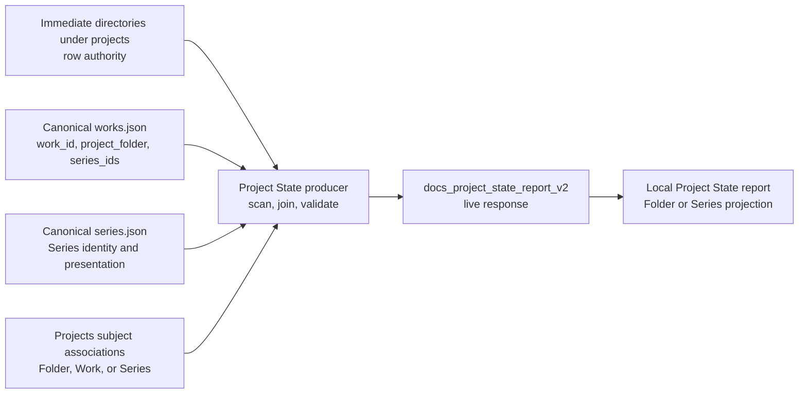

# Project State Concept And Architecture

## Purpose

Project State is a local Docs Viewer report over a complete server-produced relationship result. It answers which immediate Project folders exist, which canonical Series reach them through current Works, and which Project documents are about those folders, Works, or Series. The report is independently refreshable and has no document-build consumer. Delivery details belong to [SSP-2](/docs/?scope=studio&doc=d-20260801-133318-15e8fa).

## Ownership And Flow



The physical scan alone establishes rows. Canonical catalogue JSON owns Work and Series identity and membership. Project document front matter owns each document's exact subject. The Project State producer observes these authorities and never repairs, renames, deletes, publishes, synchronizes, or becomes canonical truth.

## Input And Placement Contract

SSP-2 consumes the private `dotlineform/projects` `manage-manifest.json` and `subject-associations.json` under one matching subject generation. It accepts only normalized valid subjects and never infers identity from title, filename, body text, route, report host, or nearby records.

The normalized placement relationship is:

```text
scanned real folder
  <- exact Folder subject
  <- Work subject through Work.project_folder
  <- Series subject through every current member Work.project_folder
```

A Folder subject reaches its exact scanned key. A Work subject reaches the first-level Folder recorded by that canonical Work. A Series subject reaches each scanned Folder containing at least one current member Work. None, malformed, conflicting, unknown, and currently unplaceable subjects enter no row. A document is deduplicated once per Folder and retains its declared subject plus applicable-Series provenance for browser grouping.

The producer reads only `work_id`, `project_folder`, and `series_ids` from canonical Works. It deliberately ignores `project_subfolder`, so a Work recorded with `project_folder: wa` and `project_subfolder: ink` joins the `projects/wa` row. Studio catalogue/media remains the owner of subfolders, filenames, media resolution, draft/published status, and publication dates.

## Row Authority And Coverage

The producer scans only immediate directories under `$DOTLINEFORM_PROJECTS_BASE_DIR/projects/`. Nested directories remain contents of their first-level project, while the base root and sibling trees retain their existing owners. Every report row therefore has a normalized key of `projects/<project-directory>`. A document declaration or canonical Work path never creates a row.

This row model exposes four useful states without diagnosing them in the browser: folder with Works and documents, documents without Works, Works without documents, and folder with neither. Recorded paths that do not reach a scanned row belong to bounded diagnostics or a separate reverse-reconciliation report.

Rows sort by normalized Folder key. Documents sort by normalized title then `doc_id`; Works and Series sort by canonical ID. The response may retain Work counts and reconciliation evidence for validation, but the displayed report shows neither counts nor guessed exception labels.

## Live Response

Each successful mount or Run/Refresh returns one complete `docs_project_state_report_v2` envelope containing generation/run context, bounded diagnostics, and ordered typed rows. Each row retains:

- exact Folder identity and local activation target;
- placed documents with exact Docs Viewer target, current title, declared subject, and Folder/Series placement provenance;
- matched Work semantic identities with current `series_ids`;
- exact Series identities, memberships, and current report presentation; and
- distinct document, placement, and Work counts required for validation and deterministic projection.

The response is ephemeral browser data, not persisted report JSON or generated Markdown. The browser never joins the filesystem, Projects manifest, subject associations, Works, or Series itself.

The historical v1 producer placed only Folder-subject documents. SSP-2.5 introduced v2 so Folder-, Work-, and Series-subject documents all trace through exact current relationships without changing the v1 meaning in place.

## Embedded Docs Viewer Report

One ordinary human-authored document in scope `dotlineform` declares `viewer_report: project_state` and `viewer_report_access: local`. The Manage-only report registry loads the focused module, and the Docs management service exposes `POST /docs/project-state`. The service delegates reconciliation to the Project State producer and returns the current live report response.

The primary table is:

| Folder | Series | Docs |
| --- | --- | --- |
| one validated local-folder link | zero or more exact linked Series names | zero or more exact Project-document links |

The displayed Folder omits the guaranteed `projects/` prefix while identity and `dlf-local:` activation retain the complete key. Series routes resolve against the configured site-preview base. Document titles are prefixed visually with the Folder, Work, or Series subject cue showing the route by which the document entered the report; copied output keeps titles plain. Missing Series or Docs values remain blank.

## Browser Projection And Clipboard

The module holds one live response and derives two bounded projections without another request:

| projection | visible columns | row grain |
| --- | --- | --- |
| Folder | Folder, Series, Docs | one row per scanned Folder, with every placed document once |
| Series | Series, Folder, Docs | one row per Series-Folder relationship, plus a blank-Series row when required |

In Series projection, a Series-subject document appears only under its exact Series; a Work-subject document appears under each current Series membership of that Work in the Folder; a Folder-subject document remains Folder-wide context. Any placed document without a current Series route remains visible in a blank-Series row.

Dynamic case-insensitive search covers visible Folder, Series, and Docs text. Every visible column sorts deterministically. Switching projection, typing, clearing, sorting, and copying remain browser-only operations; a successful refresh preserves the chosen projection and reapplies its search and sort.

**Copy table** emits the current filtered/sorted projection as semantic TSV. **Copy Markdown** emits `Project State - YYYY-MM-DD HH:MM` using the response generation time in GMT, one blank line, and a linked Markdown table. Neither action saves report state, creates an archive, mutates source, or shows a success message.

## Live Run And Failure

Mount and explicit Run/Refresh perform the same complete operation: scan, join, validate, and return current rows. Direct Finder changes become visible on the next run; no watcher, mutation hook, cache, or previous-row fallback is introduced. A failed run shows a contained current-run error and no older rows. Canonical source mutations remain committed and independent of report success.

SSP-2.6 removed the former `var/docs/project-state/folder-lookup.json` Resolver-consumer product, its schema, status/input receipt, write and stale-retention paths, configuration surface, service response fields, and dedicated tests. Project State now produces only the live v2 response and bounded run diagnostics; it has no persisted relationship product or document-build consumer.

## Relationship Meaning

Project State reads `authoring_subject` as aboutness evidence: the document declares that it is about one Folder, Work, or Series. Semantic-token usage is separate mention evidence. A semantic token in body content neither places a document in Project State nor qualifies it for public Work/Series document metadata.

[SSP-3 — Insert Subject Link Delivery](/docs/?scope=studio&doc=d-20260802-174340-2fe9f4) may insert one snapshot reference from the current subject, but it neither reads nor refreshes Project State. [SSP-5 — Work And Series Document Metadata Publication Delivery](/docs/?scope=studio&doc=d-20260802-195805-94a5be) reads exact published Work/Series subject front matter, never semantic usage.

## Not In Scope

- Work-level rows or a Work-keyed Project State report;
- ordinary-file discovery, uncataloged-file inventory, or missing primary-source analysis;
- a detail-level report grouped by `project_subfolder`;
- generated report Markdown, persisted report snapshots, or saved export history;
- arbitrary layouts or a second Series-keyed server response;
- reverse reconciliation for recorded paths without scanned rows;
- automatic repair, synchronization, continuous watching, or mutation hooks;
- semantic-token insertion, expansion, usage analysis, or public metadata publication;
- public Project State data or public local-folder activation; or
- the retired Studio file-reconciliation workflow, whose two retained questions now belong to SSP-6's Uncataloged Files and Missing Source Files reports.
