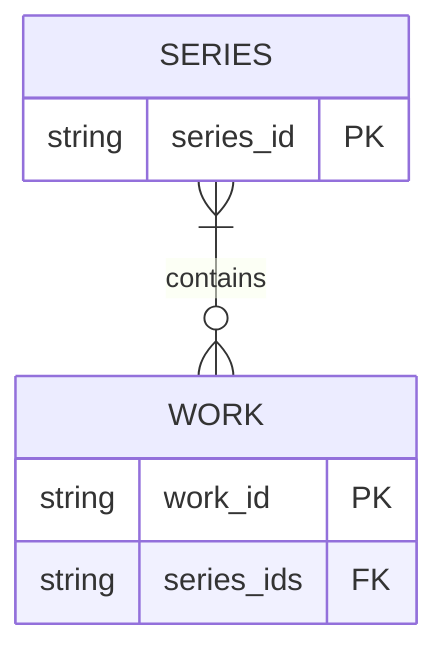
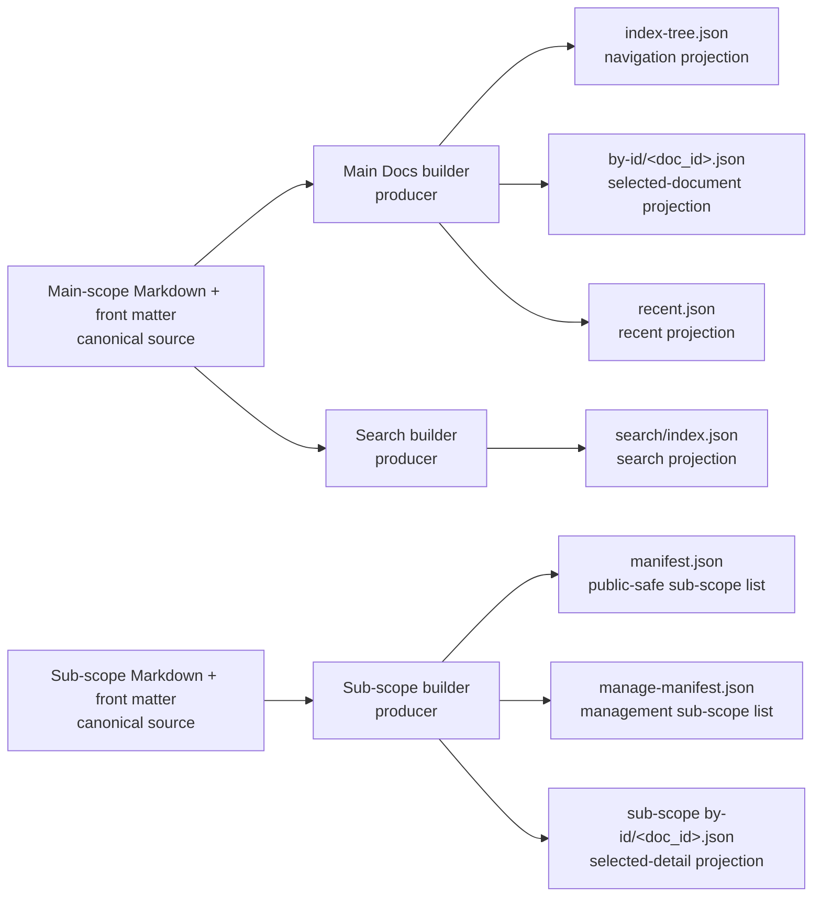

# Data Model Maps Concept And Examples

## Purpose

Earlier Catalogue data was understandable by opening a few canonical files such as `works.json` and `series.json` plus a generated `by-id` payload. The system now also contains manifests, lookups, tree and search indexes, per-record payloads, public snapshots, and cross-system relationship projections. Most remain derived, but their identities, producers, consumers, visibility, and refresh paths are difficult to reconstruct from filenames alone.

Data Model Maps provide a durable orientation layer without treating every JSON file as a relational table or reproducing every field from the code.

## Three Complementary Views

| view | answers | suitable content |
| --- | --- | --- |
| logical ERD | What is the identity, relationship, and cardinality? | Series, Works, documents, folders, Tags, and semantic targets |
| projection lineage | Which authority and producer create this artefact, and which consumer reads it? | canonical files, builders, manifests, lookups, indexes, public snapshots, and runtime projections |
| artefact register | Where is it, how is it classified, when is it refreshed, and who owns the exact contract? | paths, authority class, producer, consumers, access, refresh trigger, and code/document links |

An ERD must not show `index-tree.json`, `manage-manifest.json`, or `target-lookup.json` as if they were canonical domain entities. A lineage diagram must not imply that a generated edge is a stored foreign-key relationship. The register joins the two views without forcing all detail into diagram labels.

## Notation Principles

- Label every source or artefact as **canonical**, **authored**, **generated projection**, or **runtime-only**.
- Use an ERD only for stable logical identity and cardinality. Array-valued JSON references can be shown logically without pretending the repository uses a relational database.
- Use a directional flowchart for reads, generation, publication, and consumption.
- Keep management-only, public, and shared artefacts visibly distinct in the diagram or adjacent register.
- Name the owning producer and primary consumers; do not infer ownership from a directory name.
- Link the surrounding prose or register to current code, configuration, tests, and durable contract documents. Diagram nodes are explanatory labels, not authorities.
- Split maps by concern before labels or crossed edges make the reader reconstruct the graph again.
- Record current implementation separately from planned behavior. A proposed projection must not appear as shipped merely because a future delivery mentions it.

## Example 1 — Catalogue Logical ERD

This example records one logical relationship rather than the full Catalogue schema. A Work belongs to one or more Series through its `series_ids`; the logical model does not require every Series to contain a Work. The canonical JSON representation and validators remain authoritative.

The `FK` marker explains the logical reference. It does not claim that `series_ids` is a scalar SQL foreign key or that Mermaid validates the JSON. [Catalogue Source Model](/docs/?scope=studio&doc=d-20260519-000000-a0da45) and the canonical readers and validators own the exact current record shapes.

## Example 2 — Docs Viewer Projection Lineage

This example deliberately separates main-scope and sub-scope products. A main scope produces navigation, selected-document, Recent, and search projections. A sub-scope produces its own by-ID payloads and manifests while remaining excluded from the parent Index, Recent, and search.

The durable map would add consumers and public-copy boundaries only where they remain readable. [Generated Data Contracts](/docs/?scope=studio&doc=d-20260605-125108-c68916) owns the current payload contracts; [Document Diagrams](/docs/?scope=studio&doc=d-20260719-123719-fb7565) owns Mermaid rendering.

## Example Artefact Register

The adjacent register carries detail that would overload the lineage diagram. These rows demonstrate the intended shape rather than freezing the DMM-1 inventory.

| artefact | classification | producer | primary consumer | refresh | visibility |
| --- | --- | --- | --- | --- | --- |
| `studio/data/canonical/catalogue/works.json` | canonical | Catalogue mutation services | Catalogue builders, Studio projections, focused audits | successful canonical mutation | local source |
| `docs-viewer/scopes/<scope>/published/documents/index-tree.json` | generated projection | main Docs builder | Docs Viewer navigation | full or targeted Docs build as selected by the builder | route-dependent |
| `manage-manifest.json` | generated projection | sub-scope builder and registered customisation | Manage sub-scope report and actions | sub-scope build | management only |
| `docs-viewer/data/generated/semantic-tokens/target-lookup.json` | generated projection | Semantic Tokens target builder | managed document token rendering and authoring | relevant canonical target refresh | management only |

Each durable register must replace broad labels such as “Catalogue mutation services” with the exact current owner and link to the code or configuration that proves it.

## Proposed First Map Set

### Catalogue Logical Model

Show Series, Works, Work details, canonical identifiers, Series membership, and the boundary to generated public and Studio read models. Keep media publication and editor workflow outside the ERD unless a separate lineage map needs them.

### Docs Viewer Projection Lineage

Show canonical Markdown/front matter, main-scope and sub-scope builders, manifests, tree/by-ID/Recent/search products, local working projections, explicit public publication, and public/manage consumers. Do not duplicate the full scope topology or runtime architecture.

### Cross-System Relationship Projections

Show canonical inputs and bounded derived outputs for Semantic Tokens, Tag document associations, Project State, and Resolver Tokens. Keep each relationship family independently readable and state when a projection is proposed rather than shipped.

## Maintenance Model

The first delivery should keep diagrams authored because their value is semantic classification, not merely enumerating parseable files. Each map has a named durable owner, a small register, and explicit review triggers when a canonical schema, projection family, producer, consumer, visibility boundary, or refresh rule changes.

Path-existence lint may be considered only after the authored map set proves useful. Automatic graph generation, field-level schema extraction, and drift enforcement are separate capabilities with their own maintenance costs.

## Boundary

Data Model Maps do not replace [Projection Contract](/docs/?scope=studio&doc=d-20260523-222005-1085b2), [Catalogue Indexes And Payloads](/docs/?scope=studio&doc=d-20260519-202931-b05d27), [Generated Data Contracts](/docs/?scope=studio&doc=d-20260605-125108-c68916), or executable builders and tests. They provide navigation and explanation across those owners.

The [Data Model Maps feature](/docs/?scope=studio&doc=d-20260802-123450-f7493d) owns planning and document routing. [DMM-1](/docs/?scope=studio&doc=d-20260802-123452-6a2fd3) owns the first bounded delivery.
