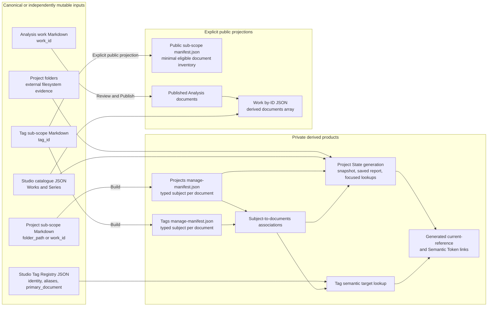
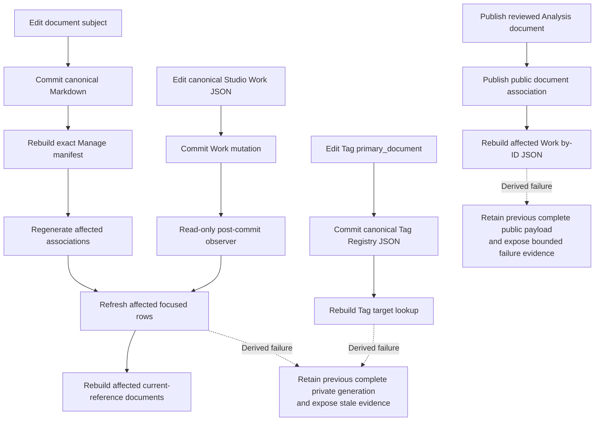

# Sub-Scope Publishing Concept And Architecture

## Purpose

Sub-Scope Publishing turns semi-structured working documents into explicit relationship evidence, maintained current references, independent editorial copies, and public catalogue links without making any derived projection the owner of folders, Works, Series, Tags, or document lifecycle.

## Ownership And Projection Map

The architecture separates canonical document source, canonical Studio JSON, external filesystem evidence, private derived products, and explicit public projections. A producing or consuming arrow does not grant mutation authority over its input.



Docs Viewer Markdown and Studio JSON remain separate canonical authorities. Physical folders are independently mutable evidence. Private manifests, associations, reports, snapshots, lookups, and rendered links are replaceable producer-owned products. Public products are created only through the configured publication boundary.

## Typed Document Subjects

Project documents accept zero or one subject declaration:

```yaml
folder_path: "projects/nerve"
```

or:

```yaml
work_id: "00123"
```

`folder_path` and `work_id` together are invalid; neither field takes precedence. Zero subjects remain valid for the create-then-edit workflow and unresolved working notes. `work_id` is a scalar string so leading zeroes remain identity. A syntactically valid subject whose current external target is absent remains reportable evidence rather than changing collection membership.

Tag documents declare canonical identity explicitly:

```yaml
tag_id: nerve
```

The registered customisation validates source and projects one normalized private Manage-manifest form:

```json
{
  "customisation": {
    "subject": {
      "kind": "work",
      "key": "00123"
    }
  }
}
```

The `manage-manifest.json` projection never infers subject identity from title, filename, body content, current route, selected row, report host, or a neighbouring source. Several documents may declare the same subject. Normal product use may prefer one-to-one associations, but cardinality remains zero-to-many and deterministic.

For a configured public sub-scope, `manifest.json` remains the minimal public-safe eligible-document inventory. Typed subjects, management status, local paths, private associations, and customisation controls remain in private generated products. A local-only collection such as `dotlineform/projects` has no public document projection.

## Relationship Products

Two products remain distinct even when one producer can generate both:

| product | question | example consumer |
| --- | --- | --- |
| subject-to-document association | Which documents declare this exact folder, Work, or Tag? | collection reports, Tag Registry, public Work metadata |
| subject relationship lookup | Which external folders, Works, Series, or other registered targets relate to this subject? | Project State and current references |

A future general relationship database may support wider analysis, joins, and exploration. Consumer-facing products remain focused materialized views with explicit schema, access, ordering, freshness, and producer ownership. No report or Resolver Token queries live canonical systems or an unrestricted graph at render time.

## Project State As Folder-Chaos Management

Project State primarily answers practical management questions: which folders exist, which have notes, which catalogue evidence relates to them, and what appears missing, undefined, stale, or unpublished. Its first report remains one folder-centred list rather than a dump of every available relationship view.

A folder-subject document contributes directly to its declared folder row. How a `work_id`-subject Project document participates in Project State remains an explicit open product decision: folder-row inclusion, derivation provenance, and Work-keyed lookup ownership are not selected by this concept. The visible report remains folder-centred regardless of that later decision. Another list is added only when it answers a distinct proven management question.

Physical folders, working documents, canonical Works/Series, and public editorial documents remain independent evidence. Project State observes disagreement and never repairs, renames, deletes, publishes, or synchronizes them.

## Contextual Current References

A Resolver Token acts as a generated **current references** block near the top of a document. Token source carries no manually authored resolver seed. At build time the containing collection supplies the document's normalized typed subject, the registered resolver performs one exact lookup, and declared groups render current folder, Work, Series, Tag, or document references.

The generic resolver consumes normalized collection context rather than independently interpreting arbitrary raw front-matter keys. Copying the same token into another document intentionally changes its result because the containing document changes. A document with no usable subject renders an explicit unresolved state.

Returned Work and Series identities reuse Semantic Tokens target and link projection. Generated usage evidence records source scope, collection, document, containing range, effective subject kind/key, lookup generation, and returned registered identity. Resolution never refreshes its lookup, scans canonical inputs, mutates source, recursively follows returned results, or silently falls back to UI context.

## Tag Association And Primary Selection

Tag documents decide only that they describe one canonical `tag_id`. Their private Manage-manifest projection produces the complete derived `tag_id -> documents[]` association.

Tag Registry and its editor own primary-document policy. The Registry schema stores zero or one exact document target as `primary_document` using `{scope, sub_scope, doc_id}` identity rather than a copied URL. Document-location projection supplies the current public-safe title and route.

Changing the primary document edits one Registry value and no document front matter. The editor may use the reverse lookup as eligible picker input, but it stores and presents only the primary rather than maintaining a multiple-document list. Documents remain independently authored and may cross-reference one another in their own content.

If the stored primary stops declaring the Tag or the document is deleted, `primary_document` remains unchanged. The editor exposes the stale target as unknown through the existing **Unavailable document** presentation; consumers never clear it, choose a replacement, or fall back to another association. The Semantic Token family consumes only a currently workable primary.

SSP-5 replaces `tag_registry_v5.doc_url[]` with `primary_document`. Its migration derives document `tag_id` declarations for the former association members where possible, carries `doc_url[0]` identity into `primary_document`, reports legacy entries that cannot be migrated, and removes `doc_url[]` once the reverse lookup and scalar primary are validated. Both membership models must not remain canonical simultaneously. Tag Registry remains the canonical Tag definition used for Work tagging—identity, group, aliases, and primary document—not the owner of the document association set.

## Editorial Copy And Publication

The normal Project publication route is:

```text
dotlineform/projects
  -> SSP-4 Copy to exact analysis/works collection
  -> fresh doc_id + target-default non-viewable state
  -> editorial cleanup and review
  -> viewable
  -> existing Analysis Publish
```

Working and editorial documents are independent copies. SSP-4 preserves a subject only through an explicitly shared transfer-compatibility contract. For the normal Work document case:

```text
folder_path -> omitted and reported
work_id     -> retained and revalidated
```

The source document, source identity, local folder target, and source media remain unchanged. Copy neither publishes nor couples later lifecycle. Analysis Publish remains the only authority that decides whether the editorial document enters public projections.

## Public Work Metadata

The public Work route should receive public document links through its existing exact payload:

```text
site/assets/works/index/<work_id>.json
```

The intended addition is a separate derived `documents[]` field, not mutation of canonical Work metadata and not mixing with the existing authored `work.links` field. Each item carries a current public-safe title and URL for a viewable published Analysis document that declares the exact `work_id`.

SSP-6 owns the payload schema version, deterministic ordering, zero/many presentation, public filtering, and targeted follow-through. Publishing or unpublishing a document updates its declared Work payload; changing `work_id` updates both old and new Work payloads; deleting a published document removes its association. SSP-4 is not the trigger because its initial editorial copy is non-viewable.

## Refresh And Failure

Canonical document mutation, canonical Studio mutation, manifest generation, relationship generation, Resolver rendering, copy, publication, and catalogue payload generation retain separate commit boundaries:



A derived failure never rolls back or repeats its source mutation. Each producer retains its previous complete generation and exposes stale or unavailable state. Generated products that must agree carry one generation identity or an explicit compatibility boundary. No consumer silently performs a live scan when its owned projection is unavailable.

## Architecture Boundary

Sub-Scope Publishing does not impose one-to-one document associations, infer identity, make local Project paths public, synchronize working and editorial copies, automatically promote viewability, choose Tag primary targets from sort order, make Resolver output authoritative, or turn public Work payloads into document registries.

The architecture permits a later general relationship store for analysis. That store must preserve canonical ownership, typed identity, access boundaries, and focused consumer projections rather than becoming an implicit mutation or live-resolution service.

The [Sub-Scope Publishing feature](/docs/?scope=studio&doc=d-20260802-194357-4d857b) owns the flat document family. SSP numbering in the index tree shows a possible delivery order, while each `.0` checkpoint reconciles retained component detail with this architecture before implementation.
