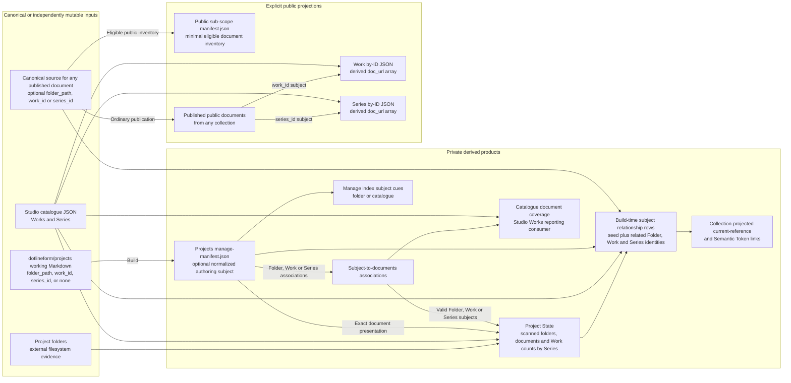
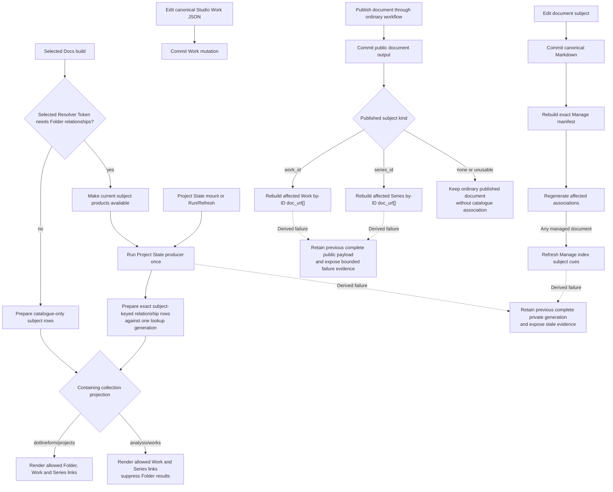

# Sub-Scope Publishing Concept And Architecture

## Purpose

Sub-Scope Publishing turns semi-structured working documents into explicit relationship evidence, maintained current references, independent editorial copies, and public catalogue links without making any derived projection the owner of folders, Works, Series, or document lifecycle.

## Ownership And Projection Map

The architecture separates canonical document source, canonical Studio JSON, external filesystem evidence, private derived products, and explicit public projections. A producing or consuming arrow does not grant mutation authority over its input.



Docs Viewer Markdown and Studio JSON remain separate canonical authorities. Physical folders are independently mutable evidence. Private manifests, associations, reports, snapshots, lookups, and rendered links are replaceable producer-owned products. Public products are created only through the configured publication boundary.

## Typed Document Subjects

The authoring convention permits zero or one subject declaration on a document. All private working documents may live together in `dotlineform/projects`.

A document about real folder state declares:

```yaml
folder_path: "projects/nerve"
```

A document about one significant catalogue Work declares:

```yaml
work_id: "00123"
```

A document about a Series as a whole declares:

```yaml
series_id: "026"
```

`folder_path`, `work_id`, and `series_id` are mutually exclusive by authoring convention; no field takes precedence. Zero subjects remain valid for generic notes, create-then-edit workflows, and ordinary publication. The fields never decide whether a document may be saved, copied, made viewable, or published.

`folder_path`, `work_id`, and `series_id` are canonical optional document-level subject fields and may be retained in any participating collection. Both IDs are scalar strings so leading zeroes remain identity. Consumer policy remains focused: Project State places valid Folder, Work, and Series declarations from `dotlineform/projects` into scanned real-folder rows through their exact current relationships; exact public `doc_url[]` reverse association reads only an explicitly declared Work or Series subject; Resolver projection may use any valid retained subject as a relationship seed. A valid declaration whose current target is absent remains reportable authoring evidence; a malformed or conflicting declaration is excluded from derived associations without blocking the document's ordinary lifecycle or publication.

Subject recognition, assignment, relationship resolution, and result projection are separate capabilities. `dotlineform/projects` may expose the focused **Assign subject** workflow. `analysis/works` can retain and normalize the same subject fields for read-only build consumers without exposing assignment. Neither Copy nor the destination route rewrites one subject kind into another.

The source reader projects an illustrative normalized private Manage-manifest form for authoring consumers:

```json
{
  "authoring_subject": {
    "kind": "series",
    "key": "026",
    "state": "valid"
  }
}
```

The exact manifest field name is an SSP-1.1 implementation decision. The projection never infers subject identity from title, filename, body content, current route, selected row, report host, destination collection, or a neighbouring source. Several documents may declare the same subject. Normal product use may prefer one-to-one associations, but cardinality remains zero-to-many and deterministic.

For a configured public sub-scope, `manifest.json` remains the minimal public-safe eligible-document inventory. Authoring subjects, management status, local paths, private associations, and customisation controls remain in private generated products. Publication eligibility and placement remain owned by the ordinary publication workflow rather than subject presence. A local-only collection such as `dotlineform/projects` has no direct public document projection.

## Relationship Products

Two products remain distinct even when one producer can generate both:

| product | question | example consumer |
| --- | --- | --- |
| subject-to-document association | Which documents declare this exact folder, Work, or Series? | Manage index cues, Project State, catalogue-document coverage, public Work/Series metadata |
| subject relationship lookup | Which external folders, Works, Series, or other registered targets relate to this subject? | Project State and current references |

A future general relationship database may support wider analysis, joins, and exploration. Consumer-facing products remain focused materialized views with explicit schema, access, ordering, freshness, and producer ownership. No report or Resolver Token queries live canonical systems or an unrestricted graph at render time.

## Project State As Folder-Chaos Management

Project State primarily answers practical management questions from the real-folder side: which folders exist, which notes relate to them through exact Folder, Work, or Series subjects, which canonical Works record media from them, and which Series those Works currently belong to. Its report remains one scanned-folder-centred list rather than a dump of every available relationship view.

The physical scan of the immediate project directories under `$DOTLINEFORM_PROJECTS_BASE_DIR/projects/` alone establishes Project State rows; nested directories remain contents of their owning project row, and the base root and sibling trees retain their existing owners. Canonical Works project to `projects/<normalized project_folder>` and retain only `work_id`, `project_folder`, and `series_ids`, while Studio catalogue/media retains `project_subfolder`, `project_filename`, and exact media resolution. Documents then trace to those established rows through their exact declared subject: Folder by exact key, Work by its canonical Folder, and Series by every scanned Folder containing a current member Work. One document is deduplicated once per Folder and retains subject/applicable-Series provenance for browser grouping. No recorded route creates a row or rewrites another identity. Folder assignments and physical folders elsewhere under the base root do not participate. Matched Works remain explicit `works[]` evidence and are grouped under each current `series_id`; browser presentation shows the exact Series links without Work counts. The current private products are `docs_project_state_report_v2` and `docs_project_state_folder_lookup_v2`. An ordinary local Docs Viewer report host runs the reconciliation on mount and Run/Refresh, then renders the current response without persisting report presentation. Its Folder labels remove the guaranteed `projects/` prefix while retaining the full base-relative key for identity and Finder activation. Recorded document or Work identities without a scanned real-folder placement belong to bounded diagnostics or a separate reverse-reconciliation report.

Physical folders, working documents, canonical Works/Series, and public editorial documents remain independent evidence. Project State observes disagreement and never repairs, renames, deletes, publishes, or synchronizes them.

## Single Working Collection And Manage Cues

All private working notes remain in `dotlineform/projects`, including generic notes, folder-state documents, and documents intended for later Work/Series publication. The normal Manage index supplies a compact authoring cue rather than another report or collection:

- a valid `folder_path` shows the folder-subject icon;
- a valid `work_id` shows the single-item dot-and-line cue, while a valid `series_id` shows the established three-item **Group by Series** list cue;
- no declaration shows no subject icon; and
- malformed or conflicting declarations may show an authoring warning without blocking copy or publication.

The icon consumes normalized Manage-manifest metadata and never reparses Markdown in the browser. It appears only as an authoring hint in Manage indexes; it is not document status, publication eligibility, or proof that a referenced folder or catalogue target currently exists.

Sub-scope lifecycle, report customisation, and declared fields are one configuration workflow rather than three. [SSC-1](/docs/?scope=studio&doc=d-20260804-172012-5d91bf) establishes the unified contract before SSP-0: every configured sub-scope receives the default report host, manifests, and standard collection behaviour, while one optional registered customisation contributes the additional aspects owned by that collection.

The intended model is:

```text
configured sub-scope
  -> default report host + manifests + standard collection behaviour
  -> optional sub_scope_customisation {id, settings}
       -> manifest and row projections
       -> read-only Info metadata
       -> focused actions and modals
       -> source validation and import rules
       -> Copy transfer contract
```

Assignable field groups belong to the registered customisation definition and its validated settings. They are not loose config arrays, a second registry, or paired with a separate action-availability boolean. The resolved group supplies both the supported values and the focused workflow capability, while raw settings and mutation authority remain server-side.

The management surfaces intentionally have different degrees of context awareness:

| surface | awareness and responsibility |
| --- | --- |
| **Copy to…** | collection-agnostic; it copies between any exact configured source and eligible destination without knowing Projects or interpreting subject meaning |
| **Edit metadata** | document-agnostic; it edits only front-matter fields common to every document |
| **Info** | scope/sub-scope-aware but renderer-agnostic; it resolves the active collection's registered metadata projection and displays every supported value read-only |
| **Assign subject** | contribution-specific; it appears only when the resolved sub-scope declares an assignable authoring-subject group and edits only the fields in that declaration |

`dotlineform/projects` is currently the only configuration intended to register **Assign subject**, with Folder using Finder path/URL paste resolution and Work/Series using Catalogue target search. The browser and modal do not activate through a literal `dotlineform/projects` comparison. After Copy, `analysis/works` retains and can expose `folder_path`, `work_id`, or `series_id` through read-only Info, but its configuration does not advertise subject assignment, so normal UI cannot retarget the editorial copy. Deliberate Markdown source editing remains possible, and neither the UI boundary nor subject state becomes a save or publication rule.

The existing Analysis Tags `group` field is the other current exception to the common-fields-only **Edit metadata** boundary. It leaves through [TDL-0](/docs/?scope=studio&doc=d-20260804-170901-b2e74c), which gives configured Tag-document fields their own modal while retaining read-only Info. SSP-0 and TDL-0 therefore remove their respective collection-specific fields without creating one generic sub-scope editor.

A Work-subject document associates only with its declared `work_id`; membership of a Series does not silently turn it into a Series document. A Series-subject document associates only with its declared `series_id` and does not fan out into every member Work payload.

## Catalogue Document Coverage Reporting

Catalogue document coverage is a curator reporting requirement over the same exact Work/Series-to-document associations. It answers which documents currently declare a Work or Series, where each document is available to the curator, and whether a usable public location exists. The report remains an observer: document front matter owns the declaration, canonical catalogue JSON owns Work/Series identity, and document-location projection owns current routes.

The existing [Catalogue Works](/docs/?scope=studio&doc=d-20260401-000000-ebf14a) index at `/studio/studio-works/?sort=cat&dir=asc` is the likely presentation family for this coverage through a column, filter, or focused detail. The requirement fixes the reporting question and derived inputs rather than the exact page/module design, so a later Studio Works refactor may select the final route and interaction. The shared subject-association product supplies the reporting input, Studio Works owns the eventual presentation, and document front matter remains the relationship authority.

## Contextual Current References

A Resolver Token acts as a generated **current references** block near the top of a document. Token source carries no manually authored resolver seed. At build time the containing document supplies its normalized authoring subject, private preparation reads focused Project State and catalogue relationship products once, and the registered resolver consumes one exact subject-keyed row containing the seed plus related Folder, Work, and Series identities. A no-subject document renders the bounded unresolved state.

The generic resolver consumes normalized collection context rather than independently interpreting arbitrary raw front-matter keys. Copy preserves those canonical subject bytes. The destination collection decides projection at build time: `dotlineform/projects` allows Folder, Work, and Series results, while `analysis/works` allows Work and Series and suppresses every Folder result. A retained Folder subject in Analysis remains the private relationship seed, so its related Series and bounded Work links can stay current without publishing the Folder identity or local link.

The resolved middle stage contains semantic target descriptors, not fabricated Semantic Token source text. Returned Work and Series identities reuse Semantic Tokens target and link projection, so built `content_html` contains ordinary anchors and readers never see intermediate token strings. Generated usage evidence records source scope, collection, document, containing range, effective subject kind/key, lookup generation, returned registered identity, result group, and `seed` or `related` role. The Manage Semantic Tokens report is the inspection surface for those resolver-derived identities.

When its result type is allowed, the seed appears first under Subject. A seed Work always remains visible. One related Work is shown directly; larger Work sets already represented by successfully projected Series links are omitted, while a Work not represented by a projected Series remains eligible for a direct link. Individual token expansion never refreshes relationship data, scans canonical inputs, mutates source, recursively follows returned results, or silently falls back to UI context.

For example, Work `00635` resolves to its Work seed, Folder `projects/10000`, and Series `001`; Analysis suppresses the Folder. Series `001` resolves to its Series seed, Folder `projects/10000`, and three member Works, so the projected Series link represents the Works without a duplicate list. Series `003` has one member Work, `00639`, so that singleton Work remains a direct related link. A retained Folder seed `projects/10000` resolves the same current relationship row in Projects and Analysis, but only Projects may project the Folder itself. [Resolver Tokens Architecture](/docs/?scope=studio&doc=d-20260802-174339-53877d) owns the complete examples.

## Editorial Copy And Publication

The normal catalogue-document publication route is:

```text
dotlineform/projects
  -> SSP-4 Copy to exact analysis/works collection
  -> fresh doc_id + target-default non-viewable state
  -> editorial cleanup and review
  -> viewable
  -> existing Analysis Publish
```

Working and editorial documents are independent copies. Copy changes the structural fields required for a new target document but preserves authoring-subject front matter without interpreting its destination meaning. For the normal Projects-to-Analysis route:

```text
folder_path -> retained unchanged; destination projection decides its use
work_id     -> retained unchanged; destination projection decides its use
series_id   -> retained unchanged; destination projection decides its use
no subject  -> copied normally
```

The source document, source identity, and source media remain unchanged. The Analysis copy receives a fresh identity and independently retains copied authoring metadata; later source edits do not silently retarget it. Copy does not normalize, validate, omit, translate, publish, or project the subject. Analysis build and Publish retain those responsibilities and do not require any subject.

## Public Work And Series Metadata

Public Work and Series routes receive document links through their existing exact payloads:

```text
site/assets/works/index/<work_id>.json
site/assets/series/index/<series_id>.json
```

The intended addition is a deterministic derived `doc_url[]` field containing the public URLs of published documents whose canonical source carries one valid catalogue declaration. It is not canonical Work/Series source, is not maintained by a catalogue editor, and does not mix with existing authored Work links. A published `work_id` document enters only its exact Work payload; a published `series_id` document enters only its exact Series payload. A published document with no valid catalogue declaration remains fully published and simply enters neither reverse lookup.

The public reverse lookup reads the final published document's canonical source front matter at build time regardless of its public collection. In the normal workflow, `dotlineform/projects` supplies a working declaration and `analysis/works` independently retains it through Copy; the public association does not depend on the original working document or Copy receipt. SSP-5 owns the payload schema version, deterministic ordering, zero/many presentation, non-blocking malformed/conflict evidence, public filtering, and targeted follow-through. Publishing, unpublishing, deleting, or changing a valid published subject rebuilds the exact affected old and new Work or Series payloads. SSP-4 is not the trigger because its initial editorial copy is non-viewable.

## Refresh And Failure

Canonical document mutation, canonical Studio mutation, manifest generation, relationship generation, relevant-build lookup refresh, Resolver rendering, copy, publication, and catalogue payload generation retain separate commit boundaries. Project State adds no canonical-mutation observer; freshness is established immediately before a selected build prepares Folder relationships for Resolver consumption:



A derived failure never rolls back or repeats its source mutation. Each producer retains its previous complete generation and exposes stale or unavailable state. Generated products that must agree carry one generation identity or an explicit compatibility boundary. Resolver rendering never silently uses the previous lookup as current after its prerequisite fails. Builds whose selected tokens need no Folder relationships and individual token expansions perform no Project State refresh. A publication build may privately consume the refreshed relationship row, but public payloads and runtime receive only allowed ordinary catalogue anchors, never Folder identities, local links, lookup data, or refresh capability.

## Architecture Boundary

Sub-Scope Publishing does not impose one-to-one document associations, infer or rewrite identity, make subject presence a save/copy/viewability/publication requirement, make local Project paths public, synchronize working and editorial copies, automatically promote viewability, roll exact document reverse associations from Work to Series or Series to Works, make Resolver output authoritative, or turn public Work/Series payloads into document registries.

The architecture permits a later general relationship store for analysis. That store must preserve canonical ownership, typed identity, access boundaries, and focused consumer projections rather than becoming an implicit mutation or live-resolution service.

The [Sub-Scope Publishing feature](/docs/?scope=studio&doc=d-20260802-194357-4d857b) owns the flat document family. SSP numbering in the index tree shows a possible delivery order, while each `.0` checkpoint reconciles retained component detail with this architecture before implementation.
