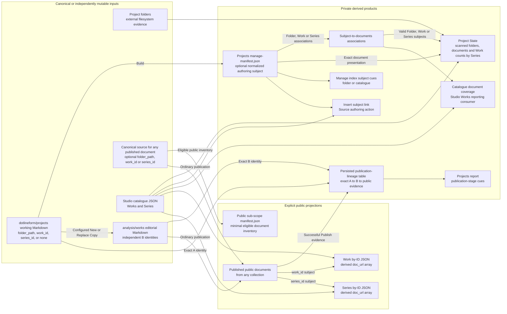
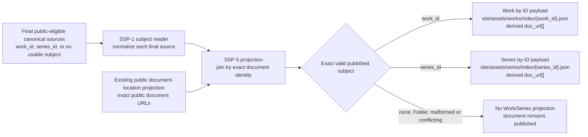
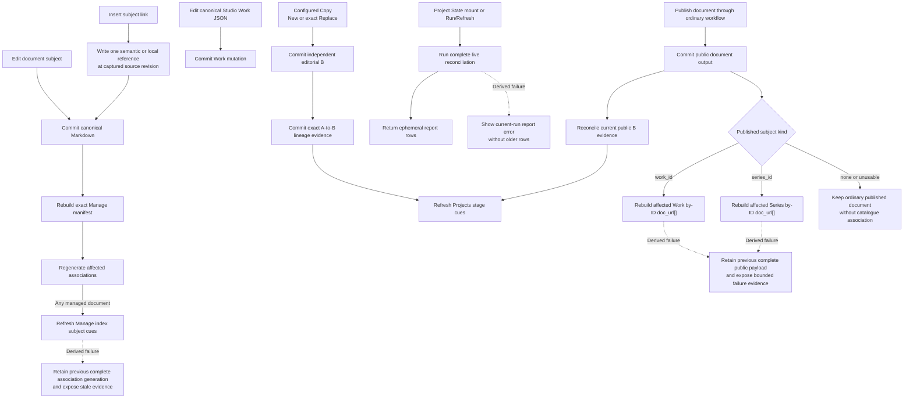

# Sub-Scope Publishing Concept And Architecture

## Purpose

Sub-Scope Publishing turns semi-structured working documents into explicit subject evidence, an independently useful Project State report, authored subject links, independent editorial copies, exact publication lineage, and public catalogue links without making any derived projection the owner of folders, Works, Series, or document lifecycle.

## Ownership And Projection Map

The architecture separates canonical document source, canonical Studio JSON, external filesystem evidence, private derived products, and explicit public projections. A producing or consuming arrow does not grant mutation authority over its input.



Docs Viewer Markdown and Studio JSON remain separate canonical authorities. Physical folders are independently mutable evidence. The publication-lineage table is persisted operation-owned state because its exact A-to-B relationship cannot be reconstructed by inference; private manifests, associations, reports, snapshots, and rendered links remain replaceable producer-owned products. Public products are created only through the configured publication boundary.

## Typed Document Subjects

The authoring convention permits zero or one subject declaration on a document. All private working documents may live together in `dotlineform/projects`.

A document about real folder state declares:

```yaml
folder_path: "projects/nerve"
```

A document about one significant catalogue Work declares:

```yaml
work_id: "00123"
```

A document about a Series as a whole declares:

```yaml
series_id: "026"
```

`folder_path`, `work_id`, and `series_id` are mutually exclusive by authoring convention; no field takes precedence. Zero subjects remain valid for generic notes, create-then-edit workflows, and ordinary publication. The fields never decide whether a document may be saved, copied, included in the next Publish, or published.

`folder_path`, `work_id`, and `series_id` are canonical optional document-level subject fields and may be retained in any participating collection. Both IDs are scalar strings so leading zeroes remain identity. Consumer policy remains focused: Project State places valid Folder, Work, and Series declarations from `dotlineform/projects` into scanned real-folder rows through their exact current relationships; exact public `doc_url[]` reverse association reads only an explicitly declared Work or Series subject; and **Insert subject link** converts the current valid subject into one authored semantic or local reference without expanding it. A valid declaration whose current target is absent remains reportable authoring evidence; a malformed or conflicting declaration is excluded from derived associations without blocking the document's ordinary lifecycle or publication.

Subject recognition, assignment, relationship resolution, and result projection are separate capabilities. `dotlineform/projects` may expose the focused **Assign subject** workflow. `analysis/works` can retain and normalize the same subject fields for read-only build consumers without exposing assignment. Neither Copy nor the destination route rewrites one subject kind into another.

The source reader projects an illustrative normalized private Manage-manifest form for authoring consumers:

```json
{
  "authoring_subject": {
    "kind": "series",
    "key": "026",
    "state": "valid"
  }
}
```

The exact manifest field name is an SSP-1.1 implementation decision. The projection never infers subject identity from title, filename, body content, current route, selected row, report host, destination collection, or a neighbouring source. Several documents may declare the same subject. Normal product use may prefer one-to-one associations, but cardinality remains zero-to-many and deterministic.

For a configured public sub-scope, `manifest.json` remains the minimal public-safe eligible-document inventory. Authoring subjects, management status, local paths, private associations, and customisation controls remain in private generated products. Publication eligibility and placement remain owned by the ordinary publication workflow rather than subject presence. A local-only collection such as `dotlineform/projects` has no direct public document projection.

## Relationship Products

Two relationship meanings remain distinct even when the same catalogue identity appears in both:

| product | question | example consumer |
| --- | --- | --- |
| subject-to-document association | Which documents declare this exact folder, Work, or Series? | Manage index cues, Project State, catalogue-document coverage, public Work/Series metadata |
| semantic-token usage | Which Works or Series does this document mention in its content? | Manage Semantic Tokens report and later relationship analysis |
| publication lineage | Which exact editorial B documents were created or replaced from working A, and which currently have public projections? | Projects publication-stage cues |

Subject association is aboutness; semantic usage is mention evidence. Semantic occurrences never become public Work/Series document metadata. A future general relationship database may support wider analysis, joins, and exploration, but consumer-facing products remain focused projections with explicit schema, access, ordering, freshness, and producer ownership.

## Project State As Folder-Chaos Management

Project State primarily answers practical management questions from the real-folder side: which folders exist, which notes relate to them through exact Folder, Work, or Series subjects, which canonical Works record media from them, and which Series those Works currently belong to. Its report remains one scanned-folder-centred list rather than a dump of every available relationship view.

The physical scan of the immediate project directories under `$DOTLINEFORM_PROJECTS_BASE_DIR/projects/` alone establishes Project State rows; nested directories remain contents of their owning project row, and the base root and sibling trees retain their existing owners. Canonical Works project to `projects/<normalized project_folder>` and retain only `work_id`, `project_folder`, and `series_ids`, while Studio catalogue/media retains `project_subfolder`, `project_filename`, and exact media resolution. Documents then trace to those established rows through their exact declared subject: Folder by exact key, Work by its canonical Folder, and Series by every scanned Folder containing a current member Work. One document is deduplicated once per Folder and retains subject/applicable-Series provenance for browser grouping. No recorded route creates a row or rewrites another identity. Folder assignments and physical folders elsewhere under the base root do not participate. Matched Works remain explicit `works[]` evidence and are grouped under each current `series_id`; browser presentation shows the exact Series links without Work counts. The current private product is the ephemeral `docs_project_state_report_v2` response. An ordinary local Docs Viewer report host runs the reconciliation on mount and Run/Refresh, then renders the current response without persisting report presentation or relationship data. Its Folder labels remove the guaranteed `projects/` prefix while retaining the full base-relative key for identity and Finder activation. SSP-6's shipped Uncataloged Files and Missing Source Files reports independently reconcile exact Work source directories and complete source paths; they neither create Project State rows nor consume its response.

Physical folders, working documents, canonical Works/Series, and public editorial documents remain independent evidence. Project State observes disagreement and never repairs, renames, deletes, publishes, synchronizes them, or supplies a persisted or document-build relationship lookup.

## Single Working Collection And Manage Cues

All private working notes remain in `dotlineform/projects`, including generic notes, folder-state documents, and documents intended for later Work/Series publication. The normal Manage index supplies a compact authoring cue rather than another report or collection:

- a valid `folder_path` shows the folder-subject icon;
- a valid `work_id` shows the single-item dot-and-line cue, while a valid `series_id` shows the established three-item **Group by Series** list cue;
- no declaration shows no subject icon; and
- malformed or conflicting declarations may show an authoring warning without blocking copy or publication.

The icon consumes normalized Manage-manifest metadata and never reparses Markdown in the browser. It appears only as an authoring hint in Manage indexes; it is not document status, publication eligibility, or proof that a referenced folder or catalogue target currently exists.

Sub-scope lifecycle, report customisation, and declared fields are one configuration workflow rather than three. [SSC-1](/docs/?scope=studio&doc=d-20260804-172012-5d91bf) establishes the unified contract before SSP-0: every configured sub-scope receives the default report host, manifests, and standard collection behaviour, while one optional registered customisation contributes the additional aspects owned by that collection.

The intended model is:

```text
configured sub-scope
  -> default report host + manifests + standard collection behaviour
  -> optional sub_scope_customisation {id, settings}
       -> manifest and row projections
       -> read-only Info metadata
       -> focused actions and modals
       -> source validation and import rules
       -> Copy transfer contract
```

Assignable field groups belong to the registered customisation definition and its validated settings. They are not loose config arrays, a second registry, or paired with a separate action-availability boolean. The resolved group supplies both the supported values and the focused workflow capability, while raw settings and mutation authority remain server-side.

The management surfaces intentionally have different degrees of context awareness:

| surface | awareness and responsibility |
| --- | --- |
| **Copy to…** | collection-agnostic; it copies between any exact configured source and eligible destination without knowing Projects or interpreting subject meaning |
| **Edit metadata** | document-agnostic; it edits only front-matter fields common to every document |
| **Info** | scope/sub-scope-aware but renderer-agnostic; it resolves the active collection's registered metadata projection and displays every supported value read-only |
| **Subject** | contribution-specific; it appears only when the resolved sub-scope declares an assignable authoring-subject group and opens the focused assignment modal for only those fields |

`dotlineform/projects` is currently the only configuration intended to register the **Subject** action, with Folder using Finder path/URL paste resolution and Work/Series using Catalogue target search. The browser and modal do not activate through a literal `dotlineform/projects` comparison. After Copy, `analysis/works` retains and can expose `folder_path`, `work_id`, or `series_id` through read-only Info, but its configuration does not advertise subject assignment, so normal UI cannot retarget the editorial copy. Deliberate Markdown source editing remains possible, and neither the UI boundary nor subject state becomes a save or publication rule.

The existing Analysis Tags `group` field is the other current exception to the common-fields-only **Edit metadata** boundary. It leaves through [TDL-0](/docs/?scope=studio&doc=d-20260804-170901-b2e74c), which gives configured Tag-document fields their own modal while retaining read-only Info. SSP-0 and TDL-0 therefore remove their respective collection-specific fields without creating one generic sub-scope editor.

A Work-subject document associates only with its declared `work_id`; membership of a Series does not silently turn it into a Series document. A Series-subject document associates only with its declared `series_id` and does not fan out into every member Work payload.

## Catalogue Document Coverage Reporting

Catalogue document coverage is a curator reporting requirement over the same exact Work/Series-to-document associations. It answers which documents currently declare a Work or Series, where each document is available to the curator, and whether a usable public location exists. The report remains an observer: document front matter owns the declaration, canonical catalogue JSON owns Work/Series identity, and document-location projection owns current routes.

The existing [Catalogue Works](/docs/?scope=studio&doc=d-20260401-000000-ebf14a) index at `/studio/studio-works/?sort=cat&dir=asc` is the likely presentation family for this coverage through a column, filter, or focused detail. The requirement fixes the reporting question and derived inputs rather than the exact page/module design, so a later Studio Works refactor may select the final route and interaction. The shared subject-association product supplies the reporting input, Studio Works owns the eventual presentation, and document front matter remains the relationship authority.

## Insert Subject Link

The Source editor offers one explicit **Insert subject link** action. It reads the current exact normalized subject and inserts one ordinary authored reference at the captured insertion point:

- Work and Series use the existing Semantic Tokens target lookup and serializer; and
- Folder uses the existing labelled `dlf-local:` Markdown link and encoded relative target.

None, malformed, conflicting, unknown, invalid, or unavailable states insert nothing and never fall back to title, body, route, selected row, or another subject kind. The action changes body source only; it does not edit front matter, expand related targets, inspect Project State, schedule a build prerequisite, or create another token family.

Inserted source is a snapshot. Later subject reassignment does not rewrite the reference. Work/Series semantic presentation may follow the existing target lookup on a later build while retaining the authored identity. Manage may activate a valid local Folder reference; the existing public promotion boundary removes its target and capability and leaves inert text.

An inserted Work/Series token records an ordinary content mention in semantic usage. It does not become evidence that the document is about that target. Exact subject front matter remains the sole authority for curator coverage and SSP-5 public Work/Series document metadata.

## Editorial Copy And Publication

The normal catalogue-document publication route is:

```text
dotlineform/projects
  -> SSP-4 Copy to exact analysis/works collection
  -> fresh doc_id + target-default publishable omission
  -> editorial cleanup and review
  -> optional Include/Exclude from next Publish
  -> existing Analysis Publish
```

Working and editorial documents are independent copies. Copy changes the structural fields required for a new target document but preserves authoring-subject front matter without interpreting its destination meaning. For the normal Projects-to-Analysis route:

```text
folder_path -> retained unchanged; destination projection decides its use
work_id     -> retained unchanged; destination projection decides its use
series_id   -> retained unchanged; destination projection decides its use
no subject  -> copied normally
```

The source document, source identity, and source media remain unchanged. The Analysis copy receives a fresh identity and independently retains copied authoring metadata; later source edits do not silently retarget it. Copy does not normalize, validate, omit, translate, publish, or project the subject. Analysis build and Publish retain those responsibilities and do not require any subject.

## Document Lineage And Publication State

[SSP-7 — Document Lineage And Publication State Delivery](/docs/?scope=studio&doc=d-20260805-231829-947705) now persists one private row for each exact working-source A to editorial-target B relationship through the shipped New/Replace Copy boundary. This row is workflow lineage, not content synchronization or document identity rewriting. A may have several B rows only through deliberate New choices. Successful scope-wide Publish now sets or clears its current exact public URL.

For a lineage-enabled configured Copy, the author explicitly chooses **New** or selects one exact existing B for **Replace**. New creates a fresh B and row. Replace preserves the selected B's immutable identity, placement, `added_date`, and current `publishable` gate while replacing its content and transferable metadata through the target transformation. Replace performs no comparison, diff, merge, automatic publication, or fallback to another target.

Scope-wide Publish remains the only public mutation. After successful Publish, it records or clears each affected B's current public URL in the same private table. No publication time, generation digest, or history is stored. Public-scope `publishable` means inclusion in the next Publish; it is not proof of current publication and does not exist in local collections. The Projects report alone derives Working, 🟠 Pre-publish, 🟢 Published, and unavailable presentation from the exact table and current B state. Its old Folder, Work, and Series row icons are removed; Project State retains those subject-placement icons. Analysis adds no publication-stage cue and keeps only its existing `publishable: false` exclusion icon.

The table uses exact `{scope, sub_scope, doc_id}` identities only. It never infers A-to-B relationships from subject, title, filename, content, dates, public URL, route, or selected UI state and never enters public products. SSP-5 public Work/Series metadata remains independently derived from the final published document's exact subject front matter.

## Public Work And Series Metadata

Public Work and Series by-ID payloads receive document links through their existing exact products:

```text
site/assets/works/index/<work_id>.json
site/assets/series/index/<series_id>.json
```

This projection is assembled from existing build-time inputs; no separate file represents a complete public document inventory.



The intended addition is a deterministic derived `doc_url[]` field containing the public URLs of published documents whose canonical source carries one valid catalogue declaration. It is not canonical Work/Series source, is not maintained by a catalogue editor, and does not mix with existing authored Work links. A published `work_id` document enters only its exact Work payload; a published `series_id` document enters only its exact Series payload. A published document with no valid catalogue declaration remains fully published and simply enters neither reverse lookup.

The public reverse lookup reads each final published document's canonical source front matter at build time regardless of its public collection, while the existing public document-location projection supplies its URL. In the normal workflow, `dotlineform/projects` supplies a working declaration and `analysis/works` independently retains it through Copy; the public association does not depend on the original working document or Copy receipt. SSP-5 owns the exact-identity join, payload schema version, deterministic zero/many projection, non-blocking malformed/conflict evidence, public filtering, and targeted follow-through. Publishing, unpublishing, deleting, or changing a valid published subject rebuilds the exact affected old and new Work or Series payloads. SSP-4 is not the trigger because Copy does not run Publish.

SSP-5 does not display `doc_url[]`. Work already has a public metadata panel, while Series has no equivalent metadata surface; a later Catalogue presentation delivery outside Sub-Scope Publishing must resolve that design asymmetry before either route consumes the field.

## Refresh And Failure

Canonical document mutation, canonical Studio mutation, manifest generation, association generation, subject-link insertion, Project State reporting, copy, publication, and catalogue payload generation retain separate commit boundaries:



SSP-7 uses ordinary post-success row-list updates after Copy and Publish. It adds no coordinated rollback, retry, generation receipt, or lineage-specific partial-commit protocol. Other derived failures never roll back or repeat their source mutations. Association and public-payload producers retain their existing complete-data failure boundaries. Project State shows the current live-run failure without older rows. Insert subject link performs no build or Project State refresh; normal rendering later treats its bytes through the existing semantic-token or local-link owner.

## Architecture Boundary

Sub-Scope Publishing does not impose one-to-one document associations, infer or rewrite identity, make subject presence a save/copy/publishability/publication requirement, make local Project paths public, synchronize working and editorial copies, compare or merge content during Replace, choose New or Replace automatically, automatically change publishability, roll exact document reverse associations from Work to Series or Series to Works, infer aboutness from semantic mentions, expand a subject into related references, or turn public Work/Series payloads into document registries.

The architecture permits a later general relationship store for analysis. That store must preserve canonical ownership, typed identity, access boundaries, and focused consumer projections rather than becoming an implicit mutation or live-resolution service.

The [Sub-Scope Publishing feature](/docs/?scope=studio&doc=d-20260802-194357-4d857b) owns the flat document family. SSP numbering in the index tree shows a possible delivery order, while each `.0` checkpoint reconciles retained component detail with this architecture before implementation.
