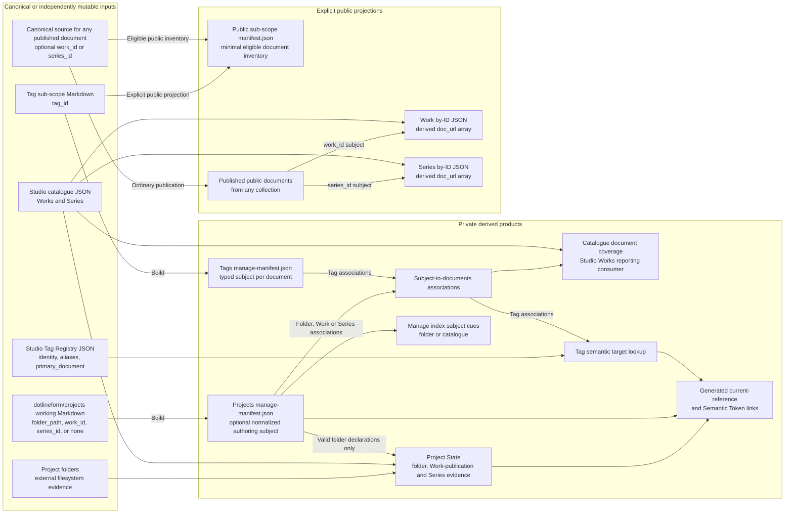
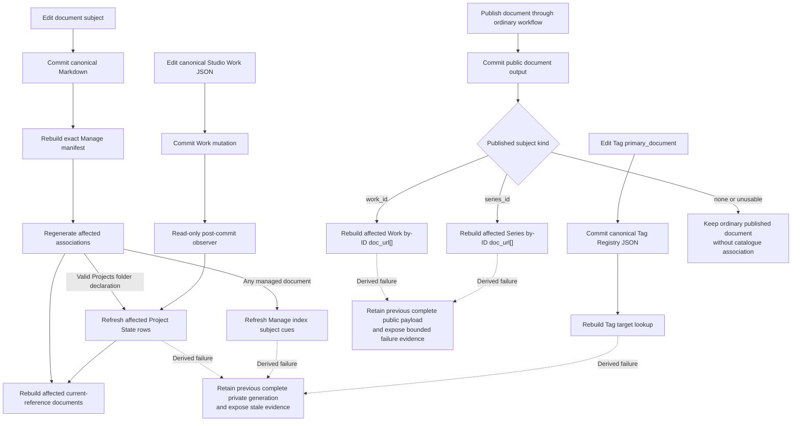

# Sub-Scope Publishing Concept And Architecture

## Purpose

Sub-Scope Publishing turns semi-structured working documents into explicit relationship evidence, maintained current references, independent editorial copies, and public catalogue links without making any derived projection the owner of folders, Works, Series, Tags, or document lifecycle.

## Ownership And Projection Map

The architecture separates canonical document source, canonical Studio JSON, external filesystem evidence, private derived products, and explicit public projections. A producing or consuming arrow does not grant mutation authority over its input.



Docs Viewer Markdown and Studio JSON remain separate canonical authorities. Physical folders are independently mutable evidence. Private manifests, associations, reports, snapshots, lookups, and rendered links are replaceable producer-owned products. Public products are created only through the configured publication boundary.

## Typed Document Subjects

The authoring convention permits zero or one subject declaration on a document. All private working documents may live together in `dotlineform/projects`.

A document about real folder state declares:

```yaml
folder_path: "projects/nerve"
```

A document about one significant catalogue Work declares:

```yaml
work_id: "00123"
```

A document about a Series as a whole declares:

```yaml
series_id: "026"
```

`folder_path`, `work_id`, and `series_id` are mutually exclusive by authoring convention; no field takes precedence. Zero subjects remain valid for generic notes, create-then-edit workflows, and ordinary publication. The fields never decide whether a document may be saved, copied, made viewable, or published.

`folder_path` is meaningful to Project State only for a valid declaration in `dotlineform/projects`. `work_id` and `series_id` are optional document-level catalogue association fields and may appear on a document in any collection. Both IDs are scalar strings so leading zeroes remain identity. A valid declaration whose current catalogue target is absent remains reportable authoring evidence; a malformed or conflicting declaration is excluded from reverse associations without blocking the document's ordinary lifecycle or publication.

Tag documents declare canonical identity explicitly:

```yaml
tag_id: nerve
```

The source reader projects an illustrative normalized private Manage-manifest form for authoring consumers:

```json
{
  "authoring_subject": {
    "kind": "series",
    "key": "026",
    "state": "valid"
  }
}
```

The exact manifest field name is an SSP-1.1 implementation decision. The projection never infers subject identity from title, filename, body content, current route, selected row, report host, destination collection, or a neighbouring source. Several documents may declare the same subject. Normal product use may prefer one-to-one associations, but cardinality remains zero-to-many and deterministic.

For a configured public sub-scope, `manifest.json` remains the minimal public-safe eligible-document inventory. Authoring subjects, management status, local paths, private associations, and customisation controls remain in private generated products. Publication eligibility and placement remain owned by the ordinary publication workflow rather than subject presence. A local-only collection such as `dotlineform/projects` has no direct public document projection.

## Relationship Products

Two products remain distinct even when one producer can generate both:

| product | question | example consumer |
| --- | --- | --- |
| subject-to-document association | Which documents declare this exact folder, Work, Series, or Tag? | Manage index cues, Project State, catalogue-document coverage, Tag Registry, public Work/Series metadata |
| subject relationship lookup | Which external folders, Works, Series, or other registered targets relate to this subject? | Project State and current references |

A future general relationship database may support wider analysis, joins, and exploration. Consumer-facing products remain focused materialized views with explicit schema, access, ordering, freshness, and producer ownership. No report or Resolver Token queries live canonical systems or an unrestricted graph at render time.

## Project State As Folder-Chaos Management

Project State primarily answers practical management questions: which folders exist, which have notes, which exact canonical Works record media from them, what the current Work catalogue/publication evidence is, which Series provide context, and what appears missing, undefined, stale, draft, or published. Its report remains one folder-centred list rather than a dump of every available relationship view.

A document with a valid `folder_path` contributes directly to its declared folder row. Documents with no subject or with `work_id`/`series_id` remain in the same working collection but do not enter Project State. Canonical Works whose recorded `project_folder` and `project_subfolder` normalize to the row remain explicit `works[]` evidence rather than disappearing after contributing their `series_ids`. This direct folder-to-Work connection shows whether physical media has been represented in Studio and whether the matching Work is currently draft or published. Series remain derived grouping context.

Physical folders, working documents, canonical Works/Series, and public editorial documents remain independent evidence. Project State observes disagreement and never repairs, renames, deletes, publishes, or synchronizes them.

## Single Working Collection And Manage Cues

All private working notes remain in `dotlineform/projects`, including generic notes, folder-state documents, and documents intended for later Work/Series publication. The normal Manage index supplies a compact authoring cue rather than another report or collection:

- a valid `folder_path` shows the folder-subject icon;
- a valid `work_id` or `series_id` shows the catalogue-subject icon, with the accessible label distinguishing Work from Series;
- no declaration shows no subject icon; and
- malformed or conflicting declarations may show an authoring warning without blocking copy or publication.

The icon consumes normalized Manage-manifest metadata and never reparses Markdown in the browser. It appears only as an authoring hint in Manage indexes; it is not document status, publication eligibility, or proof that a referenced folder or catalogue target currently exists.

A Work-subject document associates only with its declared `work_id`; membership of a Series does not silently turn it into a Series document. A Series-subject document associates only with its declared `series_id` and does not fan out into every member Work payload.

## Catalogue Document Coverage Reporting

Catalogue document coverage is a curator reporting requirement over the same exact Work/Series-to-document associations. It answers which documents currently declare a Work or Series, where each document is available to the curator, and whether a usable public location exists. The report remains an observer: document front matter owns the declaration, canonical catalogue JSON owns Work/Series identity, and document-location projection owns current routes.

The existing [Catalogue Works](/docs/?scope=studio&doc=d-20260401-000000-ebf14a) index at `/studio/studio-works/?sort=cat&dir=asc` is the likely presentation family for this coverage through a column, filter, or focused detail. The requirement fixes the reporting question and derived inputs rather than the exact page/module design, so a later Studio Works refactor may select the final route and interaction. The shared subject-association product supplies the reporting input, Studio Works owns the eventual presentation, and document front matter remains the relationship authority.

## Contextual Current References

A Resolver Token acts as a generated **current references** block near the top of a document. Token source carries no manually authored resolver seed. At build time the containing document supplies its normalized authoring subject, the registered resolver performs one exact lookup, and declared groups render current folder, Work, Series, Tag, or document references. A folder context reads the Project State row; a Work or Series context projects its exact declared identity through the existing semantic target lookup. A no-subject document renders the bounded unresolved state.

The generic resolver consumes normalized collection context rather than independently interpreting arbitrary raw front-matter keys. Copying the same token into another document intentionally changes its result because the containing document changes. A document with no usable subject renders an explicit unresolved state.

Returned Work and Series identities reuse Semantic Tokens target and link projection. Generated usage evidence records source scope, collection, document, containing range, effective subject kind/key, lookup generation, and returned registered identity. Resolution never refreshes its lookup, scans canonical inputs, mutates source, recursively follows returned results, or silently falls back to UI context.

## Tag Association And Primary Selection

Tag documents decide only that they describe one canonical `tag_id`. Their private Manage-manifest projection produces the complete derived `tag_id -> documents[]` association.

Tag Registry and its editor own primary-document policy. The Registry schema stores zero or one exact document target as `primary_document` using `{scope, sub_scope, doc_id}` identity rather than a copied URL. Document-location projection supplies the current public-safe title and route.

Changing the primary document edits one Registry value and no document front matter. The editor may use the reverse lookup as eligible picker input, but it stores and presents only the primary rather than maintaining a multiple-document list. Documents remain independently authored and may cross-reference one another in their own content.

If the stored primary stops declaring the Tag or the document is deleted, `primary_document` remains unchanged. The editor exposes the stale target as unknown through the existing **Unavailable document** presentation; consumers never clear it, choose a replacement, or fall back to another association. The Semantic Token family consumes only a currently workable primary.

SSP-5 replaces `tag_registry_v5.doc_url[]` with `primary_document`. Its migration derives document `tag_id` declarations for the former association members where possible, carries `doc_url[0]` identity into `primary_document`, reports legacy entries that cannot be migrated, and removes `doc_url[]` once the reverse lookup and scalar primary are validated. Both membership models must not remain canonical simultaneously. Tag Registry remains the canonical Tag definition used for Work tagging—identity, group, aliases, and primary document—not the owner of the document association set.

## Editorial Copy And Publication

The normal catalogue-document publication route is:

```text
dotlineform/projects
  -> SSP-4 Copy to exact analysis/works collection
  -> fresh doc_id + target-default non-viewable state
  -> editorial cleanup and review
  -> viewable
  -> existing Analysis Publish
```

Working and editorial documents are independent copies. `work_id` and `series_id` are shared optional document metadata, so ordinary Copy retains them without requiring matching collection-specific customisations. `folder_path` remains Projects-specific and is retained only by a target that supports that exact contract. For the normal Projects-to-Analysis route:

```text
work_id   -> retained as shared metadata
series_id -> retained as shared metadata
folder_path -> omitted and reported when unsupported
no subject -> copied normally
```

The source document, source identity, and source media remain unchanged. The Analysis copy receives a fresh identity and independently retains any copied authoring metadata; later source edits do not silently retarget it. Copy neither publishes nor couples later lifecycle. Analysis Publish remains the public authority for this workflow and does not require `work_id` or `series_id`.

## Public Work And Series Metadata

Public Work and Series routes receive document links through their existing exact payloads:

```text
site/assets/works/index/<work_id>.json
site/assets/series/index/<series_id>.json
```

The intended addition is a deterministic derived `doc_url[]` field containing the public URLs of published documents whose canonical source carries one valid catalogue declaration. It is not canonical Work/Series source, is not maintained by a catalogue editor, and does not mix with existing authored Work links. A published `work_id` document enters only its exact Work payload; a published `series_id` document enters only its exact Series payload. A published document with no valid catalogue declaration remains fully published and simply enters neither reverse lookup.

The public reverse lookup reads the final published document's canonical source front matter at build time regardless of its public collection. In the normal workflow, `dotlineform/projects` supplies a working declaration and `analysis/works` independently retains it through Copy; the public association does not depend on the original working document or Copy receipt. SSP-6 owns the payload schema version, deterministic ordering, zero/many presentation, non-blocking malformed/conflict evidence, public filtering, and targeted follow-through. Publishing, unpublishing, deleting, or changing a valid published subject rebuilds the exact affected old and new Work or Series payloads. SSP-4 is not the trigger because its initial editorial copy is non-viewable.

## Refresh And Failure

Canonical document mutation, canonical Studio mutation, manifest generation, relationship generation, Resolver rendering, copy, publication, and catalogue payload generation retain separate commit boundaries:



A derived failure never rolls back or repeats its source mutation. Each producer retains its previous complete generation and exposes stale or unavailable state. Generated products that must agree carry one generation identity or an explicit compatibility boundary. No consumer silently performs a live scan when its owned projection is unavailable.

## Architecture Boundary

Sub-Scope Publishing does not impose one-to-one document associations, infer identity, make subject presence a save/copy/viewability/publication requirement, make local Project paths public, synchronize working and editorial copies, automatically promote viewability, roll Work documents up to Series or Series documents down to Works, choose Tag primary targets from sort order, make Resolver output authoritative, or turn public Work/Series payloads into document registries.

The architecture permits a later general relationship store for analysis. That store must preserve canonical ownership, typed identity, access boundaries, and focused consumer projections rather than becoming an implicit mutation or live-resolution service.

The [Sub-Scope Publishing feature](/docs/?scope=studio&doc=d-20260802-194357-4d857b) owns the flat document family. SSP numbering in the index tree shows a possible delivery order, while each `.0` checkpoint reconciles retained component detail with this architecture before implementation.
