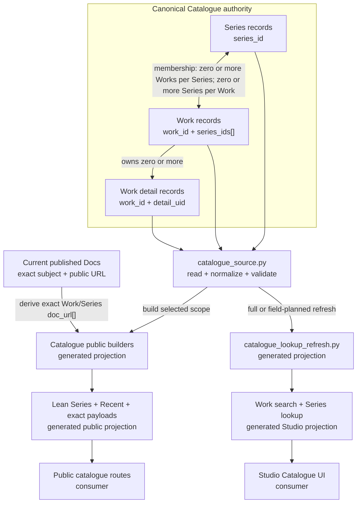

# Catalogue Data Model Map

## Purpose And Reading Guide

This map explains the Catalogue authority boundary: canonical Series, Works, and Work details are read through the source model and projected into independently refreshable public and Studio read models. Public Work and Series payloads additionally receive derived public document URLs from exact published Docs evidence. Solid arrows are current reads or generation. The relationship between Series and Works is logical; it does not claim relational storage.

## Diagram

## Artefact Register

| artefact or family | classification | producer or owner | primary consumer | refresh |
| --- | --- | --- | --- | --- |
| `studio/data/canonical/catalogue/{series,works}.json` | canonical | `studio/services/catalogue/catalogue_source.py` plus mutation services | Catalogue builders, validators, and Studio services | accepted canonical mutation |
| `studio/data/canonical/catalogue/work_details/<work_id>.json` | canonical | Catalogue detail mutation services | source reader and public detail generation | accepted detail mutation |
| lean `site/assets/data/series_index.json`, owned `recent_index.json`, and exact `site/assets/{series,works}/index/<id>.json` | generated public projection | Catalogue generation plus exact Docs enrichment from `docs_catalogue_document_urls.py` | route-owned public Catalogue consumers | scoped Catalogue build or exact Docs publication/Delete follow-through |
| `site/assets/data/search/catalogue/index.json` | generated public projection | `studio/services/catalogue/search/build_search.py` | public Catalogue search | selected search build |
| `studio/data/generated/catalogue-lookup/{work_search,series_search}.json` and `series/<series_id>.json` | generated Studio projection | `studio/services/catalogue/catalogue_lookup.py` and `catalogue_lookup_refresh.py` | Studio Catalogue lookup consumers | full or field-planned targeted refresh |

## Notes

- `series_ids[]` is the Work-owned canonical membership reference. The canonical shape permits zero or more Series per Work and zero or more Works per Series; publication separately blocks a Work that does not belong to a published Series.
- Work details are separately stored canonical records subordinate to a Work identity. The diagram does not reproduce their section schema.
- Optional Catalogue Markdown companions remain authored presentation sources; they do not replace the canonical JSON identity shown here.
- Public and Studio products are separate projections. A successful mutation selects the required refresh work; neither projection becomes canonical because it is easier to query.
- Work and Series by-ID `doc_url[]` is derived from exact current published Docs locations and each final canonical document's explicit `work_id` or `series_id`. It is not authored Catalogue source, does not roll through membership, and is not yet consumed by the public Catalogue routes.
- Focused Work and detail service responses are runtime-only projections and are not another stored family.

## What This Does Not Include

- every Catalogue field, validation rule, or mutation transaction;
- editor modal, activity, bulk-edit, workbook-import, or deletion workflow;
- media discovery, responsive image generation, or R2 publication;
- page-template and route rendering detail; or
- historical migrations and compatibility cleanup.

## Possible Enhancements

- Split the logical identity/cardinality view from public publication when either side becomes too dense.
- Add media lineage as its own child only if it becomes a recurring architecture question.
- Add path-existence checks for register entries after the authored map set proves worth maintaining.

## Authorities

[Catalogue Source Model](/docs/?scope=studio&doc=d-20260519-000000-a0da45) owns canonical record meaning. [Catalogue Indexes And Payloads](/docs/?scope=studio&doc=d-20260519-202931-b05d27) owns public and Studio read products. [Sub-Scope Publishing Concept And Architecture](/docs/?scope=studio&doc=d-20260802-194358-7717ee) owns the exact Docs subject/aboutness boundary. Current implementation evidence is concentrated in `studio/services/catalogue/catalogue_source.py`, `studio/services/catalogue/catalogue_generation_indexes.py`, `studio/services/catalogue/generate_work_pages.py`, `studio/services/catalogue/catalogue_lookup.py`, `studio/services/catalogue/catalogue_lookup_refresh.py`, and `docs-viewer/services/docs_catalogue_document_urls.py`; focused coverage includes `studio/tests/python/test_catalogue_source_mutation.py`, `test_catalogue_generation_indexes.py`, `test_catalogue_generation_writes.py`, `test_catalogue_lookup_refresh.py`, and `docs-viewer/tests/python/test_docs_catalogue_document_urls.py`.
