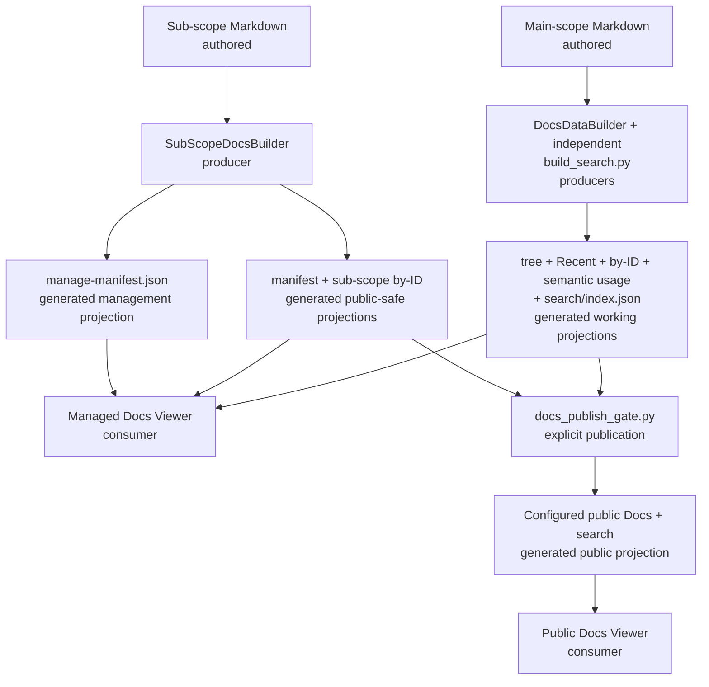

# Docs Viewer Projection Map

## Purpose And Reading Guide

This map follows authored Markdown and front matter through the working projections used by managed Docs Viewer and the separate publish gate used for public copies. Main-scope and sub-scope products remain distinct. Solid arrows are current generation, publication, or consumption.

## Diagram

## Artefact Register

| artefact or family | classification | producer | primary consumer | visibility or refresh |
| --- | --- | --- | --- | --- |
| `docs-viewer/scopes/<scope>/source/documents/<doc_id>.md` | authored | document authoring and management services | main Docs and search builders | scope source |
| `source/sub-scopes/<sub_scope>/documents/<doc_id>.md` | authored | exact sub-scope authoring target | sub-scope builder | registered sub-scope source |
| `published/documents/{index-tree.json,recent.json,by-id/<doc_id>.json,semantic-tokens/index.json}` | generated working projection | `DocsDataBuilder` | managed navigation, document, Recent, and token-report consumers | full or selected targeted Docs build |
| `published/search/index.json` | generated working projection | `build_search.py` | managed search and downstream public publication | independent full or targeted search build |
| `published/documents/sub-scopes/<sub_scope>/{manifest.json,by-id/<doc_id>.json}` | generated working, public-safe projection | `SubScopeDocsBuilder` | managed sub-scope reports and configured public copy | sub-scope build |
| `published/documents/sub-scopes/<sub_scope>/manage-manifest.json` | generated management projection | `SubScopeDocsBuilder` plus registered customisation | Manage report and actions | never publicly published |
| `site/assets/data/docs/scopes/<scope>/` and `site/assets/data/search/<scope>/index.json` | generated public projection | `docs_publish_gate.py` | public Docs Viewer | explicit configured publication only |

## Notes

- `docs_scopes.json` owns scope type, source and working locations, viewer route, sub-scope registrations, and public destinations.
- Main-scope targeted builds replace selected by-ID and semantic-usage rows while recalculating the small navigation and Recent products.
- Search is independently produced. A Docs build does not make search current unless the search builder also runs.
- Sub-scope documents remain excluded from the parent scope's Index, Recent, and search. Their reachability comes from registered report/customisation hosts and their own manifests.
- `manifest.json` is public-safe; `manage-manifest.json` retains management rows and customisation and cannot pass through the publication gate.
- Public output is a deliberate copy of configured generated products, not a live read from authored or managed working source.

## What This Does Not Include

- every scope and sub-scope registration;
- management server endpoints, Source editor transactions, or document-selection rules;
- Markdown parsing, sanitisation, media, Mermaid, or semantic-token internals;
- import, export, copy, move, and review-package workflows; or
- browser boot, caching, and component-level rendering detail.

## Possible Enhancements

- Add a separate mutation-to-rebuild sequence if source transaction and post-commit recovery become difficult to follow.
- Split public publication from working generation if the publishable family expands materially.
- Add a focused sub-scope lifecycle diagram only if manifest/customisation ownership becomes a recurring source of errors.

## Authorities

[Generated Data Contracts](/docs/?scope=studio&doc=d-20260605-125108-c68916) owns payload meaning and [Projection Contract](/docs/?scope=studio&doc=d-20260523-222005-1085b2) owns source, working, and public boundaries. Current implementation evidence is `docs-viewer/build/docs_builder/pipeline.py`, `docs-viewer/build/docs_builder/sub_scope.py`, `docs-viewer/build/build_search.py`, `docs-viewer/services/docs_publish_gate.py`, and `docs-viewer/config/scopes/docs_scopes.json`; focused coverage includes `docs-viewer/tests/python/test_build_docs_payloads.py`, `test_build_docs_subscopes.py`, `test_build_search_python.py`, `test_build_docs_public_payloads.py`, and `test_docs_publish_gate.py`.
