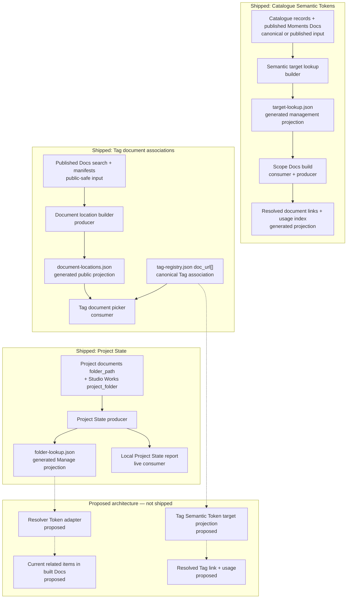

# Cross-System Relationship Map

## Purpose And Reading Guide

This map separates the shipped Semantic Token, Tag document-location, and Project State projections from proposed Resolver Token and Tag Semantic Token behavior. Solid edges are verified current generation or consumption. Dashed edges and labels containing **proposed** describe architecture only; they must not be read as shipped files or services.

## Diagram

## Artefact Register

| artefact or family | state and classification | producer or owner | primary consumer | refresh |
| --- | --- | --- | --- | --- |
| `docs-viewer/data/generated/semantic-tokens/target-lookup.json` | shipped generated management projection | `SemanticTargetLookupBuilder` | managed Docs semantic-token rendering and authoring | explicit target refresh from current registered inputs |
| scope `published/documents/semantic-tokens/index.json` | shipped generated working projection | scope Docs build | Semantic Tokens report and diagnostics | document build; targeted builds preserve untouched rows |
| `studio/data/canonical/tags/tag-registry.json` `doc_url[]` | shipped canonical association | Tag source model and mutation services | Tag Registry UI | accepted Tag mutation |
| public `document-locations.json` | shipped generated public projection | document-location builder from already-published Docs products | Tag document picker | public Docs/search projection build and publication |
| Project State relationship rows and `var/docs/project-state/folder-lookup.json` | shipped live response and generated Manage projection | Project State producer | local Project State report and proposed Resolver adapter | report mount/Run/Refresh; later one refresh before a relevant SSP-3 Manage build |
| Resolver Token expansion | proposed build projection | proposed registered resolver adapter | built managed document | selected Manage build refreshes Project State once before Project-token rendering |

## Notes

- Semantic target refresh and document rebuild are separate. Refreshing the target lookup does not silently rebuild every token-bearing document.
- The public document contains ordinary resolved links. It does not receive the management target lookup or a client-side semantic resolver.
- Tag Registry `doc_url[]` is the current ordered canonical association. `document-locations.json` supplies public-safe titles and locations for selection; it is not Tag authority.
- Document lifecycle remains independent of Tag links. Stale URLs can remain valid stored associations and are not inferred or repaired from titles or current UI context.
- The shipped Project State model is folder-centred. Docs Viewer `folder_path` and Studio Work `project_folder` remain different identities joined only by the read-only producer; no Studio or Docs mutation observer is installed.
- The existing `var/studio/reports/project-state.md` workflow is an image audit, not the shipped Docs Viewer Project State relationship report.
- Proposed Resolver expansion is one hop and read-only. A relevant Manage build refreshes Project State once before rendering; individual tokens do not scan live owners, mutate source, recursively traverse relationships, or refresh again.

## What This Does Not Include

- Catalogue public page projections already covered by the Catalogue map;
- Docs Viewer tree, manifest, search, and publication topology already covered by the Docs Viewer map;
- Tag aliases, assignments, mutation planning, or future Registry migrations;
- exact Project State row schemas or proposed Resolver Token syntax;
- proposed SSP delivery sequencing and migration detail; or
- graph traversal, ranking, inference, or automatic dependent-document rebuilds.

## Possible Enhancements

- Promote each relationship family into its own child if one diagram can no longer preserve the shipped/proposed boundary clearly.
- Add Tag Semantic Tokens after their canonical association migration and target projection are actually delivered.
- Replace the proposed Resolver section with current exact files, producers, and tests after SSP-3 completes.

## Authorities

[Semantic Tokens Architecture](/docs/?scope=studio&doc=d-20260714-234030-434069) owns semantic resolution and usage. [Tag Registry](/docs/?scope=studio&doc=d-20260331-000000-4519a5) owns current `tag_registry_v5` associations. [Project State Concept And Architecture](/docs/?scope=studio&doc=d-20260802-121105-c574f9) owns the shipped Project State flow; [Resolver Tokens Architecture](/docs/?scope=studio&doc=d-20260802-174339-53877d) owns the proposed consumer flow.

Current implementation evidence includes `docs-viewer/build/docs_builder/semantic_target_lookup.py`, `studio/services/tags/tag_source_model.py`, `studio/services/tags/tag_registry_mutations.py`, `docs-viewer/services/docs_document_location_projection.py`, and `docs-viewer/services/docs_project_state.py`; focused coverage includes `docs-viewer/tests/python/test_semantic_target_lookup.py`, `studio/tests/python/test_tag_source_model.py`, `studio/tests/python/test_tag_registry_mutations.py`, `docs-viewer/tests/python/test_build_document_locations.py`, and `docs-viewer/tests/python/test_docs_project_state.py`.
