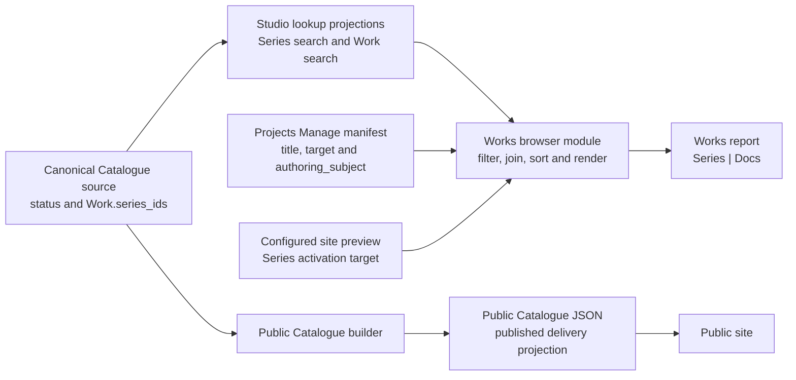

# Works Report Concept And Architecture

## Purpose

The Works report answers one bounded coverage question: which published Series have no Project document about either the Series itself or any current member Work? It is Series-grained even though **Works** is its user-facing title.

Works is the published-Series-first complement to Project State and Projects. Its title follows the public-site vocabulary used by `analysis/works`; its row identity remains exact canonical `series_id`, not `work_id`.

| report | row authority | question answered |
| --- | --- | --- |
| Project State | immediate physical Project folders | Which source folders have no current canonical Series relationship? |
| Projects | current `dotlineform/projects` documents | What documentation exists? |
| Works | published canonical Series | Which published Series have nothing written about them? |

## Ownership And Flow



Canonical Catalogue JSON owns Series and Work identity, publication status, and current Work-to-Series membership. The existing Studio Series and Work search projections carry those fields into a browser-readable local model containing both published and draft records. Project document front matter owns subject aboutness, and the Projects Manage manifest carries each current document's normalized `authoring_subject`, title, and exact target in one projection. The Works browser observes these inputs and never writes them.

Public Catalogue JSON is separately generated from canonical source for public delivery and contains published records only. It answers whether a public projection exists, not what Studio currently classifies as published. Works therefore never uses public file presence to establish or suppress a row. A canonical-published Series whose public projection is missing remains visible in Works; that disagreement belongs to projection-integrity auditing.

## Coverage Rule

For one published Series `S`, the report derives:

```text
Docs(S) = exact Series-subject documents for S
        + exact Work-subject documents for every published Work W
          where S is in W.series_ids
```

The union is deduplicated by exact `{scope, sub_scope, doc_id}` identity. A Series is undocumented exactly when `Docs(S)` is empty.

The coverage predicate deliberately stops there. One matching published Work-subject document makes the complete Series row written about. The browser does not retain or diagnose the other member Work IDs, calculate per-Work gaps, or require every member Work to have documentation. A published Work belonging to several published Series contributes its exact document to each of those Series rows. A Series-subject document contributes only to its exact declared Series.

Only Series lookup records with exact `status: published` establish rows. Only Work lookup records with exact `status: published` can expand a Work subject through current `series_ids`; draft and unknown Works contribute no coverage. The publication status or documentation coverage of every other member Work is irrelevant. Documents, unknown subjects, or recorded membership never invent a Series.

## Exact Browser Inputs

The browser loads three existing local read projections:

- the Studio `catalogue_lookup_series_search` read, containing exact Series ID, title, and status;
- the Studio `catalogue_lookup_work_search` read, containing exact Work ID, status, and `series_ids`; and
- the configured private `dotlineform/projects` Manage manifest, containing current document title, target, and normalized `authoring_subject`.

The two Catalogue reads use the existing Local Studio Catalogue read boundary resolved from the configured `studioBaseUrl`. They reuse the current lookup builders and loopback-origin transport; Works adds no Catalogue or Docs Viewer endpoint. The Projects manifest is already the complete browser input used by its own sub-scope report, so Works does not also read `subject-associations.json` or introduce a matching-generation join.

Repository co-location does not itself make a file browser-addressable. Server-side code can read a repository path directly, but browser JavaScript can fetch only a served URL; Docs Viewer and Local Studio also use different local ports and are therefore different browser origins. Local Studio's static-file response does not provide the loopback cross-origin headers used by its JSON read response, so the mere presence of `studio/data/generated/catalogue-lookup/{series_search,work_search}.json` is not sufficient for a direct Docs Viewer static fetch. This is an ordinary HTTP addressability/origin boundary, not evidence of a filesystem failure.

Works avoids a new static mapping or report endpoint by using the existing `catalogue_lookup_series_search` and `catalogue_lookup_work_search` read keys, whose JSON responses already support the configured loopback-origin access. The server transports existing browser-safe Catalogue projections; the Works browser still owns all filtering, joining, de-duplication, ordering, and presentation. If that existing Local Studio read transport is unavailable, the report fails as one contained current mount rather than falling back to public JSON or moving the join server-side.

The browser accepts a Series subject only when its exact target exists in the published-Series set and a Work subject only when its exact target exists in the published-Work set. Folder, None, malformed, conflicting, unknown-Series, draft-Series, unknown-Work, and draft-Work states contribute no document.

Document presentation contains the exact Projects target, current manifest title, existing Manage URL, and declared subject `{kind, key}`. The browser uses the shared Series/Work subject-icon vocabulary already used by Projects and Project State. The icon describes the declared subject route into the row; it is not inferred coverage state, publication state, or a substitute target.

## Browser Composition And Failure

On mount, the browser fetches the three complete inputs, validates their owned schemas, filters published Series and Works, performs the exact in-memory join, and then renders one complete current result. Each row contains:

- exact `series_id`, current Series title, and a local-preview Series target;
- zero or more exact linked Project documents with current title and declared Series/Work subject; and
- only the counts needed to validate deterministic row and document collections.

Rows sort by normalized Series title and exact `series_id`. Documents sort by normalized title, exact subject kind/key, and `doc_id`. Identity, label, and activation target remain distinct. A later refresh repeats all three reads before replacing the result; it does not incrementally patch an older join.

The composed rows are ephemeral browser state. No generated coverage JSON, report-response schema, server producer, cache, report Markdown, folder lookup, watcher, or mutation follow-through is introduced. If any required input is unavailable or invalid, the current mount shows one contained error and no partial or older rows.

## Embedded Local Report

One ordinary human-authored parent document in scope `dotlineform` declares the focused Works report and local access. The existing local report registry and explicit browser loader mount the focused module. There is no Works method in `docs-viewer-report-service.js`, no Works management route, and no public report registry, public Docs projection, or public Catalogue route consumer.

The table is:

| Series | Docs |
| --- | --- |
| one exact linked published Series title | zero or more exact Project-document links with Series or Work subject cues |

Blank Docs cells remain visible and are the direct answer that the Series has nothing written about it. The Series link is composed from the exact `series_id` and configured local site-preview origin; it does not depend on a public JSON row. Document links open the exact document in the Projects sub-scope through its existing report host and `subdoc` target.

Works does not add grouping, a Work projection, coverage percentages, automatic exception labels, saved output, arbitrary filters, or public display. Search, sorting controls, and clipboard transforms require an explicit later product decision.

## Relationship To Existing Owners

[Project State Concept And Architecture](/docs/?scope=studio&doc=d-20260802-121105-c574f9) remains physical-Folder-grained and may use Series/Work relationships only to reconcile those rows. [Projects](/docs/?scope=dotlineform&doc=d-20260801-073826-8865a8) remains document-grained. [Sub-Scope Publishing Concept And Architecture](/docs/?scope=studio&doc=d-20260802-194358-7717ee) owns exact subject aboutness and routes curator coverage presentation here instead of the Studio Works page.

SSP-5 public `doc_url[]` remains a different final-public-document projection. The Works report reads the current private Projects manifest and Studio-owned Catalogue lookup projections for local coverage; it reads neither public aggregate/exact Catalogue JSON nor `doc_url[]` and does not imply that a Working document is editorial or public.

## Not In Scope

- one row per Work or identification of undocumented member Work IDs;
- treating the absence of one Work document as a gap when another Series/Work document covers the Series;
- Folder-subject placement, physical directory scanning, Finder activation, or Project State changes;
- semantic-token mentions, content scans, title matching, or relationship expansion beyond exact current Work membership;
- `analysis/works` editorial documents, lineage stage, `publishable`, public document locations, or public Catalogue presentation;
- public Catalogue JSON as publication authority or a report input, and projection-integrity auditing;
- a Works server producer, versioned report response, Docs Viewer service method, or report endpoint;
- a new canonical association store, persisted report product, generic graph/query layer, or compatibility reader;
- mutation, repair, assignment, Copy, Publish, Delete, or automatic refresh hooks; or
- changing canonical Work, Series, subject, sub-scope, or public-route contracts.
