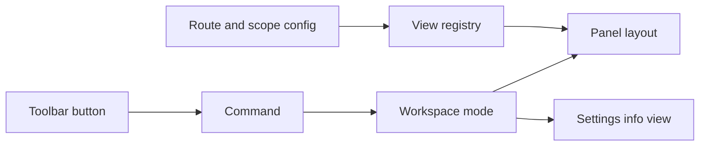

---

new scope modal - wide:

```
.docsViewer__modalCard--wide{
  --docs-viewer-modal-width: 64rem;
  margin-top: 2vh;
  max-height: calc(100vh - 2rem - 2vh);
}
```



>note: this needs putting in a doc

The uncomfortable proof is that the Workspaces set we just created already starts reproducing the problem: scope eligibility now appears in the parent request, roadmap, focused request and root links. The focused document should own the contract; the others should contain only a short link and sequencing context.

Moments-axis should pause after the visual experiment. The next work should reduce the cost of every subsequent feature.

I’d impose four concrete disciplines.

1. Documentation ownership

- One durable owner for each current contract.
- Parent requests contain decisions and boundaries, not repeated implementation details.
- Roadmaps contain sequence and status only.
- Focused requests own one unresolved slice.
- Task trackers disappear after implementation.
- Completing a slice updates one durable owner, advances the roadmap, and removes or drastically reduces the request.
- Stale or duplicative references found during a change are fixed immediately rather than recorded for later.

The current [Docs Viewer Documentation Cleanup](/Users/dlf/Developer/dotlineform/dotlineform-site/docs-viewer/source/studio/docs-viewer-documentation-register.md) is the right place to establish and apply this discipline.

2. CSS ownership

The stylesheet structure should reflect actual runtime ownership:

```text
shared shell and primitives
panel/layout
rendered document content
public scope-specific presentation
management-only features
reports
individual composition engines
```

Every feature stylesheet should have one loading surface and one namespace. Future engine CSS must never accumulate in the shared Docs Viewer or Moments stylesheet.

File size is not the only issue, but oversized CSS is usually evidence that ownership has blurred. Splitting should happen when a responsibility becomes nameable, not after another 500 lines arrive.

3. JavaScript size gates

A 1,000-line module should be treated as a failure state.

A practical rule would be:

- warning before 700–800 lines;
- hard failure at 1,000;
- no touched oversized module may grow;
- no permanent allowlist for existing offenders;
- extract complete responsibilities, not arbitrary groups of helpers.

The line limit is crude, but it forces the architectural conversation before a coordinator becomes unmaintainable.

4. Tests with declared purpose

A test profile should explain:

- which contracts it protects;
- why each test was selected;
- whether it is a pure, service, integration or browser check;
- how long it took;
- what changed to justify running it.

A documentation or CSS change should not casually invoke 200 tests. A focused frontend slice should normally need pure module checks plus one integration seam—not a simulation of the entire application.

So I would sequence the work as:

1. Finish the documentation authority and pruning pass.
2. Audit and split remaining oversized CSS by ownership.
3. Inventory oversized JavaScript modules, establish the size gate, and refactor the immediate offenders.
4. Rationalise Docs Viewer test profiles and their reported purpose.
5. Resume Moments-axis as the feature that proves the cleaned architecture.

That is not delaying the interesting work. It is making sure the interesting work does not become the thing that finally collapses Docs Viewer.

~ 

Exactly. The target is not “everything documented”; it is “every important ownership boundary stated once, somewhere predictable.”

A lightweight documentation-impact note before each implementation slice would help:

```text
Documentation impact

Update:
- owning contract doc — because behavior changes
- active request/roadmap — because the slice advances

Read only:
- adjacent architecture doc — confirms boundary, no behavior change

Review for retirement:
- older overlapping request — may no longer own work
```

If six documents appear under “Update”, that is immediately useful evidence:

- ownership is duplicated;
- one document is acting as an implementation diary;
- a request should have been closed;
- or the proposed code slice crosses too many responsibilities.

During implementation, any unexpected reference should be classified rather than automatically updated:

- **Current owner:** update it.
- **Useful navigation:** retain a short link.
- **Duplicate:** merge or remove it.
- **Historical:** rely on Git history.
- **Unclear:** resolve ownership before adding more prose.

And the docs should be written for our actual use. A useful document tells you and Codex:

- what this document owns;
- what the current decision or behavior is;
- which boundaries must not be crossed;
- where the relevant implementation lives;
- what genuinely remains unresolved;
- how to verify a change.

It does not need introductions for imaginary readers, repeated background, implementation chronology, or exhaustive file inventories that immediately become stale.

The practical standard is: **can either of us re-enter the work quickly and make the next correct change?** If yes, the documentation is doing its job.

~

You’re completely right. I conflated “repo-owned documentation asset” with “public-site asset” and ignored the most important boundary: `site/` is the deployable public site.

Your original suggestion is better:

```text
docs-viewer/source/studio/media/
└── workspaces/
    ├── workspace-routing.mmd
    └── workspace-routing.svg
```

That keeps design material beside the Studio documentation without publishing it.

Whether `/docs/` should render those files needs a separate local-only asset-resolution decision. Until then, they can remain repo design references, or small diagrams can be embedded as inline SVG in Markdown.

No `site/` involvement. We should stop there tonight.

---

> [docs-watch] studio targeted search fallback; affected ids unavailable: changed file count 7 exceeds targeted threshold 5

It’s an informational fallback, not an error.

The docs watcher noticed **7 Studio source Markdown files changed** within one debounced batch. Its default limit for a targeted rebuild is **5 files**. Because `7 > 5`, it skipped calculating individual affected document IDs and safely performed:

- a full rebuild of the **Studio docs payload**
- a full rebuild of the **Studio search index**

Other scopes such as Analysis and Library were not rebuilt. The wording “affected ids unavailable” means “not calculated because the batch exceeded the threshold,” not that document IDs were corrupt or missing.

This often happens after a branch switch, merge, bulk edit, or another operation touching several source documents. You would normally see the next line say:

```text
[docs-watch] Rebuilding studio docs and full docs search.
```

Only subsequent `rebuild failed` output would indicate a real problem.

The threshold defaults to `5` in [docs_live_rebuild_watcher.py](/Users/dlf/Developer/dotlineform/dotlineform-site/docs-viewer/services/docs_live_rebuild_watcher.py:353). It can be changed with `DOCS_WATCH_TARGETED_SEARCH_THRESHOLD`, but the occasional full rebuild is expected and safer than attempting a questionable partial update.

---

I’d bring back an `actions` concept, but not as a loose per-kind bag of behavior. I’d make the registry distinguish:

- **target kind**: `tag`
- **action/directive**: `link`, `field`, maybe later `list`
- **resolver**: which module knows how to fulfill that action

So `tag` can support more than one semantic operation without pretending they are the same thing.

Example shape:

```json
{
  "kind": "tag",
  "id": {
    "normalizer": "slug",
    "input_pattern": "^[a-z0-9][a-z0-9-]*$",
    "example": "slow-looking"
  },
  "source": {
    "type": "json_map",
    "path": "analytics-app/data/canonical/tag-registry.json",
    "root_key": "tags",
    "id_field": "tag_id"
  },
  "actions": {
    "link": {
      "route": {
        "type": "docs_viewer_doc",
        "scope": "analysis",
        "doc_id_from": "id"
      },
      "source_editor": {
        "picker": true,
        "selection_search": true
      }
    },
    "field": {
      "allowed_fields": ["description", "title"],
      "default_field": "description",
      "source_editor": {
        "picker": false
      }
    }
  }
}
```

Then the source syntax could stay explicit:

```md
[[ref:tag:slow-looking]]
[[field:tag:slow-looking:description]]
```

Or, if we wanted one token family:

```md
[[semantic:tag:slow-looking|action=link]]
[[semantic:tag:slow-looking|action=field field=description]]
```

I prefer separate token families for readability: `ref` links to a thing; `field` inserts a canonical value. They can still share the same registry kind.

The important bit is that `link` and `field` should not be two route variants. A field insertion has no route. It has data-source, allowed-field, escaping/rendering, missing-value, and provenance concerns. A link has route construction and relationship-artifact concerns.

So yes, the v1 removal of `actions` was right for simplicity, but for this next layer I’d reintroduce it with a stricter meaning:

```text
kind + action = supported semantic directive
```

That gives us:

- `tag + link`: link to Analysis doc
- `tag + field`: insert canonical tag description
- `tag + related_works`: render a generated work list
- `work + link`: current semantic reference behavior
- `series + link`: current semantic reference behavior

This also keeps the builder modular: the registry says what is allowed, but focused resolver modules implement each action family.

--- 

Current public-site config lives in `public-site/config/public-site.json`. Current repo-root detection uses that file.

Still elsewhere:
- local filesystem roots and media-generation env var names
  those live in **[Pipeline Config JSON](/docs/?scope=studio&doc=config-pipeline-json)**
- Studio/search browser text and JSON path settings
  those live in **[Studio Config JSON](/docs/?scope=studio&doc=config-studio-config-json)**
- dedicated `/catalogue/search/` runtime policy
  that lives in **[Search Policy JSON](/docs/?scope=studio&doc=config-search-policy-json)**

---

list document line counts:
`find ./docs-viewer/source/studio -name "*.md" -type f -print0 | xargs -0 wc -l | sort -nr`

scripts:
`find ./docs-viewer/runtime/js -name "*.js" -type f -print0 | xargs -0 wc -l | sort -nr`

with file size:

```
find ./docs-viewer/runtime/js -name "*.js" -type f -print0 |
while IFS= read -r -d '' file; do
  lines=$(wc -l < "$file")
  size=$(du -h "$file" | cut -f1)
  printf "%8s  %8s  %s\n" "$lines" "$size" "$file"
done | sort -nr
```

---

## servers

- `bin/local-all` - Studio, Docs Viewer, docs watcher
- `bin/local-studio` - Studio + Docs Watcher: `http://127.0.0.1:8765/studio/`
- local-all also starts Local Admin App: `http://127.0.0.1:8768/admin/`
- `docs-viewer/bin/docs-viewer` - Docs Viewer: `http://127.0.0.1:8776/docs/?scope=studio&mode=manage&doc=change-requests`

- `bin/site-validate`
- `bin/site-preview`

## scripts

./docs-viewer/build/build_docs.py --write
./docs-viewer/build/build_docs.py --scope studio
./docs-viewer/build/build_docs.py --scope studio --write
./docs-viewer/build/build_docs.py --scope studio --write --only-doc-ids example-doc
./docs-viewer/build/build_search.py

./studio/services/catalogue/search/build_search.py

./docs-viewer/build/build_docs.py --scope tmp --write

---