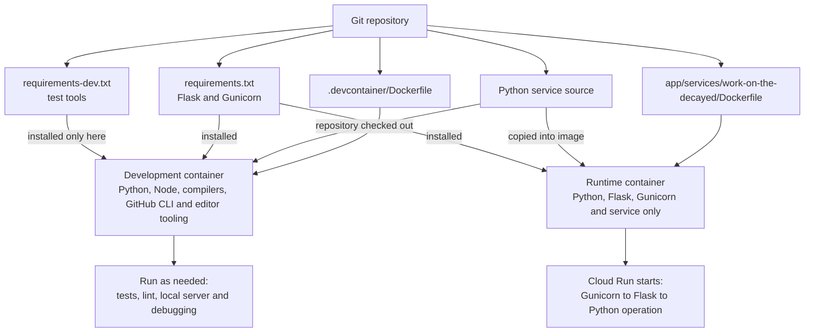

# Cloud Python Runtime

## Purpose

Use one trivial application operation to establish a real, reusable cloud-hosted Python development and deployment path before Docs Viewer needs a specialist Python capability. The operation is intentionally small; the workload boundary, container, configuration, deployment, error behavior, and Swift client seam are the useful result.

## Decision

Google Cloud Run is the provisional operational target while the Python workload remains provider-neutral. The application architecture is:

```text
bundled page
  -> JavaScript message
      -> Swift feature state
          -> Swift service interface
              -> URLSession HTTPS client
                  -> provider-neutral Python container on Cloud Run
              <- typed response
      <- validated result
  <- visible page update
```

JavaScript does not call Cloud Run directly. Swift owns endpoint configuration, request construction, transport, response validation, cancellation, timeout handling, and translation into the narrow page result.

## Accepted Readiness Boundary

Use the dedicated Google Cloud development project `silent-window-507419-e1`, whose display name is **Dotlineform App**, rather than an unrelated existing project. Deploy the first workload as the `work-on-the-decayed` Cloud Run service in `europe-west2` with request-based billing, zero minimum instances, one maximum instance, a short timeout, and explicit public unauthenticated HTTPS access.

The public boundary is proportionate only because the operation accepts no private content, performs no mutation, holds no authority, and returns one validated quarter-turn state. It is still a paid-capable publicly callable resource and requires an exact preview and approval before API enablement, public exposure, or deployment. The project, trial billing, and budget alert are owned directly by the project owner.

Use standard per-user Google Cloud CLI authentication outside the repository with no service-account key. The installed CLI retains its credentials and project selection in the user's ordinary machine-local Google configuration. The retained Dockerfile is built remotely through Cloud Build during source deployment, so a local Docker runtime is not required.

## Workload Shape

The first service exposes `POST /v1/rotate-symbol`. It requires `Content-Type: application/json` and the exact request `{"action":"rotate-symbol"}`. Success returns `{"quarterTurns":1}`. Rejected input returns a bounded machine code such as `{"error":{"code":"invalid-request"}}`; Swift, not Python, will translate that code into application and page state. The service never returns page scripts, HTML, or user-facing error copy.

The retained runtime uses Python 3.12, Flask 3.1.3, and Gunicorn 26.2.0. Typed request parsing, the one-quarter-turn result, and provider-neutral operation live under `src/work_on_the_decayed/operation.py`; Flask alone owns JSON and HTTP translation in `http.py`. Importing and running the pure operation does not require Flask. The container starts Gunicorn as an unprivileged user, binds to Cloud Run's injected `PORT`, and owns the pinned runtime dependencies.

Do not add a database, task queue, general job runner, repository checkout, workspace scanner, object store, persistent application state, generic function registry, or specialist dependency merely to make the first workload look realistic.

## Development And Runtime Containers

The repository uses shared service inputs in two separately built environments; it does not use one container image for two jobs. The existing `.devcontainer/Dockerfile` owns the whole-repository development environment used by Codespaces-style work. It provides general development tools, checks out or mounts the repository, and runs `.devcontainer/post-create.sh`, which delegates repository setup to `.codex/setup.sh`. Developers then choose which editor, test, lint, build, or local-server commands to run.

The service owns a separate `app/services/work-on-the-decayed/Dockerfile`. Cloud Build uses that recipe to construct a deliberately small runtime image containing the Python service and its runtime dependencies. Cloud Run starts that image through one fixed Gunicorn command; the development image is not deployed.



Runtime dependencies are declared once within the service boundary and installed into both environments. Development-only dependencies are installed only where tests and tooling run. Downloaded packages and virtual environments remain untracked. Local Mac development uses the same dependency declarations in an ignored Python environment, while the deployed image receives fresh installations during its build.

Do not add a second App-specific Dev Container or deploy the whole-repository development image. Extend the existing repository bootstrap only as far as needed to make the service's declared development dependencies available in Codex Cloud or Codespaces; do not create a parallel setup layer without an exact missing capability.

## Configuration And Secrets

Tracked source owns safe service configuration, container/dependency declarations, deployment commands, and examples. Environment-specific values and credentials remain in the appropriate local or cloud configuration boundary. No secret, personal path, cloud credential, or service-account key is stored in the repository or bundled application.

The Swift application receives only the browser-safe endpoint and configuration needed to invoke the development workload. It must not contain a privileged cloud credential disguised as an application secret.

## Proportionate Security And Cost Boundary

The first workload receives no private document content, performs no canonical mutation, and holds no authoritative data. Its exposure decision may therefore be deliberately simpler than a later Docs Viewer workload, but it must be explicit rather than accidental. Keep request size, execution time, instance/resource bounds, logging, and easy disablement proportionate to a personal development service.

Do not create user accounts, roles, a permission model, a secrets broker, or production authentication before the service handles data or actions that require them. Conversely, do not treat an obscured URL or a value embedded in the iPad application as strong authentication.

Before any later workload receives private content, writes project data, invokes expensive processing, or becomes generally reachable, its feature must make a new privacy, authentication, authorization, retention, retry, idempotency, abuse, and recovery decision appropriate to that operation.

## Development And Deployment

The first workload must support:

1. focused local Python tests for its pure behavior and request/response validation;
2. a local service run sufficient for Swift-client development where practical;
3. a reproducible container build;
4. a documented Cloud Run deployment command or focused script;
5. a narrow deployed smoke that proves the expected response contract; and
6. concise evidence identifying what was deployed and which application configuration targeted it.

Routine tests do not depend on live Cloud Run. The deployed smoke proves only the deployed boundary and does not replace local behavior tests.

Cloud Run does not upload source when a retained service instance starts or handles a request. A source deployment uploads the filtered service archive to Google-managed storage, builds an immutable container image, stores that image in Artifact Registry, and deploys a revision resolved to that image digest. Cloud Run can repeatedly start the retained image without rebuilding or consulting the source archive. Repeating `gcloud run deploy --source` performs another upload and build even when the intended source has not changed.

SAF-1.5 retains source deployment while there is one development environment. The workflow records the service Git state before deployment and the regional Cloud Build, Cloud Run revision, immutable image digest, endpoint, and two contract smokes afterwards. A separate build-once/promote-by-digest path becomes justified when there is a second environment, a need to redeploy one exact artifact without rebuilding, or a stronger rollback boundary.

Retain the source archive and image digest for the serving revision and immediately preceding accepted rollback revision. Do not delete by the moving `latest` tag. No automatic cleanup policy is justified below five image versions and 250 MB; after either threshold is crossed, inspect revisions and digests and remove only explicitly identified artifacts not referenced by either retained revision. Source or image deletion remains a separately reviewed destructive operation rather than part of deployment.

## Errors And Logging

Return a small stable error shape for invalid requests and expected failures. Swift translates service/transport failures into application state; the Python service does not own user-facing UI copy. Logs retain useful request identity, duration, status, and failure category without complete payloads, credentials, or future private document content.

Do not add a general retry engine. The first operation may offer one explicit user retry after a failed or cancelled request. Later operations decide their own idempotency and retry policy from their side effects.

## Extension Rule

A new cloud workload is justified only when the application needs Python or another dependency that is inappropriate in Swift or shared JavaScript. Each workload names its exact input, output, data sensitivity, execution model, cost/failure behavior, provider-specific deployment edge, local test seam, and reason it belongs in the cloud rather than on the Mac workflow.

Google-specific code stays at the deployment and integration boundary wherever practical. A future provider move should primarily change deployment configuration, not rewrite the processing responsibility.

## Status

The provider-neutral workload is accepted and retained under `app/services/work-on-the-decayed/`. It is deployed from its Dockerfile through Cloud Build to the dedicated **Dotlineform App** project `silent-window-507419-e1`. The `cloud-run-source-deploy` Artifact Registry repository and `work-on-the-decayed` Cloud Run service live in `europe-west2`; revision `work-on-the-decayed-00001-8wg` serves 100 percent of traffic from immutable digest `sha256:dcbd52c0b92c020648e9ad5eb2b10453901cef6e964c2220953e84583ab8c1ad` within the accepted scale-to-zero and one-instance maximum. The project grants its Google-created default compute identity only `roles/run.builder` for this source-build boundary. Because the inherited domain-restricted-sharing policy prohibits `allUsers`, public unauthenticated invocation uses Cloud Run's recommended disabled Invoker IAM check rather than weakening the organization policy. Exact unauthenticated valid and invalid requests passed against `https://work-on-the-decayed-334553986819.europe-west2.run.app`, and the Swift application completed the real request on native Mac and physical iPad. Source deployment, explicit evidence, and conservative retention guidance remain the one-environment workflow. SAF-1.6 corrected only local Swift classification of malformed service JSON and added deterministic boundary coverage; it did not change or call the deployed service. The public endpoint remains a harmless demonstration boundary, not authority to send private content or perform a later mutation.
