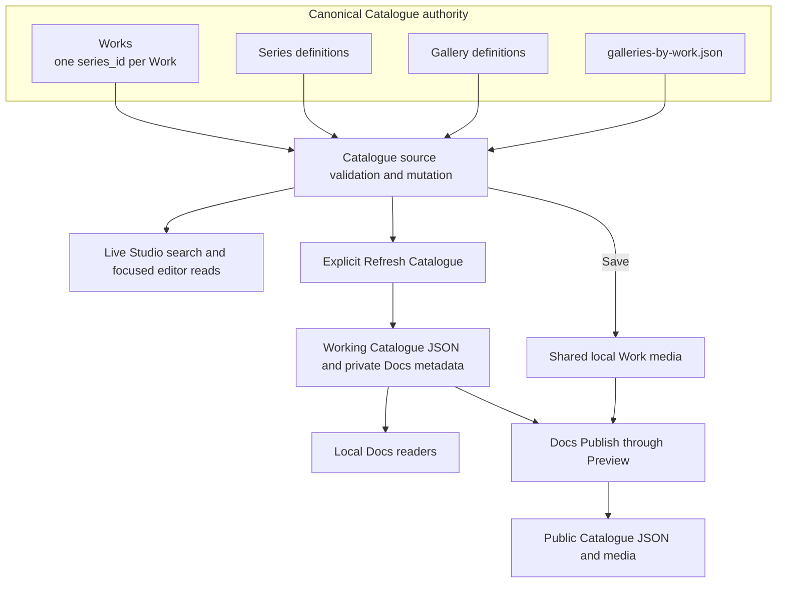

# Catalogue Data Model Map

## Purpose

This map shows the current Catalogue authority and reader boundaries. A Work has exactly one `series_id` and zero or more Gallery memberships. Canonical Works, Series and Gallery definitions are separate aggregate files; `galleries-by-work.json` owns Gallery membership. Former Detail records, optional or multiple Series membership and generated document URL enrichment are retired. [Catalogue Source Model](Catalogue_Source_Model.md) owns field and validation details.

## Diagram

## Artefact Register

| Artefact or family | Authority or producer | Reader and refresh boundary |
| --- | --- | --- |
| `studio/data/canonical/catalogue/{works,series,galleries,galleries-by-work}.json` | Catalogue source transaction owner | Live Studio service reads; accepted canonical Save or delete |
| `$DOTLINEFORM_DOCS_BASE_DIR/assets/works/` | Save's local media owner | Local Work images, thumbnails and downloads; required changed media complete during Save |
| `$DOTLINEFORM_DOCS_BASE_DIR/working/generated/catalogue/` Work/Series/Gallery records and indexes | `generate_work_pages.py` through Refresh Catalogue | Local Docs Catalogue, subject and media readers; complete explicit Refresh |
| Working `reports/catalogue-works/metadata.json` and `reports/works/manifest.json` | Private metadata generators through Refresh Catalogue | Local Docs report and Works collection readers; complete explicit Refresh |
| `site/assets/data/catalogue/` and configured R2 media | Docs Publish distribution from completed Preview and current shared assets | Public readers after explicit Git/public deployment |

The historical `studio/data/generated/catalogue-lookup/` files have no active producer or reader and are not a fallback authority. Public Catalogue payloads currently carry empty `documents` arrays; document subject associations have their own Docs owner and do not establish Series or Gallery membership.

## Change And Recovery

Save can complete while generated Docs readers still show the prior Refresh. Refresh failure leaves no current completion receipt; fix the cause and rerun complete generation. Docs Publish does not run Refresh or enforce its status, so confirm the local reader revision before publishing. [Catalogue Save And Refresh](Catalogue_Save_And_Refresh.md) owns these boundaries, and [Catalogue Deployment](Catalogue_Deployment.md) owns the public transfer and recovery path.
