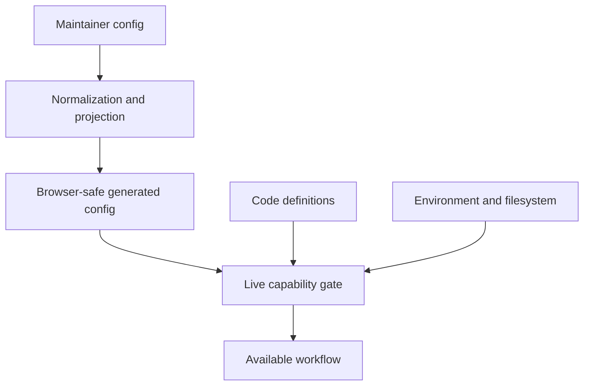

# Docs Viewer Configuration And Extension Points

Use this page to find what drives a Docs Viewer workflow and to decide whether a change belongs in JSON, code, environment settings, or generated output.

The central rule is:

> Configuration selects, narrows, and parameterises known behaviour. Code defines executable behaviour. Live service capabilities decide whether an operation is actually available.

This separation keeps public configuration browser-safe and prevents a JSON record from granting write authority or loading arbitrary code.

## The Configuration Model



Generated browser config sits between source-side workspace config and the runtime. It contains URLs and display policy, not source filesystem paths or write authority.

### Workspace And Target Contracts

`docs-viewer/config/workspace/docs-workspace.json`, schema `docs_workspace_v4`, and `docs_workspace_config.py` define one existing external `DOTLINEFORM_DOCS_BASE_DIR`. Working owns source and replaceable generated output. Preview is a read-only prepared snapshot with derived collection/media configuration. Pre-publish, local Published and scope-nested storage are retired.

`load_docs_workspace_config(repo_root)` resolves the workspace. Local readers and authoring services use `load_docs_working_config(repo_root)` at their storage boundary. Build/publication code may select explicit `working` or `preview` internally with `load_docs_stage` or `select_workspace_stage`; ordinary APIs do not accept stage selection. The loader creates no directories; unavailable configured storage, traversal and symlink escapes fail without repository or Projects-root fallback.

| Owner | Location beneath the Docs root |
| --- | --- |
| Ordinary canonical documents | `working/source/documents/` |
| Ordinary generated documents and Search | `working/generated/documents/` and `working/generated/search/index.json` |
| Collection source and generated documents | `working/source/collections/<id>/documents/` and `working/generated/collections/<id>/documents/` |
| Current Catalogue JSON | `working/generated/catalogue/` |
| Prepared documents, collections, Search and Catalogue | `preview/documents/`, `preview/collections/<id>/documents/`, `preview/search/index.json` and `preview/catalogue/` |
| Shared document ready media | `assets/media/workspace/<type>/` and `assets/media/collections/<id>/<type>/` |
| Shared Work primary, thumbnail and download bytes | `assets/works/primary/`, `assets/works/thumbs/` and `assets/works/media/files/` |
| Editable media build inputs and private provenance | Their Working ordinary/collection source owner, including `media/build-source/mermaid/` |

Each managed media type has one `asset_location`; its owner retains `asset_root` for relative reference identities. Working and Preview resolve the same current assets through `/docs/assets/`. Ready bytes are not duplicated under source, generated output or Preview. Temporary preparation builds receive the explicit existing shared asset root; they cannot invent another one.

Managed document targets use immutable `doc_id` and optional exact registered `collection`; collection targets are empty objects or contain only `collection`. Retired `stage`, `scope` and `sub_scope` selectors are rejected. Ordinary and other collection source records require boolean `draft`; Catalogue source records reject that field and have fixed document eligibility. Collection documents are flat and do not inherit ordinary hierarchy. Reports use `id: docs_collection` with an exact collection selector.

Working registers each collection once, with its ID, title and exact `report_host_doc_id`; Preview derives that registration. The host ID is configuration authority, not inferred from documents, titles or a receipt. Collection creation, registration changes and retirement are explicitly scoped deliveries; [Source Organisation](Source_Organisation.md#collection-deliveries) owns the boundary. Generic collection create/delete UI actions, endpoints, capabilities and historical creation receipts are removed.

Catalogue Regenerate creates each document with the exact five-digit Work ID as its quoted `doc_id`, source filename and by-ID filename. Catalogue source and list manifests carry no separate `work_id`; other document collections and the ordinary Catalogue report host retain `d-...` IDs. Catalogue source and generated document metadata omit `draft`; source validation rejects the field and Set Draft is rejected. Catalogue documents have fixed eligibility, while their ordinary report host still governs collection publication. Local and public browser configuration expose the exact Catalogue report host so readers compose direct Work-ID links without a document mapping. Canonical Catalogue records remain Studio-owned; configuration consolidation does not move them or Projects-owned original images.

### Builder And Local Service Integration

`docs_viewer_config_v4` supplies one `workspace` per local/public composition, without a stages array or default stage. Browser config contains URLs/display policy, never private paths or write authority. Its tracked projections are produced by `browser_config.py`.

Document Build accepts `--stage working`. Optional `--collection` selects one registered owner; `--only-doc-ids` limits document rendering. Named-collection targeted builds merge selected metadata into saved manifests; the [Builder](Builder.md) owns prerequisites and output behavior. Application writes await their required Working generation; the filesystem watcher and suppression settings are retired. External edits require explicit Rebuild. Ordinary edits do not automatically rebuild Search.

| Reader or operation | Current contract |
| --- | --- |
| Local ordinary document | `/docs/doc?doc_id=<id>` |
| Local collection artifact | `/docs/generated/external/<collection>/<artifact>` |
| Public ordinary document | `/assets/data/docs/by-id/<id>.json` |
| Public collection artifact | `/assets/data/docs/<collection>/<artifact>` |
| Shared current media | `/docs/assets/<configured-family>/<identity>`, independent of stage |
| Working aggregate Links | `/docs/workspace-links` |
| Publish | `POST /docs/publish` with `{}` |

Source/Create/metadata/placement/Delete/Draft operations resolve Working and require exact identity. Working Delete does not prune Preview or public output. Draft updates await exact-document generation and return committed readiness to the mounted reader. Media insertion writes shared local assets through the exact Working collection/type owner; the standalone tool uses `--scope docs` with optional `--docs-collection`, without a Docs stage flag.

### Publication And Downstream Ownership

`docs_prepare_preview.py` selects eligible Working sources under boolean draft and `unpublishable.json` policy, including inherited ordinary exclusions and excluded collection hosts. Catalogue documents have fixed document eligibility and no draft field; an excluded Catalogue report host still excludes its collection. Preparation builds captured inputs in temporary storage, validates and replaces Preview, writes `docs_preview_manifest_v2` after verification, then removes temporary inputs. Preview has no persistent source/generated authoring tree.

`catalogue-artifacts.json` and `docs_catalogue_artifacts.py` select Catalogue JSON independently of document eligibility. Prepare Preview copies that JSON, Search v4 and Recents unchanged. The completion manifest binds snapshot bytes and sorted shared asset identities; it does not freeze mutable asset bytes or keep asset hashes/history. Failure before replacement preserves the previous snapshot; failure during replacement requires preparation again.

**Publish** is one awaited empty-body `/docs/publish` operation owned by `docs_publish.py`: prepare fresh captured inputs, then pass the exact completed snapshot to `docs_deploy_repo.py`. Split preparation/distribution endpoints and intermediate confirmation are retired. The distribution owner compares destinations once, carries the operation-local plan into apply and verifies completed repository/media writes. It does not reread source/generated output, rebuild, refilter the prepared set, advance versions or automatically delete shared/remote assets. The synchronous operation needs no intermediate freshness checks. Review its result through site-preview; Preview remains an independently inspectable artifact.

`docs_publication_payloads.py` projects public document metadata URLs without a publishing-stage field. By-ID content keeps query-only Docs links and `docs-media:` identities; the local and public readers compose their own viewer routes and media roots. Catalogue, Search and Recents bytes remain unchanged. The public section is `/analysis/`; documents use `site/assets/data/docs/`, Search uses `site/assets/data/search/analysis/index.json`, and Catalogue uses `site/assets/data/catalogue/`. Configured R2 Docs media uses `docs/analysis/media/workspace/<type>/` and `docs/analysis/media/collections/<collection>/<type>/`.

Publish preserves the independently owned `public-reports.json`. Public collections require exact `docs_collection` registry rows and generated browser configuration registration as well as prepared data. Public document-location JSON, the legacy Catalogue document-URL writer and the old publication pause remain retired. [Catalogue Deployment](Catalogue_Deployment.md) owns the JSON/media inventory and accepted R2-before-Actions timing gap. Git commit/push and public Actions deployment remain separate.

Publication lineage requires exact configured Working collection owners. No lineage workflow or inactive historical table is currently configured. Recovery uses owning operations and Git history; no compatibility paths, backup trees or inferred owners are introduced.

### Browser And Management Integration

The local and public route registries use `docs_viewer_route_config_v5`. Neither route selects a publishing stage. Stage/scope-bearing URLs fail with a current-link message. `docs-viewer-workspace-provider.js` uses the composition's one configured workspace. `workspace-configuration` controls configuration discovery; there are no stage controls. The public composition retains read-only authority and does not probe local management services.

Management capability responses expose `workspace` plus `publish` availability. Settings use `docs_source_config_settings_v2` for that fixed local owner; the Source Config Report and its dedicated read endpoint are retired. Workspace configuration's `media_report_metadata` selects private Docs Media output beneath `working/generated/reports/`. Opening reads `/docs/media-metadata`; an explicit empty-object `/docs/media-refresh` POST regenerates the saved datasets. The path is server-only and absent from browser/public configuration. The reveal action sends exact collection, role, media type and identity to `/docs/open-media-source`, which resolves an existing file through the configured Docs artifact owner and shared Finder helper. [Media And Asset Handling](Media_And_Asset_Handling.md#docs-media-inventory-report) owns the report's persisted schema, inventory and file-opening boundary. Scope and whole-collection lifecycle UI/service workflows are retired. Ordinary workspace export reads the Working ordinary document index and retains its own preview/confirmation/apply workflow.

Document-package services and browser callers resolve Working with optional exact `collection`. Trusted metadata uses `data_sharing_export_meta_v4` and validated Review manifests use `docs_review_validated_package_v4`, without source-stage provenance; the package-list envelope remains `docs_review_packages_v3`. Retired stage/scope fields are rejected without migration or fallback. No existing packages required conversion at cutover. Static export reads selected Working generated content, records `docs_static_html_snapshot_v3` and preserves its own revision-bound preview/apply, assets and exact selection; its API remains v2. Stage-bearing local links are invalid and collection links are not folded into an ordinary snapshot. Notes Archive remains retired.

Saved panel settings use `manage` and `public` owners, separate from workspace filesystem authority. The one-time Working panel-setting conversion rejects conflicting destination state. Older Preview/Analysis records are not used by the current reader. Review retains separate panel state.

In-app bookmarks were removed on 2026-10-02, including the toolbar control, bookmark row, route feature, controller and IndexedDB access/upgrade code. Existing browser bookmark records are left unused; the reader no longer opens or modifies that database.

Report consumers pass exact optional collection/document identity without stage. The aggregate Links report is `workspace_links`. The Analysis Documents index report and its presets are retired. Public collection declarations use the same exact registered collection identity; public runtime files follow the explicit site-code projection inventory.

### Links, Tokens, Search And Locations

Links records and their workspace aggregate use `schema_version: 2` without a stage envelope. Their exact target is `{collection, doc_id}` and Working remains the sole Links owner. `docs_workspace_links.py` owns aggregation. Routine source saves still maintain only the current document and direct affected neighbours; missing prior Links records produce the existing warning rather than triggering a full refresh. Complete Working Build initialises absent eligible records across configured collections before the existing refresh, removes excluded records and relationships, and then aggregates the completed records. Existing records are preserved as relationship prior state.

`docs_document_link_targets_v2` selects exact Working document metadata independently of publication draft/ignore eligibility. Authored document links, stored relationship hrefs and navigation use `/docs/?doc=<id>` locations, adding the exact configured `collection` for named owners. Documents Linking Here and its `docs_backlinks` output/API are retired; [Related Links](Related_Links.md) owns document relationship presentation. Broken Links audits configured source collections and identifies correction targets by collection and immutable ID; it reports retired stage/scope-bearing viewer links as broken. Local destinations use Working output; public destinations use configured repository payloads, never untransferred Working or Preview output.

The semantic usage index and report are retired. Supported Work tokens contribute Catalogue document relationships through the existing Links owner; Gallery Media View tokens create no document relationship. Link construction does not validate destinations; explicit deletion still removes associated relationships. The Works Subject picker uses the local generated Catalogue target reader. The Subject list column, its heading sorts and its separate private Catalogue title-file pipeline are retired; the Works customisation retains document-detail Subject information and actions only. The private semantic target-lookup file, producer, file loader and registry lookup declarations are retired; Catalogue discovery reads current generated indexes through `/docs/catalogue-media-targets`. The shared Working ignore-file resolver and `docs_unpublishable_report_v4` have no stage/scope parameter. Both Working Links and preparation inherit ordinary ignore-list exclusions; preparation additionally excludes draft subtrees and collections with excluded hosts.

Search uses stage-independent `docs_viewer_search_index_v4`, with no header stage or result URLs; the content version excludes stage. Readers resolve exact document/collection/report-host identity through their active route. Working builds its complete index. Publish captures that existing file once and copies it unchanged while building eligible document output in temporary storage. Missing/invalid Search fails; Publish does not rebuild it or impose freshness after ordinary edits. Configured collection inclusion and inherited readiness select the Working Search corpus independently of snapshot membership. Tokenization, ranking, fields and explicit rebuild policy remain unchanged. `build_search.py` accepts only `--stage working` at its internal build boundary.

The `docs_document_locations_v2` index, public provider/picker and builder are retired. Deploy Repo derives counts and any configured publication-lineage URLs directly from accepted document identities and exact configured report hosts. Navigation and source link insertion retain their own URL helpers. Catalogue distribution now copies declared Preview files into `site/assets/data/catalogue/`, without the retired legacy schema writer or document-URL refresh.

Historical scope-bearing tests and fixtures remain unreviewed against the current workspace. Test changes require their own agreed specification; old names or pass results do not establish current coverage. Selected storage/publication evidence does not prove every failure, retry or rollback path.

## What Drives What

| driver | controls | authority |
| --- | --- | --- |
| `docs-viewer/config/workspace/docs-workspace.json` | Stage defaults, hierarchy policy, build-media registration, explicit public/R2 destinations, collections, and Search fields. | Maintainer-edited workspace config. Working source/generated, Preview, shared assets and Catalogue destinations derive from the existing external root and explicit owners. |
| `docs-viewer/runtime/js/shared/docs-viewer-code-config.js` | Universal metadata statuses. | Product-owned browser code, projected to `site/` through the public code inventory. Scope-type labels and badges are retired. |
| `docs-viewer/config/routes/docs-viewer-routes.json` | App kind, route features, access intent, payload/config URLs, panel defaults, view policy, and named service surfaces. | Full local route registry. The service injects enabled loopback URLs when it serves local routes. |
| `site/docs-viewer/config/routes/docs-viewer-public-routes.json` | Public-only route records served from the deploy root. | Checked-in public projection kept separate so local/manage and review routes are never exposed publicly. |
| `docs-viewer/config/defaults/docs-viewer-service.json` plus `.env.local` | Loopback binding, endpoint names, enabled service families, watch behaviour, and local state roots. | Defaults describe the service; environment settings select the current host instance. |
| `docs-viewer/config/reports/reports.json` | Report metadata, access defaults, presets, and a `loader_id`. | Config describes known reports; `docs-viewer/runtime/js/reports/docs-viewer-reports.js` owns the executable loader allowlist. |
| `docs-viewer/config/semantic-tokens/registry.json` | Supported token families, target types, identifier rules, occurrence metadata, and UI contribution ids. | Data declares the accepted contract; generated Catalogue discovery and UI behavior remain code-owned. |

Two other important registries are deliberately code-owned:

- browser views, modes, and controls are registered through `site/docs-viewer/runtime/js/shared/docs-viewer-view-registry.js` and entrypoint-owned definition sets
- management actions and import source formats are registered in `docs-viewer/runtime/js/management/docs-viewer-action-definitions.js` and `docs-viewer/services/docs_import_common.py`

They are code-owned because each record connects to executable lifecycle, parsing, mutation, rendering, or security behaviour.

Universal display vocabulary follows the same boundary. Metadata statuses are product-owned code; changing them is a reviewed code-config change.

## Source Config Becomes Browser Config

Do not edit these generated browser projections directly:

- `docs-viewer/config/defaults/docs-viewer-config.json`
- `docs-viewer/config/defaults/docs-viewer-public-config.json`
- `site/docs-viewer/config/defaults/docs-viewer-public-config.json`

The docs builder derives these projections from workspace config:

```text
docs-workspace.json
      |
      v
browser_config.py
      |
      +--> local browser config: explicit stages and collections for `/docs/`
      |
      +--> public browser config: accepted public destinations and browser-safe fields only
                   |
                   +--> deploy-root copy under `site/`
```

Use [Builder](Builder.md) for the build commands.

## How A Workflow Becomes Available

For views, modes, controls, and management actions, availability is the intersection of several independent decisions:

```text
code registration
  + matching app kind
  + enabled route feature
  + required backend capability
  + route policy does not hide it
  = available workflow
```

This is why `management_ui: true` or a service URL never grants authority by itself. The manage entrypoint must register the behaviour, route config must enable its feature, and the live backend must advertise the required capability before the UI can offer the operation.

When a control is unexpectedly missing, inspect those gates in that order. [Runtime](Docs_Viewer_Runtime.md) owns the public/manage/review security boundary; [Runtime Module Ownership](Runtime_Module_Ownership.md) identifies the code owners.

## Extension Points

### Change Workspace Or Collection Configuration

Edit `docs-workspace.json` for the existing workspace and its explicit stage settings. Public documents, Search, and per-type repository/R2 media destinations remain explicit under `public_projection`. Child public destinations derive from those configured parent destinations. Do not repeat derived local paths, add a scope registry, or restore old-schema compatibility records.

Use the retained collection creation workflow to create its Working config, report host, and local artifact roots together. Preparation, publication, and deployment remain separate owners. Top-level scope creation, rename, deletion, and cross-scope transfers are retired by the cutover.

A new storage or publication model requires code and its own agreed delivery.

### Add A Public Route

Reuse the public shell and public entrypoint. Add matching public route records to the full and deploy-root registries, with no local service URLs. Public sections are independent of Docs workspace identity.

A new app kind or shell authority boundary is an architecture change, not a route-config addition.

### Add A Report

A new preset for an existing report type can be config-only. A new report type needs both a registry record and an allowlisted loader implementation. Config metadata cannot name an arbitrary JavaScript module.

### Add A View, Mode, Control, Or Action

Add a code definition through the owning shared or route-specific entrypoint. Declare app kinds, route features, and backend capability requirements explicitly. Route config may hide known ids but cannot invent or widen executable definitions.

### Add An Import Source

Add a code-owned source importer, parser/preview path, apply behaviour, and focused tests. File suffixes are dispatch hints, not a complete import implementation. [Docs Import](Docs_Import.md) owns the operator workflow.

### Add A Semantic Token Kind

Use the JSON registry when the kind can reuse an existing identifier normalizer and route model. Add code and tests when normalization, lookup generation, or editor behaviour is genuinely new.

## Why This Structure Exists

- Source config can contain filesystem and build policy that must never reach public browsers.
- Generated projections give browsers only the URLs and display metadata they need.
- Separate public and manage entrypoints preserve the import boundary as well as hiding controls.
- Code registries make executable extensions reviewable, testable, and allowlisted.
- Live capability responses describe real backend authority after environment, filesystem, and service policy are known.

## Weak Spots

- The same concept can cross source config, generated browser config, and a deploy-root copy. It is easy to inspect or edit the wrong layer.
- The full and public route registries are separate checked-in files. Route edits must keep their shared public entries aligned.
- Registries are not a single plugin system. Reports, semantic tokens, views, actions, and importers each have different data/code boundaries.
- A configured feature can still be unavailable because its entrypoint, code definition, service capability, or filesystem precondition is missing.
- There is no single runtime screen showing every route feature, registered definition, and capability decision. The Source Config report covers configuration projections, not the entire availability calculation.

These are reasons to keep this map current. They are not reasons to duplicate every field and module here; the code and focused owner docs remain the detailed authority.
