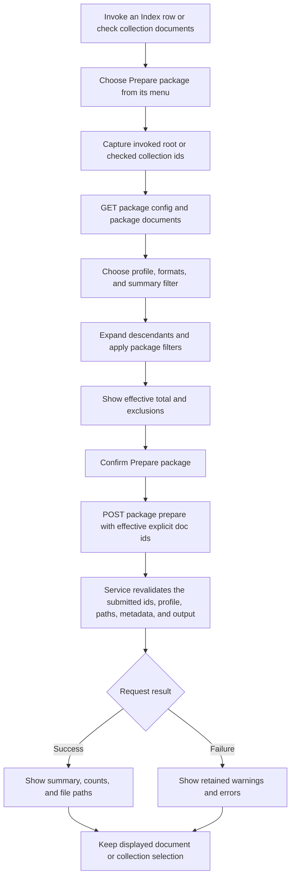

# Package Prepare

## Purpose

Use **Prepare package** to create one JSON or JSONL working package from an invoked ordinary Index document and all its descendants, or from checked documents in one configured collection. Preparation reads the exact owning source collection and writes package artifacts; it does not change document source, metadata, or publication state.

## Prepare A Package

1. Open Docs Viewer in Manage and find the ordinary document in the Index, or open the collection list and check its documents through Collection Actions.
2. For an ordinary document, right-click its Index row and choose **Prepare package**. The invoked document and every descendant are included automatically. Shift+F10/the context-menu key opens the same menu from a focused row. For a collection, choose **Collection Actions → Prepare package**; **All** remains local to that collection.
3. The action captures its document target before loading package options. The modal identifies the Index target by title and ID; the displayed document remains independent.
4. Choose the profile, package format, and content format when the profile supports a choice.
5. Descendant inclusion is fixed for Index preparation. Flat collections have no descendant expansion; neither workflow offers a descendant checkbox.
6. For **Document content**, optionally select **Only documents missing summaries**.
7. Review **Total documents to be prepared** and any included or excluded counts.
8. Choose **Prepare package** to confirm once.
9. Review the result summary, counts, file paths, warnings, or errors.

Collection checked documents remain selected after cancel, success, or failure. Choose **Clear** or **Done** to change or leave collection selection mode. The Index has no checkbox selection or All/Clear/Done controls.

## Selection Rules

- Index preparation starts from the explicitly invoked ordinary tree node and includes eligible descendants from the source hierarchy, including collapsed Index branches. The main pane may display another document or a collection detail; neither changes the captured tree target.
- Collection preparation uses its checked IDs only; displayed, highlighted, focused, and context-menu rows do not become implicit collection targets.
- One checked collection document and several checked collection documents use the same Action and modal.
- Working is resolved by the package service; there is no workspace picker.
- Collection **All** updates the checkbox-selection owner; it does not use the package service's `select_all` request mode.
- A collection request carries its exact configured `collection`; its flat records never expand descendants or borrow ordinary parent/sibling IDs.
- Index and collection targets remain independent.
- The modal calculates one effective target in this order: target eligibility, fixed descendant expansion for the ordinary root, missing-summary filtering, then any configured maximum document count.
- Only that final effective id set is sent. The service revalidates it but never adds a document the modal excluded.

## Modal Filters And Total

**Document content** offers one package-composition filter:

- **Only documents missing summaries** is off by default. A missing summary is empty or whitespace-only source `summary` metadata.

**Document tree** keeps the complete subtree included and does not offer the missing-summary filter. Draft and Publish exclusion state do not filter package membership.

The displayed total is the final effective target for the loaded source snapshot. The modal reports documents deliberately excluded by the filter or profile limit. Those pre-submit exclusions are not result `skipped` documents. When no document remains, the modal reports why and disables **Prepare package**.

## When The Action Is Unavailable

**Prepare package** is disabled when there is no invoked ordinary Index document or no checked collection document, document packages are unavailable, the package workspace is unavailable, or Docs Viewer management is busy. The menu reports the current reason. Resolve that condition and use the same action again.

## Package Output

A successful request reports the generated package and metadata paths. The selected profile determines JSON or JSONL shape, included fields, supported format choices, and descendant requirements. [Documents Prepare Profiles](Package_Prepare_Profiles.md) records those profile contracts.

Configured collection packages are export-only unless both the collection and profile enable returned-package import. Requests retain the exact optional `collection`; the owning service resolves Working.

For engine commands, output fields, validation details, and workspace requirements, use [Documents Package Preparation Script](Package_Prepare_Script.md). Returned packages remain a separate whole-package workflow.

## UI And Action Calls

The calls above use the existing `/docs/packages/*` endpoints. There is no batch-specific service, preview request, duplicate document picker, or separate Prepare browser page.

The source reader uses the current Docs builder to render content, initializes Catalogue lookup state and loads saved related-links inputs before rendering. Loading package options reads source and generated reference inputs; it does not run a Docs build or update relationships.

## Result Counts

The result modal always orders document counts as:

1. `selected`
2. `exported`
3. `failed`
4. `skipped`
5. `truncated`

The invariants are:

`selected = exported + failed + skipped`

`truncated <= exported`

| Field | Meaning |
| --- | --- |
| **selected** | The effective ids submitted from the modal. For unchanged source state, this equals **Total documents to be prepared**. |
| **exported** | Selected documents whose package records were built successfully. |
| **failed** | Selected documents whose records could not be built. Any failures prevent the package being written. |
| **skipped** | Submitted documents which no longer exist or no longer satisfy an active filter when the service revalidates current source. |
| **truncated** | Exported documents whose content was shortened by the profile limit. It counts documents, not characters. The current content profile limits content to 50,000 characters and adds `[truncated]` at a paragraph boundary. |

### Failed

For the **failed** count, the most likely per-document causes are:

- A required field is empty—currently `doc_id`, `title`, and rendered `content` are required.
- The source document cannot be rendered into HTML.
- Rendered HTML cannot be converted into the requested Markdown or plain-text content.
- The source record and source document have drifted apart, so the selected document can no longer be resolved.
- Less commonly, a package-profile defect: unsupported field source or transform, invalid field mapping, or blank output path. These should normally be caught by profile validation first.

Each selected document either produces a record or increments `failed`; any record-building error prevents the package from being written. The error details should identify the document and cause. The implementation is in `docs-viewer/services/docs_document_packages/export_transforms.py`.

Some operation-level problems do **not** increment `failed`, because processing never reaches individual documents—for example:

- Package workspace missing or unwritable.
- Invalid profile or format.
- Unsafe output path.
- Metadata/output filename collision.
- Missing configured source root.
- Service or request failure.

Those appear as an overall preparation error, generally with zero document counts.

### Skipped

Modal exclusions occur before submission and are explained beside the total. They do not inflate `selected` or `skipped`.

After submission, the service applies the same active summary choice to current source. A document changed or removed after the modal snapshot remains part of `selected` but can become `skipped`; the service does not replace it or broaden the request.

Both current profiles set `max_documents` and `max_total_chars` to `null`, so there is no package-wide document or character limit. The active 50,000-character content limit per **Document content** record produces `truncated`, not `skipped`.
