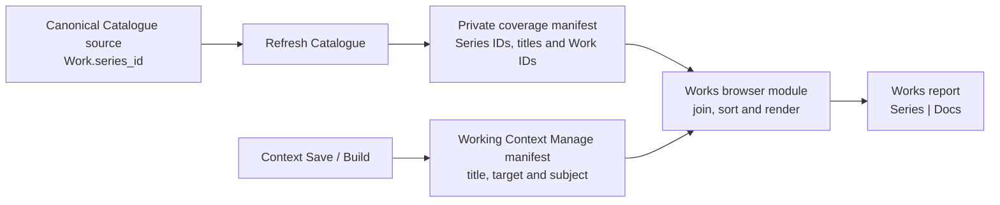

# Works Report Concept And Architecture

## Purpose

Work Document Coverage (`works`) answers one bounded question: which refreshed Catalogue Series have no Context document about a member Work? Each row represents one Series. The Series column remains plain text and the Docs column retains exact document links.

The report respects Studio's Refresh boundary. Catalogue Save changes canonical authoring data and queues its effects; only Refresh advances this report's generated Catalogue input. Context documents retain their separate Save/Build boundary. The report observes these two generated inputs and never reads canonical Catalogue records.

| report | row authority | question answered |
| --- | --- | --- |
| Projects (`project_state`) | immediate physical project folders | Which folders need organising or associating with Catalogue Works and Context documents? |
| Work Document Coverage (`works`) | private refreshed Series/member-Work manifest | Which Series have no member-Work documentation? |

## Ownership And Flow



Canonical Catalogue JSON owns Series definitions and Work-to-Series membership. Refresh projects those facts into `working/generated/catalogue/reports/work-document-coverage/manifest.json`, relative to the configured Docs workspace. Context front matter owns document Subjects, and its generated management manifest carries each document's optional scalar `subject`, title and exact identity.

The coverage manifest is private Working output, excluded from the public artifact inventory and publication queue. It has no public consumer. The report does not use public file presence to establish or suppress a row.

## Coverage Rule

For one refreshed Series `S`, the report derives:

```text
Docs(S) = exact Work-subject Context documents whose subject
          is one of S.work_ids in the saved coverage manifest
```

The result is deduplicated by exact `{collection: "works", doc_id}` identity. A Series is undocumented exactly when `Docs(S)` is empty.

One matching Work-subject document supplies coverage for the Series row. The browser does not diagnose the other member Work IDs, calculate per-Work gaps or require every member Work to have documentation. Folder and None subjects contribute no coverage. Direct Series subjects are rejected by the shared subject reader, rather than retained as another association path. Draft Context documents still count in this local report.

Only saved manifest Series establish rows, including Series with no Works. Unknown Work subjects and Works with no Series contribute no coverage. Documents never invent a Series.

## Exact Browser Inputs

The browser loads two local generated projections:

- the private coverage manifest through parameter-free `GET /docs/work-document-coverage`, using `catalogue_work_document_coverage_v1`; and
- the configured private Working `works` management manifest, containing current document identity, title, date, optional draft/thumbnail flags and optional scalar `subject`, with `working_works` identity and `subject_generation`.

The coverage manifest has a header containing only `schema` and `generated_at_utc`, followed by a `series` array. Each Series contains exactly `series_id`, `title` and ascending distinct `work_ids`. Series are ordered by exact ID, every defined Series is included, and a Work belongs to at most one Series. No Work title, year, Gallery, media, revision, count or content-version fields are persisted.

The saved-file reader validates this minimal schema and membership identities within Working storage. The browser validates the Catalogue schema and the IDs, labels and memberships it consumes; it does not validate unused Studio editor fields. Context manifest validation retains its existing owner. Docs Viewer serves the saved coverage file without consulting canonical records, generating output, or requiring Local Studio to be running. Missing data asks for an explicit Refresh; there is no canonical or public fallback.

## Refresh Selection

Work creation/deletion with Series membership, assignment/removal/reassignment, and Series creation/rename/deletion select the manifest in the existing v4 updates queue's `shared_outputs`. This includes empty Series definitions. Year, Work title, image and Gallery-only edits do not select it. Existing mutation owners supply these known effects; Refresh does not rediscover them.

When selected, Refresh projects the complete minimal manifest from its already loaded validated Catalogue records. Content comparison ignores generation time and preserves unchanged bytes. The normal completed-shared handoff excludes this private file from public selection, then removes its updates selection. Refresh retains its existing partial-failure and explicit-rerun behavior; no freshness receipt, rollback or automatic recovery is added. Complete baseline generation remains an explicit maintenance operation.

The 2026-10-10 cutover queued only this manifest from empty queues and ran Refresh, writing one file at `2026-10-10T17:25:07Z`; publication selection remained empty. Ordinary sources, documents, media and Search were not regenerated.

The browser accepts Work, Folder and None subject records from the shared reader. Only an exact Work present in saved Series membership contributes a document. Invalid or retired subject data fails manifest validation; unknown Work targets, missing Series membership, Folder and None supply no coverage.

Document presentation contains the exact Working Works target, current manifest title, existing Manage URL and declared Work subject `{kind, key}`. The shared Work subject icon describes the document's declaration; it is not an inferred coverage or publication state.

## Browser Composition And Failure

On mount, the browser fetches both complete generated inputs, performs the exact in-memory join and renders one complete result. Each row contains:

- exact Series identity and its current plain-text title; and
- zero or more exact linked Context documents with current title and declared Work subject.

Rows sort by normalized Series title and exact `series_id`. Documents sort by normalized title, exact subject kind/key, and `doc_id`. Identity, label, and activation target remain distinct. Opening/reloading the report reads saved inputs; retained mounts keep their Catalogue input until reloaded. Existing committed Context document changes update that mount's document side and recompose coverage against the same saved Catalogue membership.

The final document-coverage rows remain ephemeral browser state; only Catalogue membership is persisted. The endpoint reads the saved file and does not perform the document join. If either required input is unavailable or invalid, the current mount shows one contained error and no partial or older rows.

## Embedded Local Report

One ordinary human-authored document declares the focused local report. The existing report registry and browser loader mount it. `docs-viewer-report-service.js` supplies the read-only saved-manifest request; the endpoint and report remain management-only and absent from the public runtime inventory.

The table is:

| Series | Docs |
| --- | --- |
| one exact plain-text refreshed Series title | zero or more exact Context document links with Work subject cues |

Blank Docs cells remain visible and identify Series without member-Work documentation. Series titles have no navigation control. Document links use `?collection=works&doc=<doc-id>` through the existing exact-document reader.

The report does not add grouping, per-Work coverage, coverage percentages, automatic exception labels, arbitrary filters or public display. Search, sorting controls and clipboard transforms require an explicit later product decision.

## Relationship To Existing Owners

Compact Work/Gallery indexes and full Work by-ID data retain their own consumers. Coverage uses its dedicated private Catalogue manifest and the existing Context manifest. Context's separately retired `reports/works/manifest.json` title lookup is not recreated. Projects and other canonical inspection reports retain their existing boundaries; changing them is a separate outcome.

## Verification And Limits

Changed-source Python/JavaScript lint and Python syntax passed. The production GET dispatcher read the newly generated manifest, and the existing browser normalization/composition functions accepted 140 Series, 4,619 member Works and 235 Context documents, producing 140 rows, 20 with coverage. This is current-data diagnostic evidence; browser transport/presentation, committed-document subscriptions, empty Series, mutation execution and partial failures were not exercised. Restart Local Studio and Docs Viewer services and force-reload Docs Viewer to adopt the changed owners; no Publish is required.

The existing `docs-viewer/tests/python/test_works_report_contract.py` still asserts former live lookup inputs and retired scope/target plumbing. It is unreviewed for the current report boundary and was neither changed nor run. Test work requires separate approval under [Testing](Testing.md).

## Not In Scope

- one row per Work or identification of undocumented member Work IDs;
- treating the absence of one Work document as a gap when another member-Work document covers the Series;
- Folder-subject placement, physical directory scanning, Finder activation, or Project State changes;
- semantic-token mentions, content scans, title matching, or relationship expansion beyond exact current Work membership;
- `analysis/works` editorial documents, lineage stage, `publishable`, public document locations, or public Catalogue presentation;
- public Catalogue JSON as publication authority or a report input, and projection-integrity auditing;
- a server-side document-coverage join, saved final report rows or a public manifest;
- a new canonical association store, generic graph/query layer or compatibility reader;
- mutation, repair, assignment, Copy, Publish, Delete, or automatic refresh hooks; or
- changing canonical Work, Series, Subject, collection or public-route contracts.
