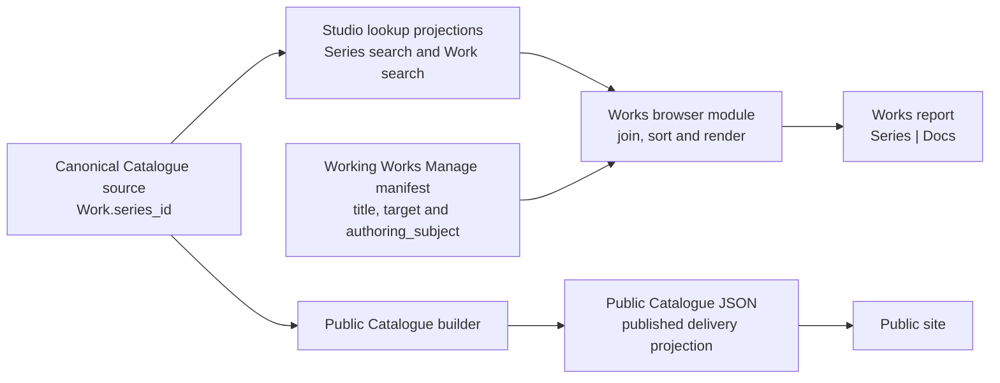

# Works Report Concept And Architecture

## Purpose

The Works report answers one bounded coverage question: which Studio Series have no Context document about a current member Work? Each row represents one Series even though **Works** is its user-facing title. On 2026-10-03 direct Series document Subjects were retired; the Series column remains plain text and the Docs column retains exact document links.

Works complements the folder-first Projects report. Its row identity is the exact Studio `series_id`; coverage comes through documents assigned to exact member Work IDs.

| report | row authority | question answered |
| --- | --- | --- |
| Projects (`project_state`) | immediate physical project folders | Which folders need organising or associating with Catalogue Works and Context documents? |
| Works (`works`) | Studio Series lookup rows | Which Series have no member-Work documentation? |

## Ownership And Flow



Canonical Catalogue JSON owns Series and Work identity and current Work-to-Series membership. The existing Studio Series and Work search responses carry exact IDs, titles and each Work's optional `series_id` into the browser. Context front matter owns document Subject declarations, and the Working Works management manifest carries each document's normalized `authoring_subject`, title and exact identity. The Works browser observes these inputs and never writes them.

Public Catalogue JSON is separately generated for public delivery. Works uses the exact Series and Work sets returned by the existing local lookup owners; it adds no status filtering and never uses public file presence to establish or suppress a row.

## Coverage Rule

For one returned Studio Series `S`, the report derives:

```text
Docs(S) = exact Work-subject documents for every returned Work W
          where W.series_id = S.series_id
```

The result is deduplicated by exact `{collection: "works", doc_id}` identity. A Series is undocumented exactly when `Docs(S)` is empty.

One matching Work-subject document supplies coverage for the Series row. The browser does not diagnose the other member Work IDs, calculate per-Work gaps or require every member Work to have documentation. Folder and None subjects contribute no coverage. Direct Series subjects are rejected by the shared subject reader, rather than retained as another association path. Draft Context documents still count in this local report.

Only returned Series lookup records establish rows. A Work subject contributes only when its exact Work exists in the returned Work set and its current `series_id` identifies a returned Series. Documents and recorded membership never invent a Series.

## Exact Browser Inputs

The browser loads three existing local read projections:

- the Studio `catalogue_lookup_series_search` read, schema `studio_catalogue_lookup_series_search_v2`, containing exact Series ID, title and record revision;
- the Studio `catalogue_lookup_work_search` read, schema `studio_catalogue_lookup_work_search_v2`, containing exact Work ID, title, optional `series_id`, Gallery IDs, displayed year and record revision; and
- the configured private Working `works` management manifest, containing current document identity, title, date, optional draft flag and normalized `authoring_subject`, with `working_works` identity and `subject_generation`.

The two Catalogue reads use the existing Local Studio Catalogue read boundary resolved from the configured `studioBaseUrl`. They reuse the current lookup builders and loopback-origin transport; Works adds no Catalogue or Docs Viewer endpoint. The Projects manifest is already the complete browser input used by its own sub-scope report, so Works does not also read `subject-associations.json` or introduce a matching-generation join.

Work and Series lookup APIs build their responses from current canonical records. The historical persisted lookup files are retired and removed. Docs Viewer and Local Studio use different local ports; the existing Catalogue JSON read transport supplies the configured loopback-origin access required by this report.

Works avoids a new static mapping or report endpoint by using the existing `catalogue_lookup_series_search` and `catalogue_lookup_work_search` read keys, whose JSON responses already support the configured loopback-origin access. The server transports existing browser-safe Catalogue projections; the Works browser still owns all filtering, joining, de-duplication, ordering, and presentation. If that existing Local Studio read transport is unavailable, the report fails as one contained current mount rather than falling back to public JSON or moving the join server-side.

The browser accepts Work, Folder and None subject records from the shared reader. Only an exact returned Work with a returned Series contributes a document. Invalid or retired subject data fails manifest validation; unknown Work targets, missing Series membership, Folder and None supply no coverage.

Document presentation contains the exact Working Works target, current manifest title, existing Manage URL and declared Work subject `{kind, key}`. The shared Work subject icon describes the document's declaration; it is not an inferred coverage or publication state.

## Browser Composition And Failure

On mount, the browser fetches the three complete inputs, validates their owned schemas, performs the exact in-memory join and renders one complete current result. Each row contains:

- exact Series identity and its current plain-text title;
- zero or more exact linked Context documents with current title and declared Work subject; and
- only the counts needed to validate deterministic row and document collections.

Rows sort by normalized Series title and exact `series_id`. Documents sort by normalized title, exact subject kind/key, and `doc_id`. Identity, label, and activation target remain distinct. A later refresh repeats all three reads before replacing the result; it does not incrementally patch an older join.

The composed rows are ephemeral browser state. No generated coverage JSON, report-response schema, server producer, cache, report Markdown, folder lookup, watcher, or mutation follow-through is introduced. If any required input is unavailable or invalid, the current mount shows one contained error and no partial or older rows.

## Embedded Local Report

One ordinary human-authored parent document in scope `dotlineform` declares the focused Works report and local access. The existing local report registry and explicit browser loader mount the focused module. There is no Works method in `docs-viewer-report-service.js`, no Works management route, and no public report registry, public Docs projection, or public Catalogue route consumer.

The table is:

| Series | Docs |
| --- | --- |
| one exact plain-text Studio Series title | zero or more exact Context document links with Work subject cues |

Blank Docs cells remain visible and identify Series without member-Work documentation. Series titles have no navigation control. Document links use `?collection=works&doc=<doc-id>` through the existing exact-document reader.

Works does not add grouping, a Work projection, coverage percentages, automatic exception labels, saved output, arbitrary filters, or public display. Search, sorting controls, and clipboard transforms require an explicit later product decision.

## Relationship To Existing Owners

Public `doc_url[]` remains a different final-public-document projection. The Works report reads the current private Projects manifest and Studio-owned Catalogue lookup projections for local coverage; it reads neither public aggregate/exact Catalogue JSON nor `doc_url[]` and does not imply that a Working document is editorial or public.

## Not In Scope

- one row per Work or identification of undocumented member Work IDs;
- treating the absence of one Work document as a gap when another member-Work document covers the Series;
- Folder-subject placement, physical directory scanning, Finder activation, or Project State changes;
- semantic-token mentions, content scans, title matching, or relationship expansion beyond exact current Work membership;
- `analysis/works` editorial documents, lineage stage, `publishable`, public document locations, or public Catalogue presentation;
- public Catalogue JSON as publication authority or a report input, and projection-integrity auditing;
- a Works server producer, versioned report response, Docs Viewer service method, or report endpoint;
- a new canonical association store, persisted report product, generic graph/query layer, or compatibility reader;
- mutation, repair, assignment, Copy, Publish, Delete, or automatic refresh hooks; or
- changing canonical Work, Series, subject, sub-scope, or public-route contracts.
