# Docs Viewer Configuration And Extension Points

Use this page to find what drives a Docs Viewer workflow and to decide whether a change belongs in JSON, code, environment settings, or generated output.

The central rule is:

> Configuration selects, narrows, and parameterises known behaviour. Code defines executable behaviour. Live service capabilities decide whether an operation is actually available.

This separation keeps public configuration browser-safe and prevents a JSON record from granting write authority or loading arbitrary code.

## The Configuration Model

```mermaid
flowchart TD
    accTitle: Docs Viewer workflow availability
    accDescr: Maintainer configuration becomes a browser-safe projection while code definitions and live capabilities gate whether a workflow is available.

    config["Maintainer config"]
    code["Code definitions"]
    environment["Environment and filesystem"]
    projection["Normalization and projection"]
    browser["Browser-safe generated config"]
    capabilities["Live capability gate"]
    workflow["Available workflow"]

    config --> projection
    projection --> browser
    browser --> capabilities
    code --> capabilities
    environment --> capabilities
    capabilities --> workflow
```



Generated browser config sits between source-side workspace config and the runtime. It contains URLs and display policy, not source filesystem paths or write authority.

### Workspace And Target Contracts

`docs-viewer/config/workspace/docs-workspace.json`, schema `docs_workspace_v4`, and `docs_workspace_config.py` define one existing external `DOTLINEFORM_DOCS_BASE_DIR`. Working owns source and replaceable generated output. Preview is a read-only prepared snapshot with derived collection/media configuration. Pre-publish, local Published and scope-nested storage are retired.

`load_docs_workspace_config(repo_root)` resolves the workspace without selecting a stage. `load_docs_stage(repo_root, stage)` or `select_workspace_stage(workspace, stage)` requires explicit `working` or `preview`. The loader creates no directories; unavailable configured storage, traversal and symlink escapes fail without repository or Projects-root fallback.

| Owner | Location beneath the Docs root |
| --- | --- |
| Ordinary canonical documents | `working/source/documents/` |
| Ordinary generated documents and Search | `working/generated/documents/` and `working/generated/search/index.json` |
| Collection source and generated documents | `working/source/collections/<id>/documents/` and `working/generated/collections/<id>/documents/` |
| Current Catalogue JSON | `working/generated/catalogue/` |
| Prepared documents, collections, Search and Catalogue | `preview/documents/`, `preview/collections/<id>/documents/`, `preview/search/index.json` and `preview/catalogue/` |
| Shared document ready media | `assets/media/workspace/<type>/` and `assets/media/collections/<id>/<type>/` |
| Shared Work primary, thumbnail and download bytes | `assets/works/primary/`, `assets/works/thumbs/` and `assets/works/media/files/` |
| Editable media build inputs and private provenance | Their Working ordinary/collection source owner, including `media/build-source/mermaid/` |

Each managed media type has one `asset_location`; its owner retains `asset_root` for relative reference identities. Working and Preview resolve the same current assets through `/docs/assets/`. Ready bytes are not duplicated under source, generated output or Preview. Temporary preparation builds receive the explicit existing shared asset root; they cannot invent another one.

Managed document targets use exact `stage`, immutable `doc_id` and optional registered `collection`. Retired `scope`/`sub_scope` selectors are rejected. Source records require boolean `draft`; collection documents are flat and do not inherit ordinary hierarchy. Reports use `id: docs_collection` with an exact collection selector.

Working registers each collection once, with its ID, title and exact `report_host_doc_id`; Preview derives that registration. The host ID is configuration authority, not inferred from documents, titles or a receipt. New collection creates its Working source/generated roots and report host. Whole-collection deletion remains unavailable. Historical lifecycle receipt values remain provenance rather than compatibility selectors.

New document in the exact Working `catalogue` collection requires a five-digit quoted `work_id` and non-blank title. Its targeted build preserves that association in the generated Links subject. Canonical Catalogue records remain Studio-owned; configuration consolidation does not move them or Projects-owned original images.

### Builder And Local Service Integration

`docs_viewer_config_v3` projects Working and Preview records locally and one public workspace record for public readers. Browser config contains URLs/display policy, never private paths or write authority. The three tracked projections below are produced by `browser_config.py`.

Document Build accepts `--stage working`. Optional `--collection` selects one registered owner; `--only-doc-ids` limits document rendering. Named-collection targeted builds merge selected metadata into saved manifests; the [Builder](d-20260423-000000-c9f3ea.md) owns prerequisites and output behavior. The watcher observes Working ordinary/collection source, suppresses duplicate owning writes and never watches Preview. Ordinary edits do not automatically rebuild Search.

| Reader or operation | Current contract |
| --- | --- |
| Working ordinary document | `/docs/doc?stage=working&doc_id=<id>` |
| Working collection artifact | `/docs/generated/external/working/<collection>/<artifact>` |
| Preview ordinary document | `/docs/preview/doc?doc_id=<id>` |
| Preview collection artifact | `/docs/preview/external/<collection>/<artifact>` |
| Shared current media | `/docs/assets/<configured-family>/<identity>`, independent of stage |
| Working aggregate Links | `/docs/workspace-links?stage=working` |
| Collection lifecycle | `/docs/collections/create-preview`, `create-apply`, `delete-preview`, `delete-apply`; deletion remains blocked |

Source/Create/metadata/placement/Delete/Draft operations require Working and exact identity. Working Delete does not prune Preview or public output. Source-only Draft updates return readiness to the mounted reader while watcher generation remains independent. Media insertion writes shared local assets through the exact Working collection/type owner; the standalone tool uses `--scope docs --docs-stage working` with optional `--docs-collection`.

### Publication And Downstream Ownership

`docs_prepare_preview.py` selects eligible Working sources under boolean draft and `unpublishable.json` policy, including inherited ordinary exclusions and excluded collection hosts. It builds captured inputs in temporary storage, validates and replaces Preview, writes `docs_preview_manifest_v2` after verification, then removes temporary inputs. Preview has no persistent source/generated authoring tree.

`catalogue-artifacts.json` and `docs_catalogue_artifacts.py` select Catalogue JSON independently of document eligibility. Prepare Preview copies that JSON, Search v4 and Recents unchanged. The completion manifest binds snapshot bytes and sorted shared asset identities; it does not freeze mutable asset bytes or keep asset hashes/history. Failure before replacement preserves the previous snapshot; failure during replacement requires preparation again.

**Publish** is the current UI name for the existing `docs_deploy_repo.py` revision-bound plan/apply operation. Its `/docs/deploy-repo/*` endpoints and `docs_deploy_repo_preview_v3` envelope remain the sole distribution owner. It requires Preview, copies its complete prepared set to configured repository destinations, and transfers referenced current shared assets to repository/R2. It does not read canonical source or Working output, build, filter the prepared set again, advance versions or automatically delete shared/remote assets.

`docs_publication_payloads.py` projects document URLs and the public `published` wire identity. Catalogue, Search and Recents bytes remain unchanged. The public section is `/analysis/`; documents use `site/assets/data/docs/`, Search uses `site/assets/data/search/analysis/index.json`, and Catalogue uses `site/assets/data/catalogue/`. Configured R2 addresses, including `sub-scopes/<id>/media/`, are retained public addresses rather than local storage aliases.

Publish preserves the independently owned `public-reports.json`. Public collections require exact `docs_collection` registry rows and generated browser configuration registration as well as prepared data. Public document-location JSON, the legacy Catalogue document-URL writer and the old publication pause remain retired. [Catalogue Deployment](d-20260909-205938-3569d6.md) owns the JSON/media inventory and accepted R2-before-Actions timing gap. Git commit/push and public Actions deployment remain separate.

Publication lineage requires exact configured Working collection owners. No lineage workflow or inactive historical table is currently configured. Recovery uses owning operations and Git history; no compatibility paths, backup trees or inferred owners are introduced.

### Browser And Management Integration

The local and public route registries use `docs_viewer_route_config_v5`. Manage has an explicit default stage of Working; public routes cannot select an authoring stage. Scope-bearing URLs fail with a current-link message. `docs-viewer-workspace-provider.js` selects the exact local stage or the public workspace; it never looks up a singleton scope. `workspace-configuration` controls configuration discovery and local stage controls. The public composition retains read-only authority.

Management capability responses expose `stages` directly. Source Config uses `docs_source_config_report_v2`, projecting the root workspace `recent_limit` beside its browser value; settings use `docs_source_config_settings_v2` and require the selected stage record. Docs Media uses `docs_media_report_v4`; its reveal action sends exact stage, collection, role, media type and identity to `/docs/open-media-source`, which resolves an existing file through the configured Docs artifact owner. See [Media And Asset Handling](d-20260514-184303-7914e2.md) for its inventory and file-opening boundary. Top-level scope creation, rename, deletion and selection are removed, including their services and manifest. Retained child lifecycle uses `docs-viewer-management-collection-lifecycle-controller.js` and `docs-viewer-collection-lifecycle.js`. Ordinary workspace export reads the selected stage's ordinary document index and uses the existing snapshot preview/confirmation/apply workflow.

Document-package services and browser callers require explicit Working stage and optional exact `collection`. Trusted metadata uses `data_sharing_export_meta_v3`; Review manifest/list schemas use version 3 and source-stage provenance. Old scope- or sub-scope-bearing packages are rejected with a re-export request, without metadata upgrade or fallback to another collection. See Docs Import Architecture and Docs Review for ownership and membership rules. Static export reads selected Working generated content or the read-only Preview snapshot, records `docs_static_html_snapshot_v3` stage provenance and preserves revision-bound preview/apply, assets and exact selection. Its preview/apply API remains v2. Local document links without a stage inherit the selected snapshot stage; links naming another stage or child are not rewritten into that snapshot. Notes Archive routes, services, capability and controls are removed; the retirement performs no data transfer.

Saved browser state remains reader-owned, separate from workspace filesystem authority. Historical scope/stage conversions are migration provenance, not permission to restore retired local stages or compatibility storage. Review retains its separate panel state.

Report consumers now pass stage and exact optional child/document identity. The aggregate Links report is `workspace_links`. The Analysis Documents index report and its presets are retired. Public collection declarations use the same exact registered collection identity; public runtime files follow the explicit site-code projection inventory.

### Links, Tokens, Search And Locations

Links records and their workspace aggregate use `schema_version: 2`. Their exact target is `{stage, collection, doc_id}` and Working remains the sole Links owner. `docs_workspace_links.py` replaces the scope aggregate owner. Routine source saves still maintain only the current document and direct affected neighbours; missing prior Links records produce the existing warning rather than triggering a full refresh. Complete Working Build initialises absent eligible records across configured collections before the existing refresh, removes excluded records and relationships, and then aggregates the completed records. Existing records are preserved as relationship prior state.

`docs_document_link_targets_v2` selects exact Working documents and shares Links' ordinary ignore-list ancestry rule: omit any ordinary document whose ID or ancestor's ID is listed. Drafts remain selectable and linkable; named collections retain their existing Working eligibility. Authored document links and stored relationship hrefs remain stage-free `/docs/?doc=<id>` locations, with `subdoc` for a configured report-host placement. The Links reader adds the invoking stage to navigation; authoring does not pin an inserted link to Working. `docs_backlinks_v2` carries the selected stage. Broken Links audits all configured source collections and identifies correction targets by stage, child and immutable ID; it reports retired scope-bearing viewer links as broken. Local destinations use their explicit stage or the normal Working route default; public destinations use deployed payloads, never untransferred Working or Preview output.

Semantic usage uses `docs_semantic_token_usage_index_v2`, with a stage envelope and explicit `source_stage`, `source_collection` and `source_doc_id` on every occurrence. Usage remains separate from Links. The Works Subject column and picker use the stage-bound generated Catalogue target reader. Remaining private semantic lookup consumers retain their own refresh owner pending explicit retirement. The shared Working ignore-file resolver and `docs_unpublishable_report_v4` have no scope parameter. Both Working Links and preparation inherit ordinary ignore-list exclusions; preparation additionally excludes draft subtrees and collections with excluded hosts.

Search uses stage-independent `docs_viewer_search_index_v4`, with no header stage or result URLs; the content version excludes stage. Readers resolve exact document/collection/report-host identity through their active route. Working builds its complete index. Prepare Preview captures that existing file with its plan and copies it unchanged while building eligible document output in temporary storage. Missing/invalid Search fails; rebuilding Search during preparation invalidates the plan. Ordinary source freshness and Search membership are not preparation requirements in this workflow-first slice. Configured collection inclusion and inherited readiness select the Working Search corpus independently of snapshot membership. Tokenization, ranking, fields and explicit rebuild policy remain unchanged. `build_search.py` accepts only `--stage working`.

The `docs_document_locations_v2` index, public provider/picker and builder are retired. Deploy Repo derives counts and any configured publication-lineage URLs directly from accepted document identities and exact configured report hosts. Navigation and source link insertion retain their own URL helpers. Catalogue distribution now copies declared Preview files into `site/assets/data/catalogue/`, without the retired legacy schema writer or document-URL refresh.

Historical scope-bearing tests and fixtures remain unreviewed against the current workspace. Test changes require their own agreed specification; old names or pass results do not establish current coverage. Selected storage/publication evidence does not prove every failure, retry or rollback path.

## What Drives What

| driver | controls | authority |
| --- | --- | --- |
| `docs-viewer/config/workspace/docs-workspace.json` | Stage defaults, hierarchy policy, build-media registration, explicit public/R2 destinations, collections, and Search fields. | Maintainer-edited workspace config. Working source/generated, Preview, shared assets and Catalogue destinations derive from the existing external root and explicit owners. |
| `docs-viewer/runtime/js/shared/docs-viewer-code-config.js` | Universal metadata statuses. | Product-owned browser code, projected to `site/` through the public code inventory. Scope-type labels and badges are retired. |
| `docs-viewer/config/routes/docs-viewer-routes.json` | App kind, route features, access intent, payload/config URLs, panel defaults, view policy, and named service surfaces. | Full local route registry. The service injects enabled loopback URLs when it serves local routes. |
| `site/docs-viewer/config/routes/docs-viewer-public-routes.json` | Public-only route records served from the deploy root. | Checked-in public projection kept separate so local/manage and review routes are never exposed publicly. |
| `docs-viewer/config/defaults/docs-viewer-service.json` plus `.env.local` | Loopback binding, endpoint names, enabled service families, watch behaviour, and local state roots. | Defaults describe the service; environment settings select the current host instance. |
| `docs-viewer/config/reports/reports.json` | Report metadata, access defaults, presets, and a `loader_id`. | Config describes known reports; `docs-viewer/runtime/js/reports/docs-viewer-reports.js` owns the executable loader allowlist. |
| `docs-viewer/config/semantic-tokens/registry.json` | Supported token families, target types, identifier rules, the `data/generated/` target-lookup URL, and UI contribution ids. | Data declares the accepted contract; executable lookup and UI behavior remain code-owned. |

Two other important registries are deliberately code-owned:

- browser views, modes, and controls are registered through `site/docs-viewer/runtime/js/shared/docs-viewer-view-registry.js` and entrypoint-owned definition sets
- management actions and import source formats are registered in `docs-viewer/runtime/js/management/docs-viewer-action-definitions.js` and `docs-viewer/services/docs_import_common.py`

They are code-owned because each record connects to executable lifecycle, parsing, mutation, rendering, or security behaviour.

Universal display vocabulary follows the same boundary. Metadata statuses are product-owned code; changing them is a reviewed code-config change.

## Source Config Becomes Browser Config

Do not edit these generated browser projections directly:

- `docs-viewer/config/defaults/docs-viewer-config.json`
- `docs-viewer/config/defaults/docs-viewer-public-config.json`
- `site/docs-viewer/config/defaults/docs-viewer-public-config.json`

The docs builder derives these projections from workspace config:

```text
docs-workspace.json
      |
      v
browser_config.py
      |
      +--> local browser config: explicit stages and collections for `/docs/`
      |
      +--> public browser config: accepted public destinations and browser-safe fields only
                   |
                   +--> deploy-root copy under `site/`
```

Use [Source Config Report](/docs/?scope=studio&doc=d-20260514-123140-83239c) in local manage mode to compare source config with its browser and generated projections. Use [Builder](/docs/?scope=studio&doc=d-20260423-000000-c9f3ea) for the build commands.

## How A Workflow Becomes Available

For views, modes, controls, and management actions, availability is the intersection of several independent decisions:

```text
code registration
  + matching app kind
  + enabled route feature
  + required backend capability
  + route policy does not hide it
  = available workflow
```

This is why `management_ui: true` or a service URL never grants authority by itself. The manage entrypoint must register the behaviour, route config must enable its feature, and the live backend must advertise the required capability before the UI can offer the operation.

When a control is unexpectedly missing, inspect those gates in that order. [Runtime](/docs/?scope=studio&doc=d-20260331-000000-c313fd) owns the public/manage/review security boundary; [Runtime Module Ownership](/docs/?scope=studio&doc=d-20260605-125108-1d1ef3) identifies the code owners.

## Extension Points

### Change Workspace Or Collection Configuration

Edit `docs-workspace.json` for the existing workspace and its explicit stage settings. Public documents, Search, and per-type repository/R2 media destinations remain explicit under `public_projection`. Child public destinations derive from those configured parent destinations. Do not repeat derived local paths, add a scope registry, or restore old-schema compatibility records.

Use the retained collection creation workflow to create its Working config, report host, and local artifact roots together. Preparation, publication, and deployment remain separate owners. Top-level scope creation, rename, deletion, and cross-scope transfers are retired by the cutover.

A new storage or publication model requires code and its own agreed delivery.

### Add A Public Route

Reuse the public shell and public entrypoint. Add matching public route records to the full and deploy-root registries, with no local service URLs. Public sections are independent of Docs workspace identity.

A new app kind or shell authority boundary is an architecture change, not a route-config addition.

### Add A Report

A new preset for an existing report type can be config-only. A new report type needs both a registry record and an allowlisted loader implementation. Config metadata cannot name an arbitrary JavaScript module.

### Add A View, Mode, Control, Or Action

Add a code definition through the owning shared or route-specific entrypoint. Declare app kinds, route features, and backend capability requirements explicitly. Route config may hide known ids but cannot invent or widen executable definitions.

### Add An Import Source

Add a code-owned source importer, parser/preview path, apply behaviour, and focused tests. File suffixes are dispatch hints, not a complete import implementation. [Docs Import](/docs/?scope=studio&doc=d-20260424-000000-fc8b5d) owns the operator workflow.

### Add A Semantic Token Kind

Use the JSON registry when the kind can reuse an existing identifier normalizer and route model. Add code and tests when normalization, lookup generation, or editor behaviour is genuinely new.

## Why This Structure Exists

- Source config can contain filesystem and build policy that must never reach public browsers.
- Generated projections give browsers only the URLs and display metadata they need.
- Separate public and manage entrypoints preserve the import boundary as well as hiding controls.
- Code registries make executable extensions reviewable, testable, and allowlisted.
- Live capability responses describe real backend authority after environment, filesystem, and service policy are known.

## Weak Spots

- The same concept can cross source config, generated browser config, and a deploy-root copy. It is easy to inspect or edit the wrong layer.
- The full and public route registries are separate checked-in files. Route edits must keep their shared public entries aligned.
- Registries are not a single plugin system. Reports, semantic tokens, views, actions, and importers each have different data/code boundaries.
- A configured feature can still be unavailable because its entrypoint, code definition, service capability, or filesystem precondition is missing.
- There is no single runtime screen showing every route feature, registered definition, and capability decision. The Source Config report covers configuration projections, not the entire availability calculation.

These are reasons to keep this map current. They are not reasons to duplicate every field and module here; the code and focused owner docs remain the detailed authority.
