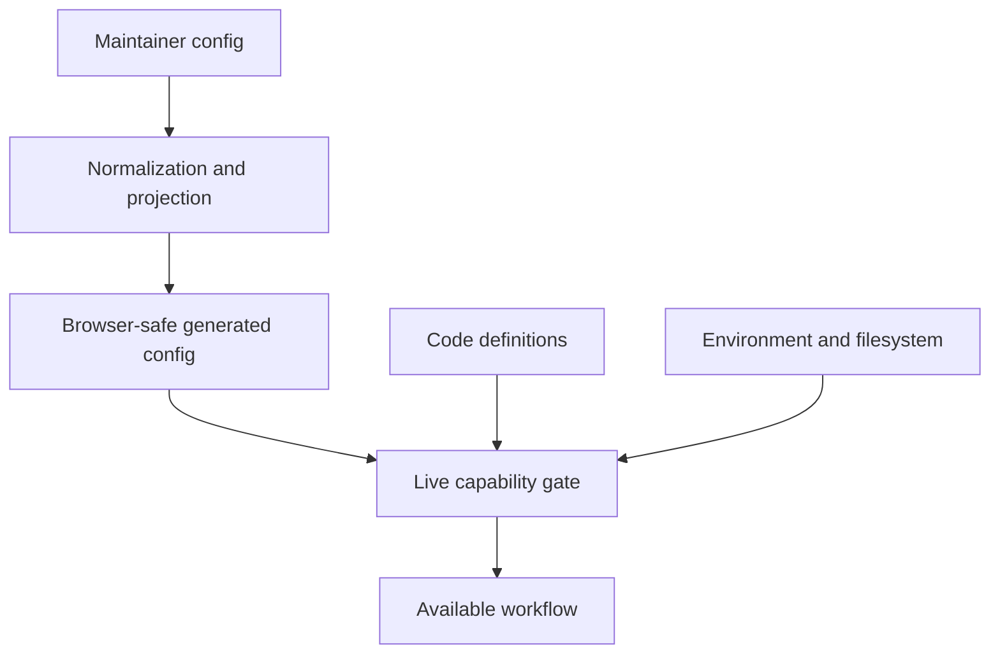

# Docs Viewer Configuration And Extension Points

Use this page to find what drives a Docs Viewer workflow and to decide whether a change belongs in JSON, code, environment settings, or generated output.

The central rule is:

> Configuration selects, narrows, and parameterises known behaviour. Code defines executable behaviour. Live service capabilities decide whether an operation is actually available.

This separation keeps public configuration browser-safe and prevents a JSON record from granting write authority or loading arbitrary code.

## The Configuration Model



Generated browser config sits between source-side workspace config and the runtime. It contains URLs and display policy, not source filesystem paths or write authority.

### Workspace And Target Contracts

Docs Viewer uses one workspace defined by `docs-viewer/config/workspace/docs-workspace.json`, schema `docs_workspace_v2`, and `docs-viewer/services/docs_workspace_config.py`. Working, Pre-publish and Published live directly beneath the configured Docs root; top-level scope identity and storage nesting are retired.

`DOTLINEFORM_DOCS_BASE_DIR` selects one existing external root. `DocsWorkspaceConfig` owns the public section URL, public destinations, and accepted Published paths. `DocsStageConfig` selects either `working` or `pre-publish` explicitly and owns that stage's source, generated artifacts, media, defaults, and configured collections. `load_docs_workspace_config(repo_root)` does not choose an authoring stage; use `load_docs_stage(repo_root, stage)` or `select_workspace_stage(workspace, stage)`.

| owner | derived location under the external root |
| --- | --- |
| Ordinary source documents | `<stage>/source/documents/` |
| Ordinary generated documents and Search | `<stage>/generated/documents/` and `<stage>/generated/search/index.json` |
| Collection source and generated documents | `<stage>/source/collections/<id>/documents/` and `<stage>/generated/collections/<id>/documents/` |
| Accepted Published documents and Search | `published/documents/` and `published/search/index.json` |
| Accepted collection documents | `published/collections/<id>/documents/` |
| Media | `media/` beneath each ordinary or collection source/generated/Published owner |

The config loader derives paths without creating directories. Missing configured storage is an error; there is no repository or Projects-root fallback. External descendant paths cannot traverse symlinks. Existing provider adapters in `docs_artifact_locations.py` continue owning repository, external-local, and R2 I/O; they do not need a Docs scope identifier.

Managed document targets contain exactly `stage` and immutable `doc_id`, adding `collection` only for a collection document. Collection targets contain `stage` and optional `collection`. The target normalizers reject retired `scope` and `sub_scope`; they do not select a document from a title or current UI state. Source records use `SourceDoc`; named membership is recorded as `collection: <id>` and ordinary documents have no collection identifier. Report declarations use `id: docs_collection` with an exact `collection` selector; other report IDs and optional `preset` remain unchanged. Old `sub-scope` metadata and `sub_scope` request/report fields are rejected.

Collections retain their IDs, customisations, return-import support, and report-host receipts. Customisation projection callbacks receive the exact collection and stage, without a parent scope. The historical `docs-viewer-scope-lifecycle` receipt value identifies the creating tool and is retained as provenance. New creation receipts use `docs-viewer-collection-lifecycle`; historical receipt revisions are not reissued when terminology changes. Creation remains a Working operation; whole-collection deletion remains unavailable. The top-level scope registry and manifest have no replacement lifecycle or compatibility shim.

The public section remains `/analysis/`. Public document payloads live at `site/assets/data/docs/`, with collection payloads beneath `<collection-id>/`. The explicit public Search destination remains `site/assets/data/search/analysis/index.json`; `analysis` there is the retained public section name. Existing configured R2 addresses remain unchanged, including public `/sub-scopes/<id>/media/<type>/` destinations; they are explicit public addresses, never local storage aliases. Local media references use `docs/<type>/...` or `docs/collections/<id>/<type>/...`; local served URLs also include the explicit stage. Public deployment must preserve the independently owned `site/assets/data/docs/public-reports.json`.

### Builder And Local Service Integration

The source implementation projects and reads `docs_viewer_config_v3`: local configuration has a `stages` array for Working, Pre-publish and accepted Published; public configuration has one `workspace` record. Both retain `docs_viewer.recent_limit`, explicitly configured as 20. Local configuration also projects the explicit `public_viewer_base_url` for document-link handling. The three tracked browser configuration files are generated through their owning producer. The local viewer and watcher use the converted workspace; the tracked public artifact remains separate from deployment to the public site.

Document Build requires `--stage working` or `--stage pre-publish`. `--collection` selects one configured child; ordinary targeted builds retain `--only-doc-ids`. `rebuild_stage_outputs` and the source-write wrappers receive the explicit stage and optional child, with no scope argument. Ordinary saves and watcher changes leave Search explicit. Complete Build still awaits ordinary documents, configured children, requested Search, aggregate Links and prepared Mermaid before writing `docs_build_manifest_v2` through `docs_build_manifest.py`.

| reader or operation | single-workspace contract |
| --- | --- |
| Ordinary generated document | `/docs/doc?stage=<stage>&doc_id=<id>` |
| Child generated artifact | `/docs/generated/external/<stage>/<collection>/<artifact>` |
| Generated local media | `/docs/media/<stage>/[collections/<id>/]<type>/<filename>` |
| Accepted ordinary document | `/docs/published/doc?doc_id=<id>` |
| Accepted child artifact | `/docs/published/external/<collection>/<artifact>` |
| Accepted local media | `/docs/published/media/[collections/<id>/]<type>/<identity>` |
| Working aggregate Links | `/docs/workspace-links?stage=working` |
| Retained collection lifecycle | `/docs/collections/create-preview`, `create-apply`, `delete-preview`, `delete-apply`; deletion remains blocked |

Source read/save, Create, metadata, placement, Delete and Draft requests use stage and exact document/child identity. Old scope- or sub-scope-bearing requests are rejected; top-level scope lifecycle dispatch is removed. Default-document settings use `apply_stage_settings_change`, and their browser contract is `docs_source_config_settings_v2`. Working Delete changes source and required generated output, leaving accepted Published content under its publication owner.

Media insertion and inventory use `(stage, collection, media_class, filename)` identity. The standalone media tool retains its separate `--scope docs` domain selector, with `--docs-stage working` and optional `--docs-collection`; `--docs-scope` is removed. Subject associations use `docs_subject_associations_v2`. Mermaid plan, manifest and build envelopes use version 2 with `collection` identity; immutable diagram asset names are unchanged.

Startup validates the existing Docs root without creating replacement storage. The watcher watches Working ordinary and child sources, identifies suppression owners by stage/child, and stops before further writes if a changed workspace config cannot be loaded. It does not start watching Pre-publish authoring sources.

### Publication And Downstream Ownership

`docs_pre_publish.py` requires Working and preserves draft, ignored-subtree and report-host selection. `docs_publish.py` replaces the retired scope publication module without an alias. Its preview/apply require Pre-publish and accept the complete prepared set after verifying the stage-bound Build manifest. `docs_publish_manifest_v2` identifies Published, retains the prepared `generated_revision`, and records the exact accepted file set and revision. Accepted reads validate this manifest and serve its bytes; they do not consult current source or perform a reader-time compatibility conversion.

`docs_publication_payloads.py` projects prepared stage identities and URLs into Published, then accepted URLs into the configured public section for downstream use. Search v3 content receipts are refreshed when stage, URLs or configured collection presentation changes, without regenerating postings. Subject generation remains the original prepared-input receipt. Report-host and child-document IDs remain exact.

Deploy Repo preview/apply require `stage: published`, use `docs_deploy_repo_preview_v2`, and are bound to both the reviewed accepted revision and destination plan. Pre-publish can compose Publish and Deploy Repo with both selected when available; Published retains Deploy-only operation. The service receives Published identity for deployment even when the modal started in Pre-publish. Configured Pre-publish collection destinations supply projection policy, never source/generated content. Deployment preserves `public-reports.json` and uses public-media reconciliation v2 with unchanged R2 locations. Retired scope-route creation and source-Delete public-cleanup modules are removed; Working Delete does not prune the accepted or public snapshot.

Catalogue document URLs join the complete validated accepted document set to its accepted subject associations, without rereading source front matter. Catalogue site projection remains paused under its existing owner. Project State v4 consumes only Working Works, with subject-association v2 and exact stage/collection targets. Media-source evidence v2 likewise requires exact stage/child ownership and permits writes only in Working.

Publication lineage v4 uses explicit Working stage/child identities for configured workflows; old tables are not automatically reinterpreted. The current configuration has no lineage workflow or inactive historical tables. Any future workflow requires exact distinct source and editorial owners.

The accepted and tracked child ID is `concepts`; its conversion from historical `tags` preserved document IDs, content, original publication time and prepared revision. The accepted manifest retains the previous accepted revision and conversion receipt. Storage or identity conversion does not accept new content: preserve publication provenance and recompute only the affected payload/manifest receipts. A new Build, Publish, inferred owner, or compatibility route is not a substitute for a separately reviewed conversion.

### Browser And Management Integration

The local and public route registries use `docs_viewer_route_config_v5`. Manage has an explicit default stage of Working; public routes cannot select an authoring stage. Scope-bearing URLs fail with a current-link message. `docs-viewer-workspace-provider.js` selects the exact local stage or the public workspace; it never looks up a singleton scope. `workspace-configuration` controls configuration discovery and local stage controls. The public composition retains read-only authority.

Management capability responses expose `stages` directly. Source Config uses `docs_source_config_report_v2`, projecting the root workspace `recent_limit` beside its browser value; settings use `docs_source_config_settings_v2` and require the selected stage record. Docs Media uses `docs_media_report_v4`; its reveal action sends exact stage, collection, role, media type and identity to `/docs/open-media-source`, which resolves an existing file through the configured Docs artifact owner. See [Media And Asset Handling](d-20260514-184303-7914e2.md) for its inventory and file-opening boundary. Top-level scope creation, rename, deletion and selection are removed, including their services and manifest. Retained child lifecycle uses `docs-viewer-management-collection-lifecycle-controller.js` and `docs-viewer-collection-lifecycle.js`. Ordinary workspace export reads the selected stage's ordinary document index and uses the existing snapshot preview/confirmation/apply workflow.

Document-package services and browser callers require explicit Working stage and optional exact `collection`. Trusted metadata uses `data_sharing_export_meta_v3`; Review manifest/list schemas use version 3 and source-stage provenance. Old scope- or sub-scope-bearing packages are rejected with a re-export request, without metadata upgrade or fallback to another collection. See Docs Import Architecture and Docs Review for ownership and membership rules. Static export reads selected Working or Pre-publish generated content, records `docs_static_html_snapshot_v3` stage provenance and preserves revision-bound preview/apply, assets and exact selection. Its preview/apply API remains v2. Local document links without a stage inherit the selected snapshot stage; links naming another stage or child are not rewritten into that snapshot. Notes Archive routes, services, capability and controls are removed; the retirement performs no data transfer.

Saved browser state has separate `public`, `working`, `pre-publish` and `published` owners. The approved one-time conversion maps only `analysis`, `analysis/working`, `analysis/pre-publish` and `analysis/published`, preserving stored document IDs, labels, ordering and other bookmark fields. IndexedDB version 2 converts bookmarks in its upgrade transaction to `v2:<owner>::<doc_id>` keys and an `owner` field; a collision aborts the upgrade. Panel values move to `dotlineform-docs-viewer-index-panel:v2:<owner>` after checking for conflicts, with a completion marker written last. Retired-scope entries remain untouched and inactive. Review keeps its separate panel key. Normal reads use only the new identities; this conversion is not a compatibility lookup.

Report consumers now pass stage and exact optional child/document identity. The aggregate Links report is `workspace_links` with the `workspace_documents_admin` index preset. Existing live report declarations and authored links remain subject to the separately identified PSE-3.22 write set. Public code projection is current; complete site validation still requires the coordinated public payload destination change.

### Links, Tokens, Search And Locations

Links records and their workspace aggregate use `schema_version: 2`. Their exact target is `{stage, collection, doc_id}` and Working remains the sole Links owner. `docs_workspace_links.py` replaces the scope aggregate owner. Routine source saves still maintain only the current document and direct affected neighbours; missing prior Links records produce the existing warning rather than triggering a full refresh. Complete Working Build initialises absent eligible records across configured collections before the existing refresh, removes excluded records and relationships, and then aggregates the completed records. Existing records are preserved as relationship prior state.

`docs_document_link_targets_v2` selects exact Working documents and shares Links' ordinary ignore-list ancestry rule: omit any ordinary document whose ID or ancestor's ID is listed. Drafts remain selectable and linkable; named collections retain their existing Working eligibility. Authored document links and stored relationship hrefs remain stage-free `/docs/?doc=<id>` locations, with `subdoc` for a configured report-host placement. The Links reader adds the invoking stage to navigation; authoring does not pin an inserted link to Working. `docs_backlinks_v2` carries the selected stage. Broken Links audits all configured source collections and identifies correction targets by stage, child and immutable ID; it reports retired scope-bearing viewer links as broken. Local destinations use their explicit stage or the normal Working route default; public destinations use accepted Published payloads, never newly prepared output.

Semantic usage uses `docs_semantic_token_usage_index_v2`, with a stage envelope and explicit `source_stage`, `source_collection` and `source_doc_id` on every occurrence. Usage remains separate from Links. Typed Catalogue target lookup and its media identity are unchanged. The shared Working ignore-file resolver and `docs_unpublishable_report_v4` have no scope parameter. Both Working Links and preparation inherit ordinary ignore-list exclusions; preparation additionally excludes draft subtrees and collections with excluded hosts.

Search uses `docs_viewer_search_index_v3`, carrying stage in its header and content version. Working and Pre-publish build their own complete index; accepted local and public readers require `stage: published`. The publication owner projects the accepted identity and canonical public URLs. A migration may use a fresh Build, Pre-publish review and Publish through the normal owning operations to establish a new accepted snapshot; record it as a new publication. Exact preservation/conversion of an earlier accepted snapshot is needed only when that is an explicit requirement. Tokenization, rankings, corpus fields and explicit rebuild policy remain unchanged. `build_search.py` requires `--stage working|pre-publish`; no scope or Catalogue selector remains.

`docs_document_locations_v2` projects only accepted public URLs, document titles and report titles. The public provider/picker reads the single configured-section index at `/assets/data/search/analysis/document-locations.json`, with no scope map, allowlist, label or legacy route interpretation. Internal projection records retain exact `doc_id` and `collection` for publication consumers. `build_document_locations.py` reads the tracked public projections and does not read source or select another accepted set.

The cutover converted the inventoried Links and semantic usage prior records before reconciling Working and the existing Pre-publish generated sets through their owning builders, including explicit Search builds. Ordinary builders continue to reject incompatible prior records. The accepted snapshot conversion preserves publication provenance, and the two inactive lineage tables were removed under the user's explicit decision; no current lineage workflow is configured. Live source conversion was revision-checked against its reviewed inventory during the viewer pause. No runtime compatibility reader, alternate root or shadow source copy is part of these contracts.

Scope-based tests and fixtures remain unreviewed against these workspace contracts. Migration requires separately specified test work; existing test names or historical pass results do not establish current coverage. Browser saved-state migration, package mutation and publication/deployment workflows have source-review evidence but were not all exercised during the workspace cutover. Keep those evidence limits explicit when choosing future verification.

## What Drives What

| driver | controls | authority |
| --- | --- | --- |
| `docs-viewer/config/workspace/docs-workspace.json` | Stage defaults, hierarchy policy, build-media registration, explicit public/R2 destinations, collections, and Search fields. | Maintainer-edited workspace config. Source, generated, Published, and media paths derive from the existing external root and explicit stage/collection. |
| `docs-viewer/runtime/js/shared/docs-viewer-code-config.js` | Universal metadata statuses. | Product-owned browser code, projected to `site/` through the public code inventory. Scope-type labels and badges are retired. |
| `docs-viewer/config/routes/docs-viewer-routes.json` | App kind, route features, access intent, payload/config URLs, panel defaults, view policy, and named service surfaces. | Full local route registry. The service injects enabled loopback URLs when it serves local routes. |
| `site/docs-viewer/config/routes/docs-viewer-public-routes.json` | Public-only route records served from the deploy root. | Checked-in public projection kept separate so local/manage and review routes are never exposed publicly. |
| `docs-viewer/config/defaults/docs-viewer-service.json` plus `.env.local` | Loopback binding, endpoint names, enabled service families, watch behaviour, and local state roots. | Defaults describe the service; environment settings select the current host instance. |
| `docs-viewer/config/reports/reports.json` | Report metadata, access defaults, presets, and a `loader_id`. | Config describes known reports; `docs-viewer/runtime/js/reports/docs-viewer-reports.js` owns the executable loader allowlist. |
| `docs-viewer/config/semantic-tokens/registry.json` | Supported token families, target types, identifier rules, the `data/generated/` target-lookup URL, and UI contribution ids. | Data declares the accepted contract; executable lookup and UI behavior remain code-owned. |

Two other important registries are deliberately code-owned:

- browser views, modes, and controls are registered through `site/docs-viewer/runtime/js/shared/docs-viewer-view-registry.js` and entrypoint-owned definition sets
- management actions and import source formats are registered in `docs-viewer/runtime/js/management/docs-viewer-action-definitions.js` and `docs-viewer/services/docs_import_common.py`

They are code-owned because each record connects to executable lifecycle, parsing, mutation, rendering, or security behaviour.

Universal display vocabulary follows the same boundary. Metadata statuses are product-owned code; changing them is a reviewed code-config change.

## Source Config Becomes Browser Config

Do not edit these generated browser projections directly:

- `docs-viewer/config/defaults/docs-viewer-config.json`
- `docs-viewer/config/defaults/docs-viewer-public-config.json`
- `site/docs-viewer/config/defaults/docs-viewer-public-config.json`

The docs builder derives these projections from workspace config:

```text
docs-workspace.json
      |
      v
browser_config.py
      |
      +--> local browser config: explicit stages and collections for `/docs/`
      |
      +--> public browser config: accepted public destinations and browser-safe fields only
                   |
                   +--> deploy-root copy under `site/`
```

Use [Source Config Report](/docs/?scope=studio&doc=d-20260514-123140-83239c) in local manage mode to compare source config with its browser and generated projections. Use [Builder](/docs/?scope=studio&doc=d-20260423-000000-c9f3ea) for the build commands.

## How A Workflow Becomes Available

For views, modes, controls, and management actions, availability is the intersection of several independent decisions:

```text
code registration
  + matching app kind
  + enabled route feature
  + required backend capability
  + route policy does not hide it
  = available workflow
```

This is why `management_ui: true` or a service URL never grants authority by itself. The manage entrypoint must register the behaviour, route config must enable its feature, and the live backend must advertise the required capability before the UI can offer the operation.

When a control is unexpectedly missing, inspect those gates in that order. [Runtime](/docs/?scope=studio&doc=d-20260331-000000-c313fd) owns the public/manage/review security boundary; [Runtime Module Ownership](/docs/?scope=studio&doc=d-20260605-125108-1d1ef3) identifies the code owners.

## Extension Points

### Change Workspace Or Collection Configuration

Edit `docs-workspace.json` for the existing workspace and its explicit stage settings. Public documents, Search, and per-type repository/R2 media destinations remain explicit under `public_projection`. Child public destinations derive from those configured parent destinations. Do not repeat derived local paths, add a scope registry, or restore old-schema compatibility records.

Use the retained collection creation workflow to create its Working config, report host, and local artifact roots together. Preparation, publication, and deployment remain separate owners. Top-level scope creation, rename, deletion, and cross-scope transfers are retired by the cutover.

A new storage or publication model requires code and its own agreed delivery.

### Add A Public Route

Reuse the public shell and public entrypoint. Add matching public route records to the full and deploy-root registries, with no local service URLs. Public sections are independent of Docs workspace identity.

A new app kind or shell authority boundary is an architecture change, not a route-config addition.

### Add A Report

A new preset for an existing report type can be config-only. A new report type needs both a registry record and an allowlisted loader implementation. Config metadata cannot name an arbitrary JavaScript module.

### Add A View, Mode, Control, Or Action

Add a code definition through the owning shared or route-specific entrypoint. Declare app kinds, route features, and backend capability requirements explicitly. Route config may hide known ids but cannot invent or widen executable definitions.

### Add An Import Source

Add a code-owned source importer, parser/preview path, apply behaviour, and focused tests. File suffixes are dispatch hints, not a complete import implementation. [Docs Import](/docs/?scope=studio&doc=d-20260424-000000-fc8b5d) owns the operator workflow.

### Add A Semantic Token Kind

Use the JSON registry when the kind can reuse an existing identifier normalizer and route model. Add code and tests when normalization, lookup generation, or editor behaviour is genuinely new.

## Why This Structure Exists

- Source config can contain filesystem and build policy that must never reach public browsers.
- Generated projections give browsers only the URLs and display metadata they need.
- Separate public and manage entrypoints preserve the import boundary as well as hiding controls.
- Code registries make executable extensions reviewable, testable, and allowlisted.
- Live capability responses describe real backend authority after environment, filesystem, and service policy are known.

## Weak Spots

- The same concept can cross source config, generated browser config, and a deploy-root copy. It is easy to inspect or edit the wrong layer.
- The full and public route registries are separate checked-in files. Route edits must keep their shared public entries aligned.
- Registries are not a single plugin system. Reports, semantic tokens, views, actions, and importers each have different data/code boundaries.
- A configured feature can still be unavailable because its entrypoint, code definition, service capability, or filesystem precondition is missing.
- There is no single runtime screen showing every route feature, registered definition, and capability decision. The Source Config report covers configuration projections, not the entire availability calculation.

These are reasons to keep this map current. They are not reasons to duplicate every field and module here; the code and focused owner docs remain the detailed authority.
