# Cross-System Relationship Map

## Purpose And Reading Guide

This map separates document subjects, semantic mentions, document-owned Concepts and publication lineage. The Concept branch reflects the 7 September 2026 Studio Tag retirement. Doc-to-doc association storage remains proposed in [Doc Relationships](/docs/?scope=studio&doc=d-20260907-125101-d3bde6). Resolver Tokens remain retired.

## Diagram

```mermaid
flowchart TB
    accTitle: Current cross-system relationship projections
    accDescr: Subject aboutness, semantic mentions, Tag document locations, live Project State reporting, Working-owned Copy Delete and Publish lineage, and Projects publication cues remain separate products with explicit authorities.

    subgraph subjects["Shipped: document subject aboutness"]
        direction TB
        sourceSubjects["Document front matter<br/>folder_path, work_id, or series_id"]
        subjectProjection["Manage subject projection<br/>normalized exact subject"]
        aboutConsumers["Project State + coverage + public documents[]<br/>focused consumers"]
        sourceSubjects --> subjectProjection --> aboutConsumers
    end

    subgraph semantic["Shipped: catalogue semantic mentions"]
        direction TB
        catalogue["Catalogue records + published Moments Docs<br/>canonical or published input"]
        targetLookup["target-lookup.json<br/>generated management projection"]
        docsBuild["Scope Docs build<br/>consumer + producer"]
        rendered["Resolved links + usage index<br/>generated mention projection"]
        catalogue --> targetLookup --> docsBuild --> rendered
    end

    subgraph concepts["Shipped: document-owned Concepts"]
        direction TB
        conceptDoc["Analysis Concept document<br/>optional unique concept_id"]
        definitions["concept-associations.json<br/>private definition projection"]
        conceptTargets["Concept target lookup<br/>concept:concept syntax"]
        conceptOutput["Resolved Concept link + usage<br/>exact stage and document"]
        conceptDoc --> definitions
        conceptDoc --> conceptTargets --> conceptOutput
    end

    subgraph project["Shipped: live Project State"]
        direction TB
        projectFolders["Immediate Project folders<br/>row authority"]
        projectEvidence["Canonical Works + exact subjects<br/>read-only evidence"]
        projectState["Project State producer"]
        projectResponse["Live v2 response"]
        projectReport["Local Project State report"]
        projectFolders --> projectState
        projectEvidence --> projectState --> projectResponse --> projectReport
    end

    subgraph copyLineage["Shipped: Working-owned document lineage"]
        direction TB
        copyResult["Configured New/Replace Copy result<br/>exact Working and Editorial identities"]
        deleteResult["Confirmed document Delete<br/>exact Working or Editorial identities"]
        publishResult["Successful scope Publish<br/>exact current Editorial public files"]
        publicationLineage["Private Working-owned lineage table<br/>current Editorial children + published_url"]
        publicationCues["Projects<br/>highest Editorial or Published cue + exact child detail"]
        copyResult --> publicationLineage
        deleteResult --> publicationLineage
        publishResult --> publicationLineage
        publicationLineage --> publicationCues
    end

```

## Artefact Register

| artefact or family | meaning and state | producer or owner | primary consumer | refresh |
| --- | --- | --- | --- | --- |
| private `authoring_subject` and `subject-associations.json` | shipped exact aboutness projection | document source and sub-scope build | Project State, curator coverage, and exact public metadata builds | source/collection build |
| `docs-viewer/data/generated/semantic-tokens/target-lookup.json` | shipped semantic target projection | `SemanticTargetLookupBuilder` | managed Docs semantic-token rendering and authoring | explicit target refresh |
| scope `published/documents/semantic-tokens/index.json` | shipped semantic mention/usage projection | scope Docs build | Semantic Tokens report and later analysis | document build; targeted builds preserve untouched rows |
| exact Concept document `concept_id` | canonical Concept definition | Analysis document source | private Concept projection and semantic lookup | document edit and owning build |
| `concept-associations.json` | private stage-specific definition projection | Concepts collection build | definition consumers | Concepts collection build |
| `docs_project_state_report_v2` response | shipped ephemeral Folder relationship report | Project State producer | local Project State report | report mount or Run/Refresh |
| `docs-viewer/data/canonical/document-publication-lineage.json` | shipped strict v3 Working records with zero-to-many current Editorial children and nullable `published_url` | configured Copy, confirmed document Delete, and successful scope Publish through `docs_document_publication_lineage.py` | Projects publication-state cue and exact child detail | successful New/Replace Copy, relevant Working/Editorial Delete, or scope Publish |

## Relationship Meanings

- A document subject says what the document is about. Project State placement, curator coverage, and public Work/Series `documents[]` use this exact declaration.
- A semantic token says which Work or Series the document mentions or relates to in body content. Its usage index supports mapping and analysis, not aboutness or public document metadata.
- A Concept document defines its optional `concept_id`; document identity and Concept identity remain separate. The retired Studio registry has no ownership role.
- Project State is a folder-centred live reconciliation. It observes canonical folders, Works, Series, and subjects without becoming a relationship database or mutation owner.
- Publication lineage records the current Editorial children deliberately created or replaced from one exact current Working document and whether each currently has a public projection. Working Delete ends the complete record; Editorial Delete removes only that child after required public cleanup; Publish alone reconciles surviving `published_url` evidence. The table never infers identity or synchronizes content.
- **Insert subject link** inserts one authored snapshot from the current subject. It does not create another relationship projection or make Project State a build prerequisite.

## What This Does Not Include

- inference from semantic mentions to document aboutness;
- automatic Work-to-Series or Series-to-Work document association;
- graph traversal, ranking, recursive expansion, or dependent-document rebuilds;
- content comparison, diff, merge, or automatic New/Replace choice;
- Project State detail rows based on `project_subfolder`;
- delivery sequencing; or
- the retired Resolver Token design, retained only as a historical record.

## Possible Enhancements

- Design authored doc-to-doc links and their derived entity associations separately from existing semantic token mentions.
- Add a separate semantic relationship-analysis map when usage-index consumers grow beyond the current report.

## Authorities

Concept implementation evidence is `docs-viewer/services/docs_concept_documents.py`, `docs-viewer/build/docs_builder/semantic_target_lookup.py`, `docs-viewer/tests/python/test_docs_concept_documents.py` and `docs-viewer/tests/python/test_semantic_target_lookup.py`. Subject, Project State and lineage ownership remain in their respective Docs Viewer services.
